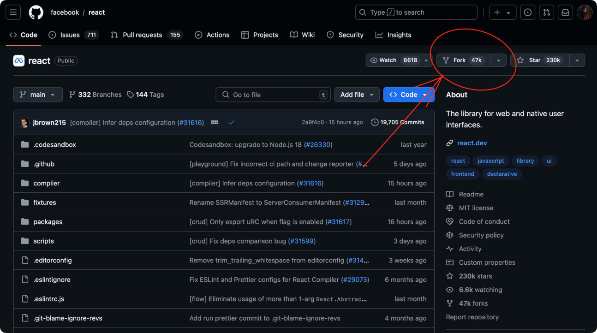
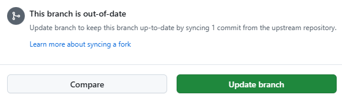

# 参与编写文档

【南赛】战术小队文档十分欢迎您为本项目贡献力量，因为有您一样的人，才有了本站的今天！

本项目基于 [Gitbook](https://gitbook.com) + [Github](https://github.com/) 开发，需要您基本了解 Markdown 格式。

若您想要为本项目贡献一份力量，在此之前，您应该需要一些准备工作

> 不要害怕编辑——任何人都可以编辑几乎任何页面，而且我们鼓励你可以勇于更新页面！寻找可以改善的任何东西，不论其内容、文容或编排，然后更正它。

## 准备工作

首先，您需要注册成为一名 [Github](https://github.com/) 用户 → [Sign up](https://github.com/signup)

我无法打开 Github ?

在中国，由于 DNS 污染以及国际网络波动等原因，您可能无法保证与 Microsoft 服务器的正常通讯，您可以使用 [Watt Toolkit](https://steampp.net/)、[FastGithub](https://github.com/creazyboyone/FastGithub) 等软件进行加速访问

在注册成为一名 [Github](https://github.com/) 用户后，您想要前往本项目[仓库](https://github.com/nansai66/Squad-docx)，随后点击右上角 Fork → 选择你的账号并设置 **Repository name** 后点击 **Create fork** 后等待复制完成

<figure><figcaption></figcaption></figure>

此时你账号下会出现一份一模一样的仓库：https://github.com/你的用户名/Repository name

当然，如果您是一名资深的电脑使用者，您可以尝试使用 [Git](https://git-scm.com/install/windows)

## 贡献力量

> 本页面只提供 Github 网页端贡献力量的教程，如果您觉得效率过低，您可以尝试使用 Git 将仓库克隆至本地修改后提交

### 同步原仓库最新数据

进入你 Fork 后的仓库主页，在文件列表上方找到 **Sync fork** 按钮并点击

如果显示为：**This branch is out-of-date**

则代表当前仓库数据需要同步，继续点击 **Update branch** 即可

<figure><figcaption></figcaption></figure>

如果显示为：**This branch is not behind the upstream** 则代表无需同步

### 新建独立分支

> 请务必新建独立分支开发，不要直接基于 `main` 分支提交修改。
>
> 若直接使用 `main` 提交 PR，容易出现改动纠缠、同步上游代码冲突等问题
>
> （会增加维护者审核成本，一般这种 PR 是无法被合并的）

1. 在你的仓库页面，左上角分支下拉框，默认显示 `main`
2. 在输入框填写分支名（示例：**docs-fix-text**）
3. 点击：**Create branch: docs-fix-text from main**

<figure><figcaption></figcaption></figure>

页面会自动切换到你新建的分支

### 找到需要修改的文件进行编辑

1. 在文件列表找到目标文件（比如 README.md 或者 docx 说明文档）
2. 点开文件，页面右上角 ✏️ **Edit this file（铅笔图标）**，进入网页编辑器

### 修改内容

修改文字、调整文档内容；顶部可以切换「Edit（编辑） / Preview（预览效果）」

我们建议您可以参考 [样式组件](component-styles.md) 让文档排版更加美观

为保障项目安全，所有修改内容<mark style="color:red;">**禁止嵌入外部链接、外部资源与广告内容**</mark>。如需上传图片，请统一放置至 `data/.gitbook/assets` 目录内。

### 提交改动

点击 **Commit changes** 绿色按钮即可提交本次改动

* Commit message：这个输入框代表本次修改的大概标题内容
* Extended description：用于补充本次修改的完整信息。若修改内容包含数据、引用外部资料、调整逻辑依据等内容，请务必在此处写明来源与说明；缺少相关信息的 PR 将不予合并。

✅关键选项：选择 **Create a new branch**（此时分支名已经是你刚刚创建好的 **docs-fix-text**）

❌不要选 **Commit directly to main**！

一切就绪后，继续按下 **Propose changes** 绿色按钮即可

### 发起 Pull Request

进入你 Fork 后的仓库主页，在文件列表上方找到 **Contribute** 按钮并点击

继续点击 **Open pull request** 即可

随后您需要填写本次 PR 的内容：

* Add a title：简要概括本次修改内容
* Add a description：补充改动详情，若涉及数据、外部引用，请注明资料来源。

信息填写完成，确认内容无误后，点击绿色 **Create pull request** 按钮提交 PR，等待维护者审核即可！
