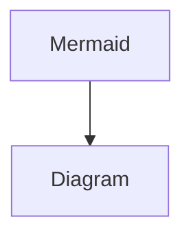

# 样式组件

以下列出了您可以使用的所有样式组件，您可以在 Code 页面参考源代码进行编辑：

## Heading 1


### Heading 2


#### Heading 3


* Unordered list


1. Ordered list 1
2. Ordered list 2


* [ ] Task list


***



Hint




```markdown
// add agent instructions
```



> Quote


```
Code（Plain text）
```





|   |   |   |
| - | - | - |
|   |   |   |
|   |   |   |
|   |   |   |
|   |   |   |
|   |   |   |


<table data-view="cards"><thead><tr><th></th></tr></thead><tbody><tr><td></td></tr></tbody></table>













<details>

<summary></summary>


</details>




###





###








##






