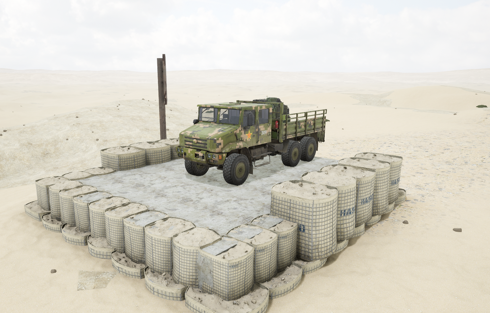
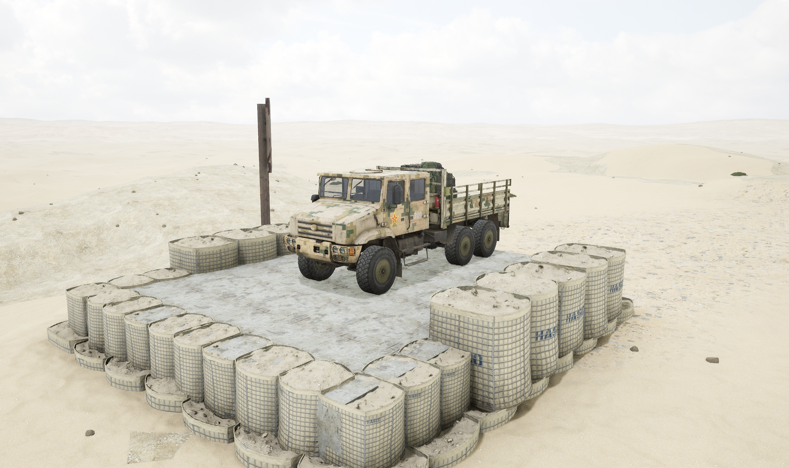
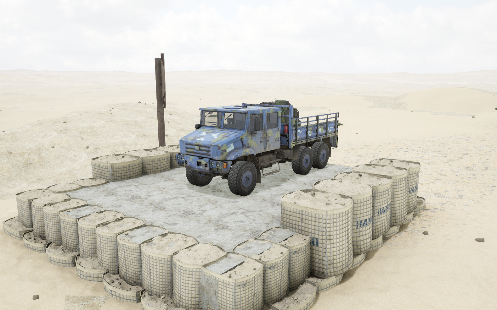

# CTM-131 Logistics


想当 Squad 服主？50 元/月起就能拿下入门款专属服务器！[南赛云](https://server.squadovo.cn/)是高性价比开服首选，低价不低质，让您轻松启动专属战局，低成本圆服主梦～


CTM-131 Logistics 是中国军队后勤运输的中坚力量，具有多种用途。

## 基本数据

| 数据名称    | 值    |
| ------- | ---- |
| 载具血量    | 750  |
| 最大载员人数  | 12   |
| 最大载弹量   | 3000 |
| 是否为两栖载具 | 否    |
| 价值兵力点   | 5    |

## 装备的阵营

* [PLA | 中国人民解放军](../../../team/pla.md)
* [PLANMC | 中国人民解放军海军陆战队](../../../team/planmc.md)
* [PLAAGF | 中国人民解放军两栖部队](../../../team/plaagf.md)

## 载具实图

<figure><figcaption></figcaption></figure>

<figure><figcaption></figcaption></figure>

<figure><figcaption></figcaption></figure>
