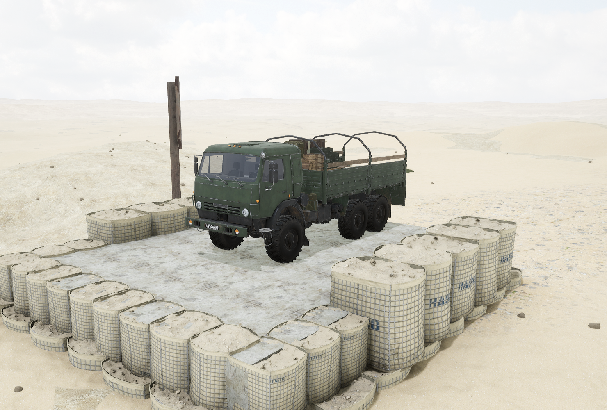
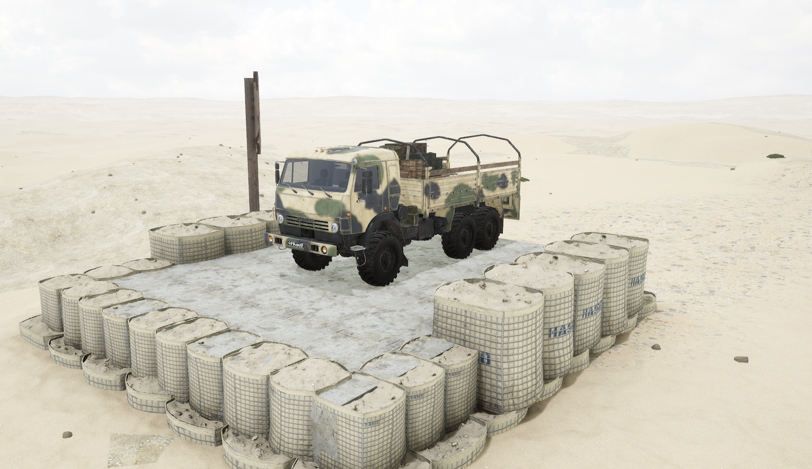

# KaMaz 5320 Logistics


想当 Squad 服主？50 元/月起就能拿下入门款专属服务器！[南赛云](https://server.squadovo.cn/)是高性价比开服首选，低价不低质，让您轻松启动专属战局，低成本圆服主梦～


KaMaz 5320 Logistics 是俄罗斯军队后勤运输的中坚力量，具有多种用途。

## 基本数据

| 数据名称    | 值    |
| ------- | ---- |
| 载具血量    | 750  |
| 最大载员人数  | 12   |
| 最大载弹量   | 3000 |
| 是否为两栖载具 | 否    |
| 价值兵力点   | 5    |

## 装备的阵营

* [RGF | 俄罗斯陆军](../../../team/rgf.md)
* [VDV | 俄罗斯空降军](../../../team/vdv.md)

## 载具实图

<figure><figcaption></figcaption></figure>

<figure><figcaption></figcaption></figure>
