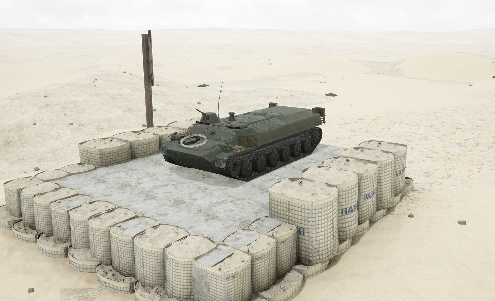
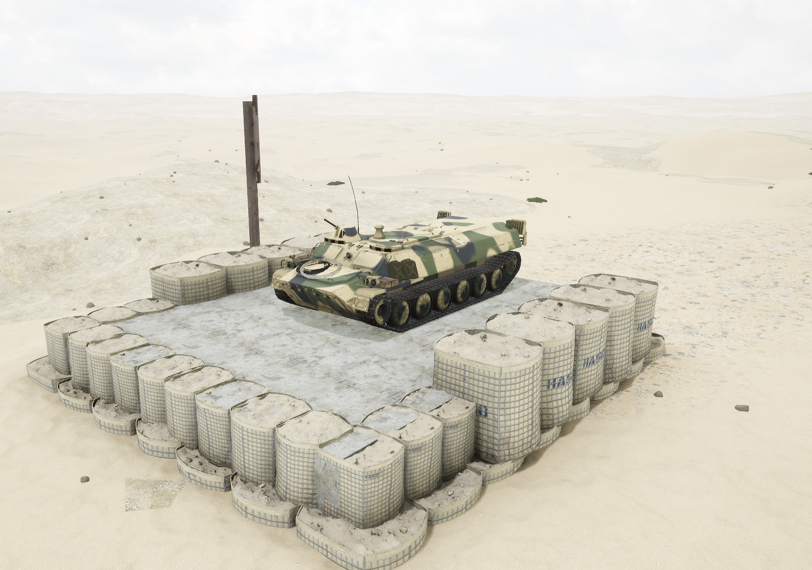
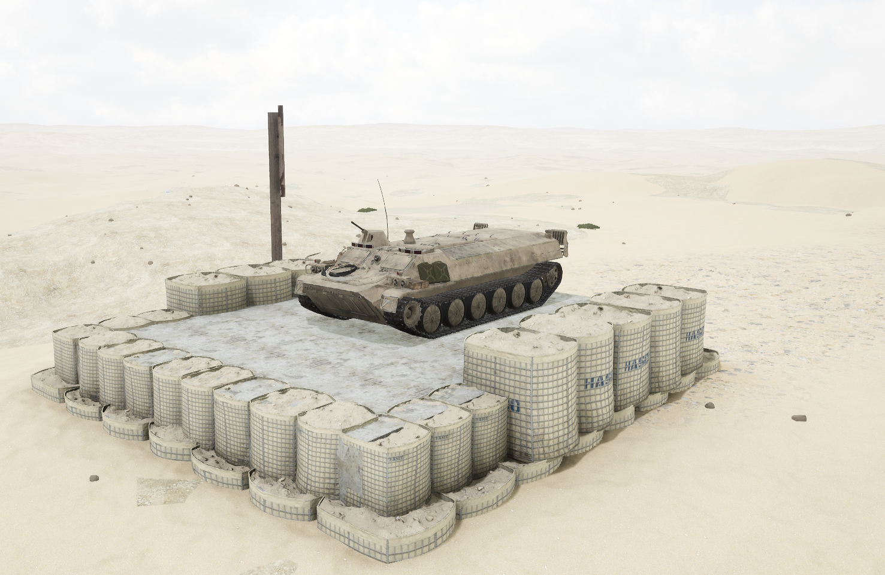

# MT-LB Logistics


想当 Squad 服主？50 元/月起就能拿下入门款专属服务器！[南赛云](https://server.squadovo.cn/)是高性价比开服首选，低价不低质，让您轻松启动专属战局，低成本圆服主梦～


MT-LB Logistics 是20世纪70年代苏联研制装备的一种履带式装甲输送车。

## 基本数据

| 数据名称     | 值         |
| -------- | --------- |
| 载具血量     | 1000      |
| 最大载员人数   | 18        |
| 最大载弹量    | 2000      |
| 是否为两栖载具  | 是         |
| 是否具备 STA | 否         |
| 瞄具可缩放倍数  | 1.0x、2.1x |
| 价值兵力点    | 5         |

## 装备的阵营

* [RGF | 俄罗斯陆军](../../../team/rgf.md)
* [INS | 叛乱军队](../../../team/ins-pan-luan-jun-dui.md)

## 武器数据



* 子弹数量：250 x 2
* 射击间隙：0.0856s
* 装填时间：11.28s
* 最大穿深：7
* 最大伤害：97
* 爆炸伤害：0
* 安全距离：0m



## 载具实图

<figure><figcaption></figcaption></figure>

<figure><figcaption></figcaption></figure>

<figure><figcaption></figcaption></figure>
