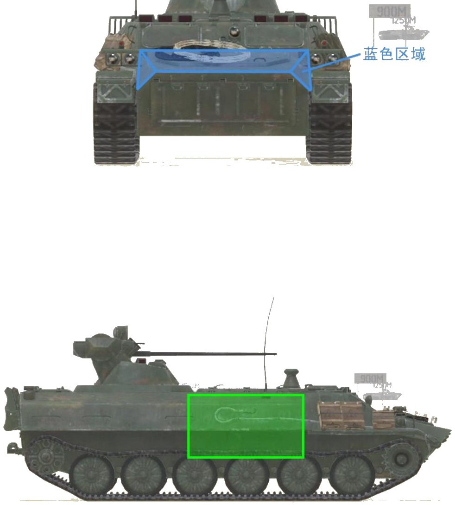
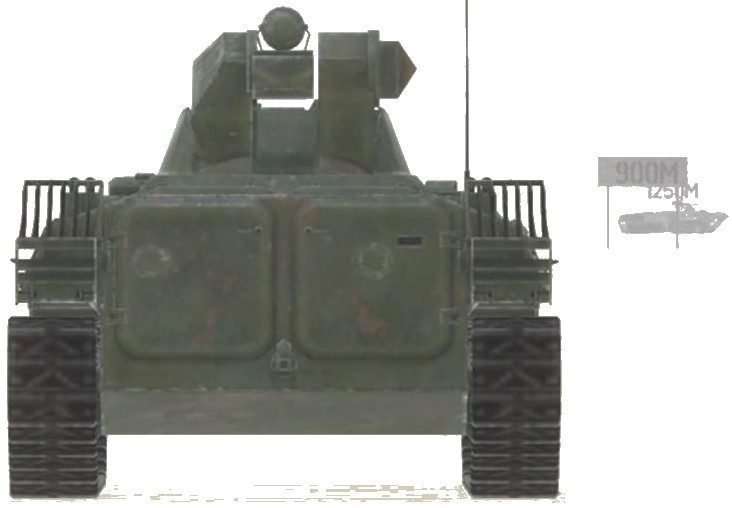
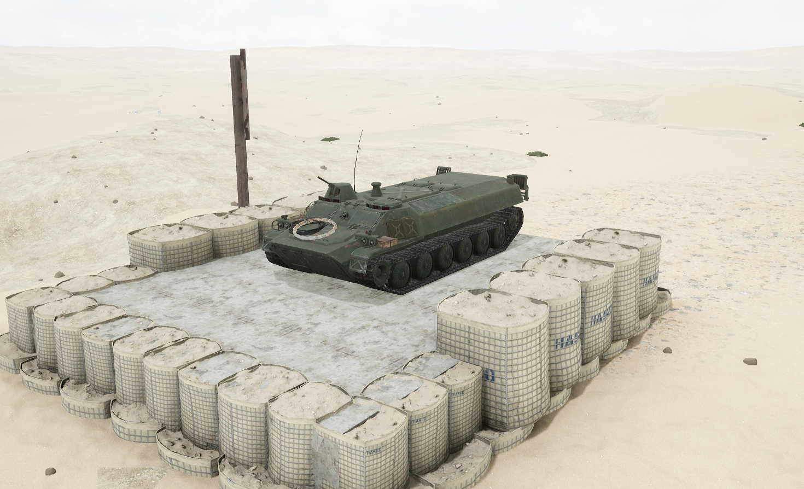
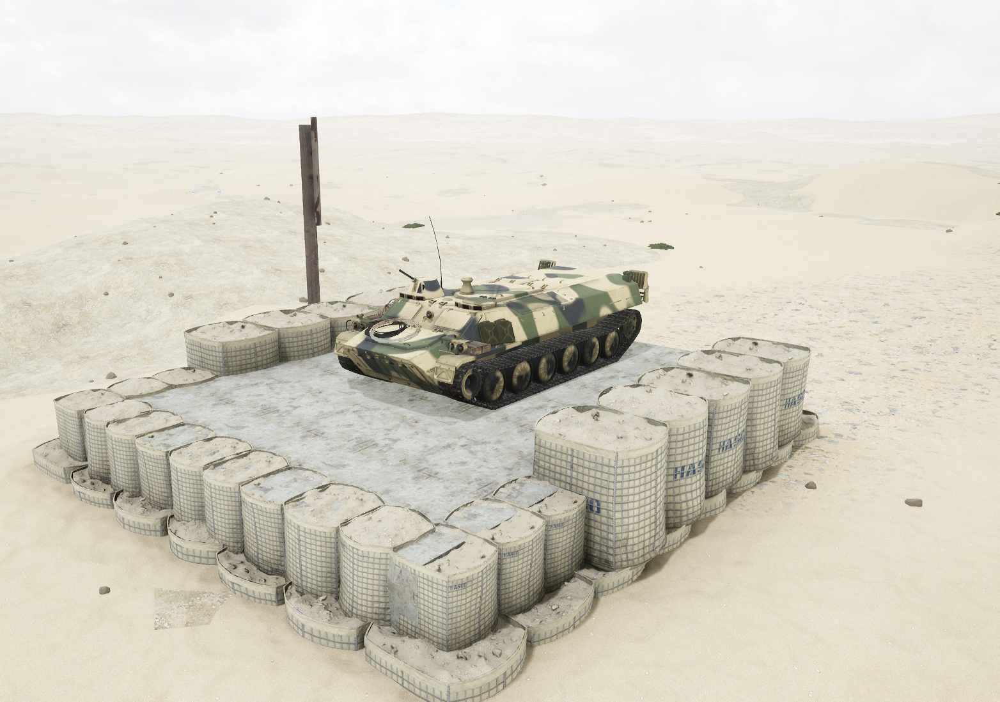
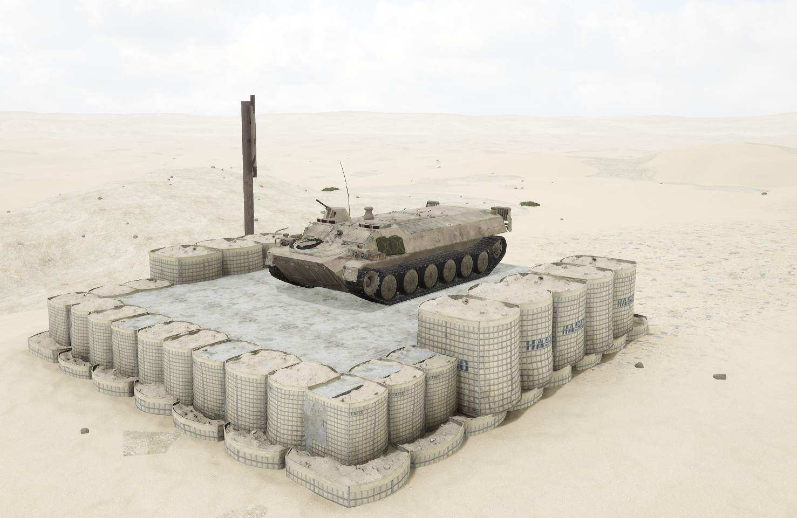

# MT-LB Logistics


想当 Squad 服主？50 元/月起就能拿下入门款专属服务器！[南赛云](https://server.squadovo.cn/)是高性价比开服首选，低价不低质，让您轻松启动专属战局，低成本圆服主梦～


MT-LB Logistics 是 20 世纪 70 年代苏联研制装备的一种履带式装甲输送车。

## 基本数据

| 数据名称     | 值         |
| -------- | --------- |
| 载具血量     | 1000      |
| 最大载员人数   | 18        |
| 最大载弹量    | 2000      |
| 是否为两栖载具  | 是         |
| 是否具备 STA | 否         |
| 瞄具可缩放倍数  | 1.0x、2.1x |
| 价值兵力点    | 5         |
| 炮塔血量     | 300（包含在总血量内） |
| 理论射速     | 330 RPM |
| 备弹        | 150/150（AP/HE） |
| 穿深        | 70/8（AP/HE） |

## 装备的阵营

* [RGF | 俄罗斯陆军](../../../team/rgf.md)
* [INS | 叛乱军队](../../../team/ins-pan-luan-jun-dui.md)

## 武器数据



* 子弹数量：250 x 2
* 射击间隙：0.0856s
* 装填时间：11.28s
* 最大穿深：7
* 最大伤害：97
* 爆炸伤害：0
* 安全距离：0m



## 载具对抗指南

本型号为 MT-LB 装甲运输车，搭载电摇 7.62mm 轻机枪，可装 2000 点弹药或建材。

### 弱点分析

- **正面：** 此系列底盘规格完全相同，同高度下蓝色区域可防 12.7。
- **侧面：** 此系列侧面皆可被 12.7 所伤。
- **后面：** 后面与侧面同理。

### 载具玩法

* 参考 30。但 MT-LB 系列动力一般，运动战也不太能打得起来，唯一的好处可能就是发动机不至于会被 12.7 抽爆。

### 对抗建议

* 6MB 实际上就是 04 和 30 的结合版，兼具 04 的垃圾穿深、30 的低血量和炮塔外观。总之从上到下拉完了，随便打。

### 图示

<figure><figcaption>正视图与侧视图</figcaption></figure>

<figure><figcaption>后视图</figcaption></figure>

## 载具实图

<figure><figcaption></figcaption></figure>

<figure><figcaption></figcaption></figure>

<figure><figcaption></figcaption></figure>
