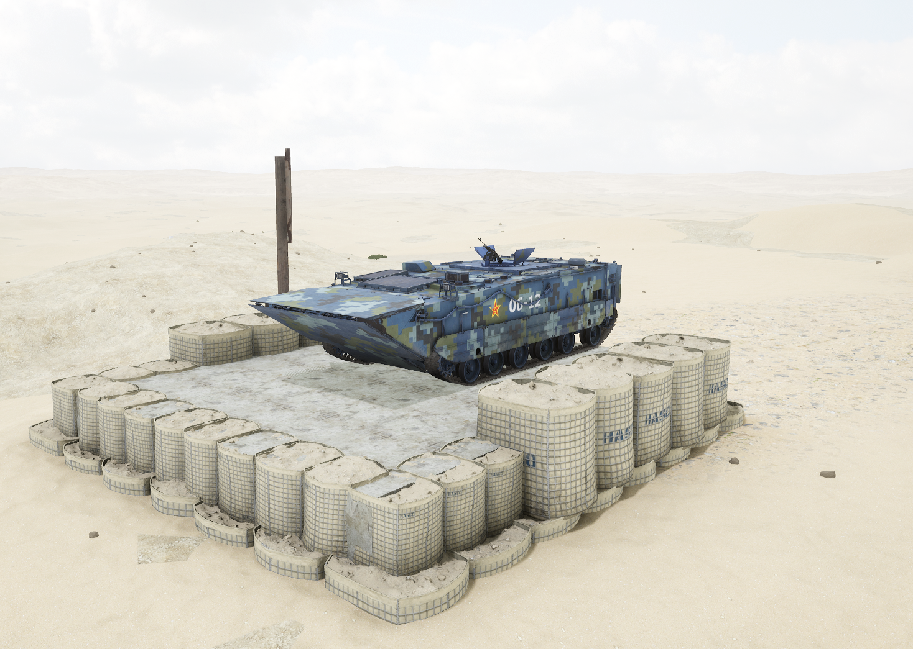

# ZSD05 Logistics


想当 Squad 服主？50 元/月起就能拿下入门款专属服务器！[南赛云](https://server.squadovo.cn/)是高性价比开服首选，低价不低质，让您轻松启动专属战局，低成本圆服主梦～


ZSD05 Logistics 是中国军队海上后勤运输的中坚力量。

## 基本数据

| 数据名称     | 值         |
| -------- | --------- |
| 载具血量     | 1250      |
| 最大载员人数   | 7         |
| 最大载弹量    | 2000      |
| 是否为两栖载具  | 是         |
| 是否具备 STA | 否         |
| 瞄具可缩放倍数  | 1.0x、1.5x |
| 价值兵力点    | 5         |

## 装备的阵营

* [PLA | 中国人民解放军](../../../team/pla.md)
* [PLANMC | 中国人民解放军海军陆战队](../../../team/planmc.md)
* [PLAAGF | 中国人民解放军两栖部队](../../../team/plaagf.md)

## 武器数据



* 子弹数量：200 x 5
* 射击间隙：0.092s
* 装填时间：10.33s
* 最大穿深：7
* 最大伤害：86
* 爆炸伤害：0
* 安全距离：0m



## 载具实图

<figure><figcaption></figcaption></figure>
