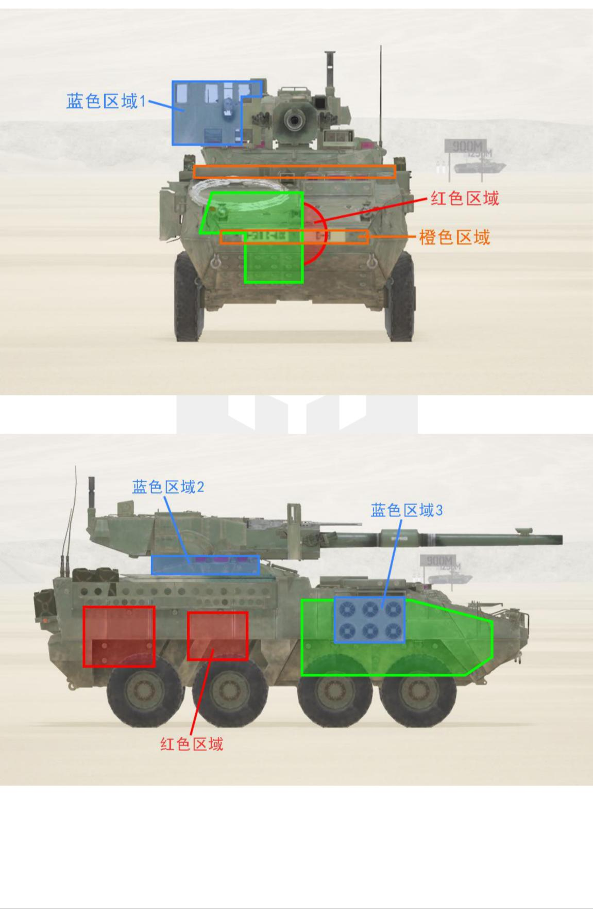
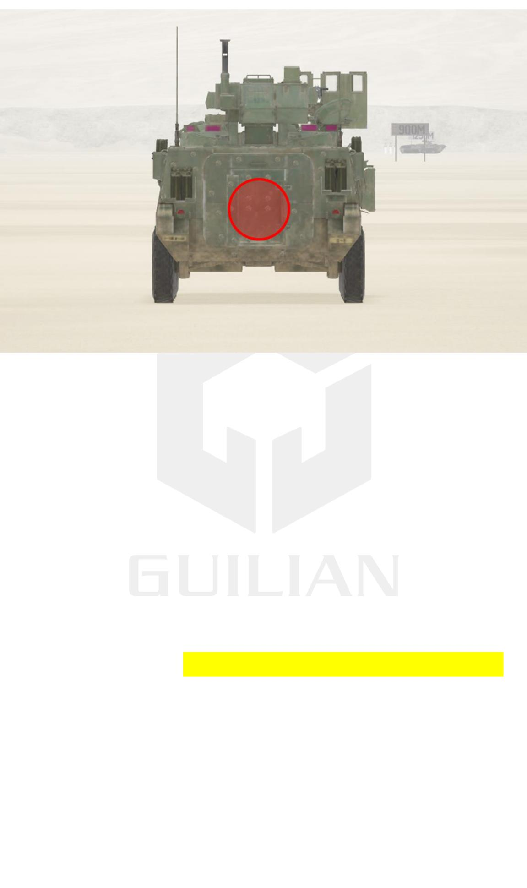
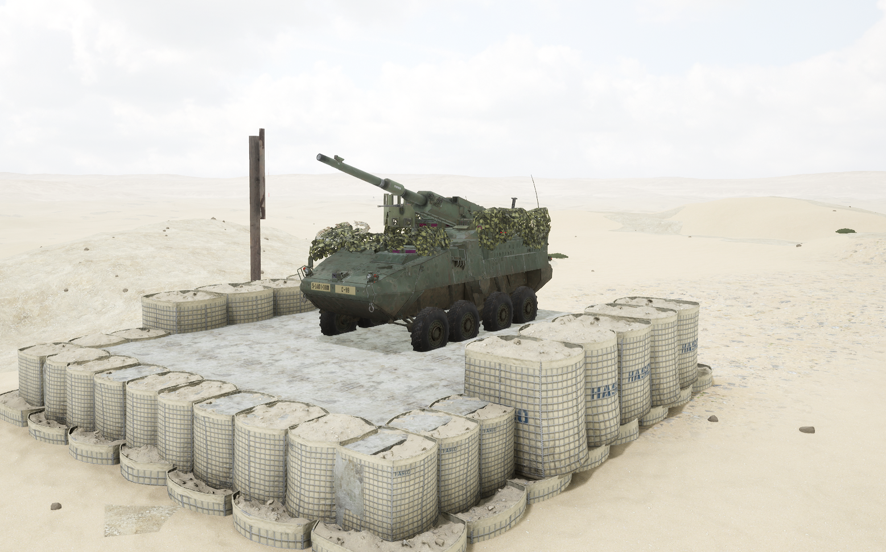
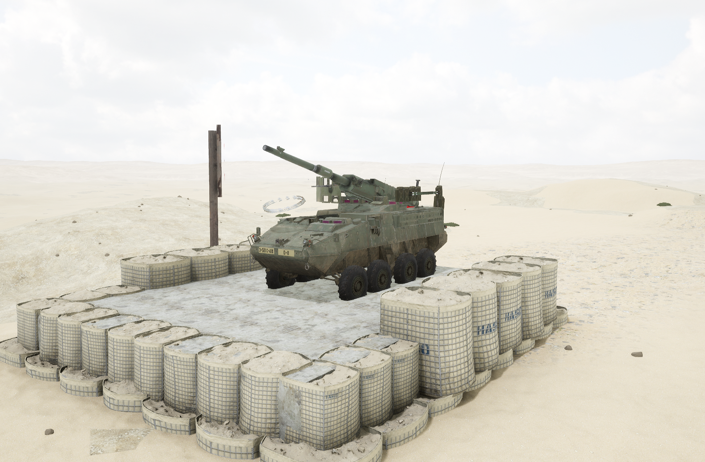

# M1128


想当 Squad 服主？50 元/月起就能拿下入门款专属服务器！[南赛云](https://server.squadovo.cn/)是高性价比开服首选，低价不低质，让您轻松启动专属战局，低成本圆服主梦～


M1128 MGS 是斯崔克战车家族中的八轮突击炮。

## 基本数据

| 数据名称     | 值         |
| -------- | --------- |
| 载具血量     | 1250      |
| 最大载员人数   | 4         |
| 最大载弹量    | 600       |
| 是否为两栖载具  | 否         |
| 是否具备 STA | 是         |
| 瞄具可缩放倍数  | 3.0x、8.0x |
| 价值兵力点    | 15        |
| 炮塔血量     | 600（包含在总血量内） |
| 换弹时间     | 6s |
| 备弹        | 6/8/3（AP/HE/WP） |
| 穿深        | 800/400/0（AP/HE/WP） |

## 装备的阵营

* [USA | 美国陆军](../../../team/usa.md)

## 武器数据



* 子弹数量：1 x 6
* 射击间隙：1.0s
* 装填时间：6.0s
* 最大穿深：800
* 最大伤害：8000
* 爆炸伤害：0
* 安全距离：0m



* 子弹数量：1 x 10
* 射击间隙：0s
* 装填时间：6.0s
* 最大穿深：400
* 最大伤害：1900
* 爆炸伤害：200
* 安全距离：0m



* 子弹数量：2000 x 1
* 射击间隙：0.07s
* 装填时间：11.28s&#x20;
* 最大穿深：7
* 最大伤害：86
* 爆炸伤害：200
* 安全距离：0m



* 子弹数量：2 x 1
* 射击间隙：1s
* 装填时间：1s
* 最大穿深：0
* 最大伤害：0
* 爆炸伤害：0
* 安全距离：0m



* 子弹数量：2 x 1
* 射击间隙：0s
* 装填时间：6.0s
* 最大穿深：0
* 最大伤害：0
* 爆炸伤害：0
* 安全距离：0m



## 载具对抗指南

### 弱点分析

- **正面：** M1128 的底盘和 M1126 相同，发动机位置也一样。发动机后方红色区域部分弹药架暴露，两处橙色区域可被 12.7 打穿，蓝色区域 1 为手摇重机枪区域，不算近车体区域内，攻击此处不会造成伤害。
- **侧面：** 1128 除两侧蓝色区域 2 和右侧蓝色区域 3 外其他区域均可被 12.7 打穿。两处红色区域为双弹药架，位置在从后两轮上方靠后，高度为车体的中部。
- **后面：** 后面所有区域均不防 12.7。

### 载具玩法

* 斯崔克系列的驾驶手感在轮战中是很不错的，对于新手驾驶员非常友好，可以放心大胆地开。
* 1128 的血量和章鱼一样都为 1250，坦克两炮打炸。
* 1128 装备一门 105mm 炮，性能极强，换弹时间为火炮中史无前例的 6s，这使得其强度飙升，甚至有单挑 T72、豹 2 等比较容易被穿弹药架的坦克的能力。
* 炮手注意 1128 仅配备了 6 发穿甲弹，容错率极低，不见到敌方坦克、步战车的情况下不要用，补给卡等载具使用破甲弹就好。
* 驾驶员注意尽量不要做漂移之类的大幅度动作，炮塔会甩上天的，1128 的方向机太差劲，甚至连正常拐个弯都跟不上。
* v9.0 版本后 1128 丛林版炮塔独立血量和全系弹药架数值异常问题已经全部修复，以前的玩法习惯要改一改了。

### 对抗建议

* 坦克打 1128 不会像打 ZLT05 或章鱼那么轻松，1128 的换弹时间太快，如果两发不空不跳的情况下你需要跟它互换两炮才能拿下，如果它和坦克一起行动那情况会更糟。建议优先攻击炮塔使其失去反击能力。
* 带导弹的步战车，大致可参考布莱德利篇。
* 不带导弹的步战车，在近距离锁定攻击 1128 的炮塔，1128 方向机不好使，近距离尽量和它绕圈子。远距离吃一炮后要迅速撤退不可恋战。
* 只有 12.7mm（.50）重机枪的载具（如各家侦察车），看见了赶紧跑，别上来送（想偷袭除外）。
* v9.0 版本后 1128 丛林版炮塔独立血量和全系弹药架数值异常问题已经全部修复，弹药架可以成为你攻击 1128 的首选目标了。1128 和 08 一样正面发动机未能全部保护住弹药架，因此即使是正面也可以尝试一炮点。

### 图示

<figure><figcaption>正视图与侧视图</figcaption></figure>

<figure><figcaption>后视图</figcaption></figure>

## 载具实图

<figure><figcaption></figcaption></figure>

<figure><figcaption></figcaption></figure>
