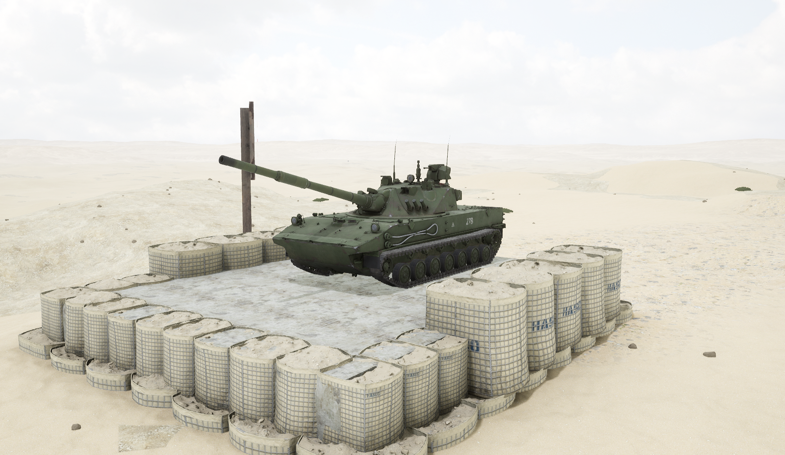
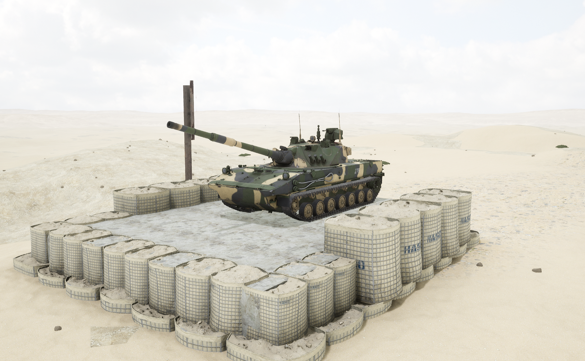

# SDM1&#x20;


想当 Squad 服主？50 元/月起就能拿下入门款专属服务器！[南赛云](https://server.squadovo.cn/)是高性价比开服首选，低价不低质，让您轻松启动专属战局，低成本圆服主梦～


Sprut-SDM1 轻型水上坦克，可在水陆两栖环境中灵活执行任务。

## 基本数据

| 数据名称     | 值          |
| -------- | ---------- |
| 载具血量     | 1250       |
| 最大载员人数   | 3          |
| 最大载弹量    | 600        |
| 是否为两栖载具  | 是          |
| 是否具备 STA | 是          |
| 瞄具可缩放倍数  | 4.0x、12.0x |
| 价值兵力点    | 15         |

## 装备的阵营

* [RGF | 俄罗斯陆军](../../../team/rgf.md)

## 武器数据



* 子弹数量：1 x 14
* 射击间隙：0s
* 装填时间：8.0s
* 最大穿深：800
* 最大伤害：8000
* 爆炸伤害：0
* 安全距离：0m



* 子弹数量：1 x 6
* 射击间隙：0s
* 装填时间：8.0s
* 最大穿深：500
* 最大伤害：1900
* 爆炸伤害：200
* 安全距离：0m



* 子弹数量：2500 x 1
* 射击间隙：0.085s
* 装填时间：11.28s
* 最大穿深：7
* 最大伤害：97&#x20;
* 爆炸伤害：200&#x20;
* 安全距离：0m



* 子弹数量：2 x 1&#x20;
* 射击间隙：1s&#x20;
* 装填时间：1s&#x20;
* 最大穿深：0&#x20;
* 最大伤害：0&#x20;
* 爆炸伤害：0&#x20;
* 安全距离：0m



* 子弹数量：1 x 2&#x20;
* 射击间隙：0.085s&#x20;
* 装填时间：8.0s&#x20;
* 最大穿深：500&#x20;
* 最大伤害：3000&#x20;
* 爆炸伤害：153&#x20;
* 安全距离：123m



* 子弹数量：1 x 14&#x20;
* 射击间隙：0s&#x20;
* 装填时间：8.0s&#x20;
* 最大穿深：10&#x20;
* 最大伤害：200&#x20;
* 爆炸伤害：300&#x20;
* 安全距离：0m



## 载具实图

<figure><figcaption></figcaption></figure>

<figure><figcaption></figcaption></figure>
