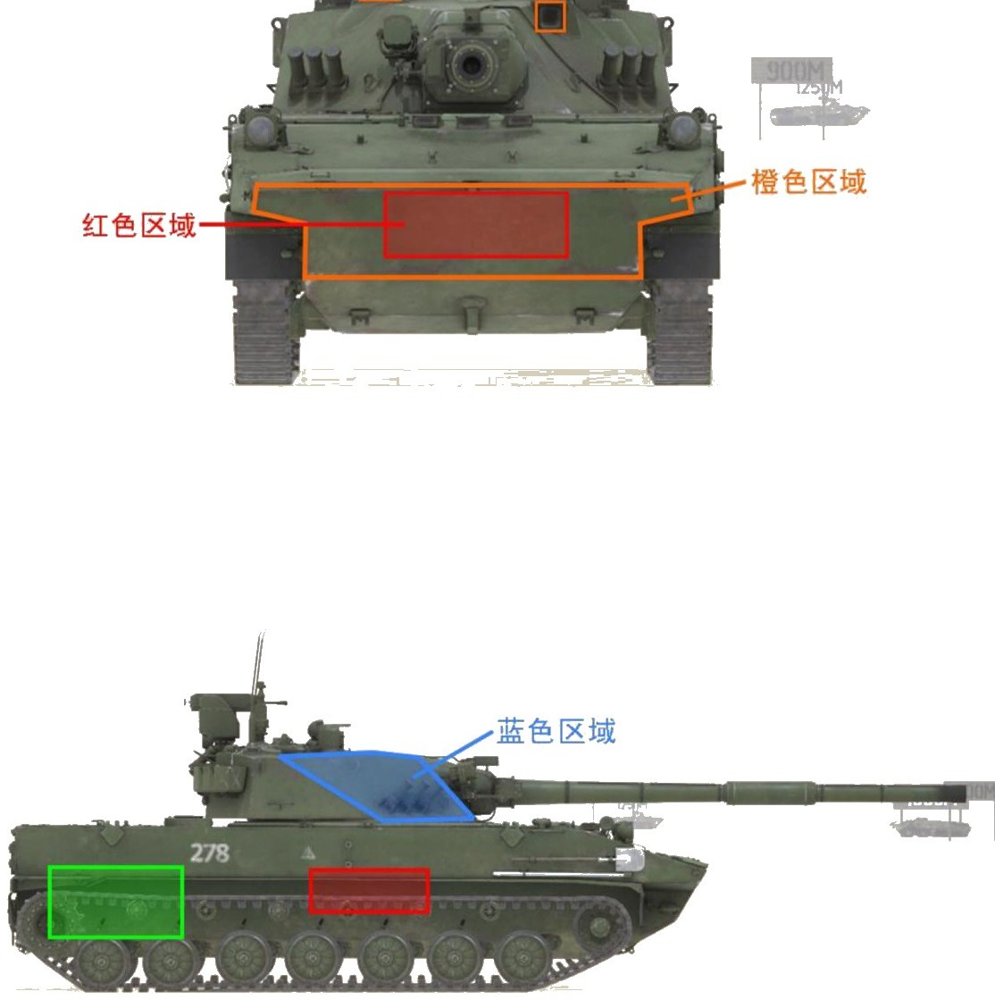
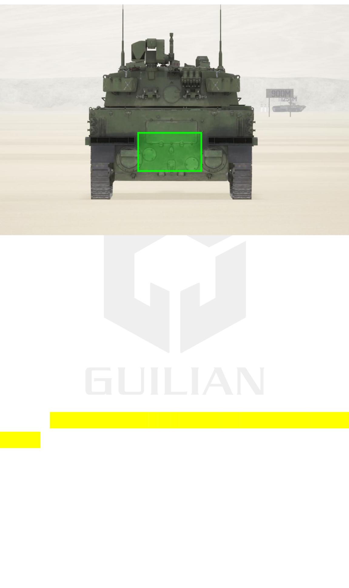
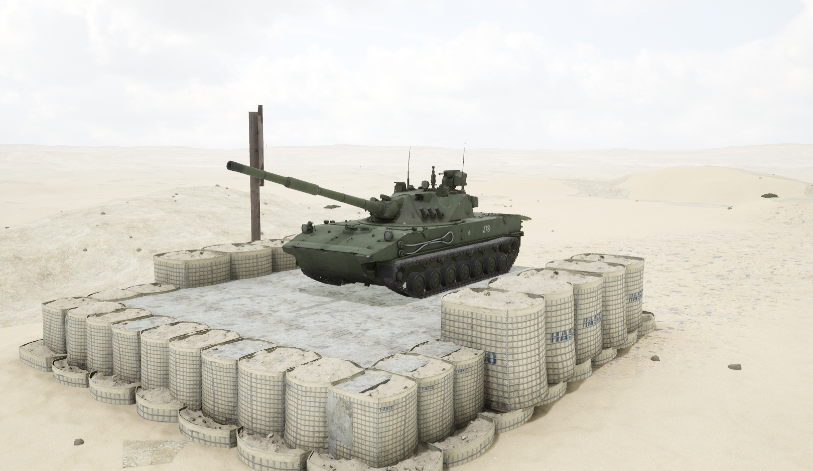
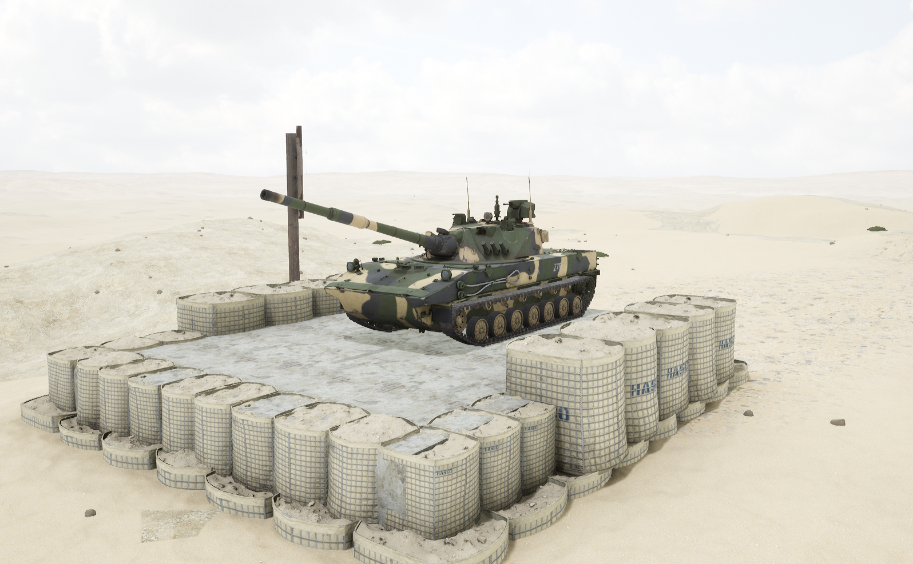

# SDM1&#x20;


想当 Squad 服主？50 元/月起就能拿下入门款专属服务器！[南赛云](https://server.squadovo.cn/)是高性价比开服首选，低价不低质，让您轻松启动专属战局，低成本圆服主梦～


Sprut-SDM1 轻型水上坦克，可在水陆两栖环境中灵活执行任务。

## 基本数据

| 数据名称     | 值          |
| -------- | ---------- |
| 载具血量     | 1250       |
| 最大载员人数   | 3          |
| 最大载弹量    | 600        |
| 是否为两栖载具  | 是          |
| 是否具备 STA | 是          |
| 瞄具可缩放倍数  | 4.0x、12.0x |
| 价值兵力点    | 15         |
| 炮塔血量     | 300（包含在总血量内） |
| 换弹时间     | 8s |
| 备弹        | 14/6/14/2（AP/HE/HF/GM） |
| 穿深        | 800/500/10/500（AP/HE/HF/GM） |

## 装备的阵营

* [RGF | 俄罗斯陆军](../../../team/rgf.md)

## 武器数据



* 子弹数量：1 x 14
* 射击间隙：0s
* 装填时间：8.0s
* 最大穿深：800
* 最大伤害：8000
* 爆炸伤害：0
* 安全距离：0m



* 子弹数量：1 x 6
* 射击间隙：0s
* 装填时间：8.0s
* 最大穿深：500
* 最大伤害：1900
* 爆炸伤害：200
* 安全距离：0m



* 子弹数量：2500 x 1
* 射击间隙：0.085s
* 装填时间：11.28s
* 最大穿深：7
* 最大伤害：97&#x20;
* 爆炸伤害：200&#x20;
* 安全距离：0m



* 子弹数量：2 x 1&#x20;
* 射击间隙：1s&#x20;
* 装填时间：1s&#x20;
* 最大穿深：0&#x20;
* 最大伤害：0&#x20;
* 爆炸伤害：0&#x20;
* 安全距离：0m



* 子弹数量：1 x 2&#x20;
* 射击间隙：0.085s&#x20;
* 装填时间：8.0s&#x20;
* 最大穿深：500&#x20;
* 最大伤害：3000&#x20;
* 爆炸伤害：153&#x20;
* 安全距离：123m



* 子弹数量：1 x 14&#x20;
* 射击间隙：0s&#x20;
* 装填时间：8.0s&#x20;
* 最大穿深：10&#x20;
* 最大伤害：200&#x20;
* 爆炸伤害：300&#x20;
* 安全距离：0m



## 载具对抗指南

### 弱点分析

- **正面：** 章鱼是后置发动机，红色区域弹药架就在首下正中间，前方没有任何保护，坦克可以一炮打穿。橙色区域不可防 12.7，机炮则不受限制。
- **侧面：** 章鱼侧面除蓝色区域外其他位置均可被 12.7 打穿。红色区域弹药架没有任何防护，位置在从前往后数第 3、第 4 负重轮正上方、炮塔正下方，高度为车体的中部，坦克可以一炮打穿。
- **后面：** 从后面无法伤到弹药架，只能打炸发动机，但后面所有区域均不防 12.7。

### 载具玩法

* 章鱼的驾驶手感算是非常不错的，提速快、稳定性好、不容易跑偏打滑，转弯也非常灵敏，面对急弯往往不需要拉手刹就能一把转过去，对于新手驾驶员还是非常友好的。
* 章鱼的血量和 ZLT05 一样都为 1250，坦克两炮打炸。
* 章鱼的护甲和步战车是同一水平，机炮和坦克炮打上去基本不会跳弹，因此别想将埋头、摆头之类的技巧运用到这里来，没有用。
* 章鱼装备一门 125mm 炮，套用的 T72 的数据，性能和弹药种类均与 T72 相同，换弹时间为 8s，比 ZLT05 要好不少。
* 章鱼单体生存能力较弱，与坦克协同、作为坦克的附加火力使用最佳。
* 驾驶员注意尽量不要做漂移之类的大幅度动作，章鱼那个方向机太差劲，炮塔会甩上天的。

### 对抗建议

* 坦克打章鱼不会像打 ZLT05 那么轻松，章鱼本身的机动性和火力就不差。会玩的章鱼车组往往会跟随坦克一起行动，这时就需要根据战场形势和自身实力来判断是打还是撤。
* 带导弹的步战车，大致可参考布莱德利篇。
* 不带导弹的步战车，在近距离锁定攻击章鱼的炮塔，它最多打一发，换弹的 8s 足够让你将它的炮塔锁死。远距离吃一炮后要迅速撤退不可恋战。
* 只有 12.7mm（.50）重机枪的载具（如 M1126 斯崔克），正面遇到章鱼能跑就跑。虽然章鱼可攻击面积较大，但火力并不是 12.7 能够惹得起的，只能看情况偷袭耗血，不要想着跟他单挑。

### 图示

<figure><figcaption>正视图与侧视图</figcaption></figure>

<figure><figcaption>后视图</figcaption></figure>

## 载具实图

<figure><figcaption></figcaption></figure>

<figure><figcaption></figcaption></figure>
