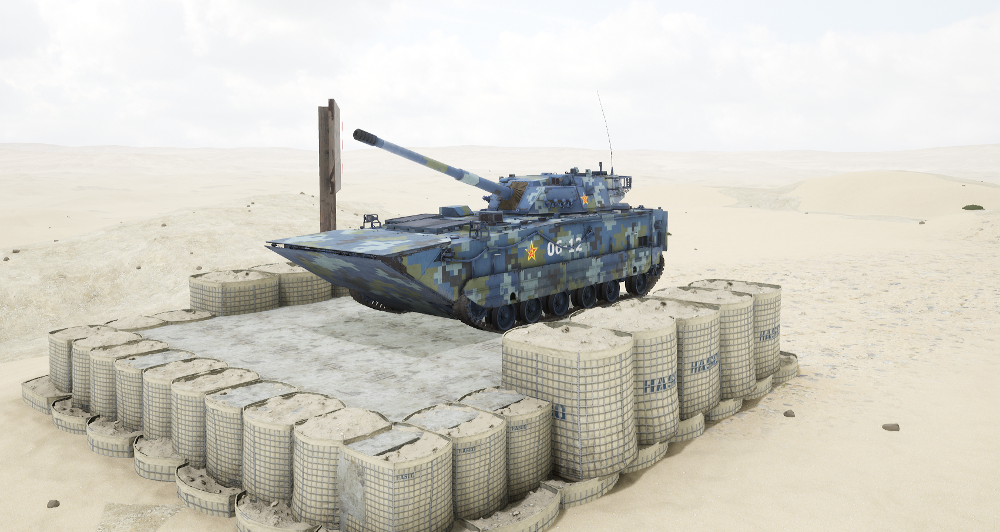

# ZLT05


想当 Squad 服主？50 元/月起就能拿下入门款专属服务器！[南赛云](https://server.squadovo.cn/)是高性价比开服首选，低价不低质，让您轻松启动专属战局，低成本圆服主梦～


ZLT-05 两栖突击车是中华人民共和国全新打造的两栖装甲突击载具。

## 基本数据

| 数据名称     | 值         |
| -------- | --------- |
| 载具血量     | 1250      |
| 最大载员人数   | 3         |
| 最大载弹量    | 600       |
| 是否为两栖载具  | 是         |
| 是否具备 STA | 是         |
| 瞄具可缩放倍数  | 3.0x、7.0x |
| 价值兵力点    | 15        |

## 装备的阵营

* [PLA | 中国人民解放军](../../../team/pla.md)
* [PLANMC | 中国人民解放军海军陆战队](../../../team/planmc.md)
* [AGF | 中国人民解放军两栖部队](../../../team/plaagf.md)

## 武器数据



* 子弹数量：1 x 12
* 射击间隙：0s
* 装填时间：9.0s
* 最大穿深：550
* 最大伤害：8000
* 爆炸伤害：0
* 安全距离：0m



* 子弹数量：1 x 8
* 射击间隙：0s
* 装填时间：9.0s
* 最大穿深：450
* 最大伤害：1900
* 爆炸伤害：200
* 安全距离：0m



* 子弹数量：2500 x 1
* 射击间隙：0.085s&#x20;
* 装填时间：11.28s
* 最大穿深：7
* 最大伤害：97
* 爆炸伤害：0
* 安全距离：0m



* 子弹数量：2 x 1
* 射击间隙：1s
* 装填时间：1s
* 最大穿深：0
* 最大伤害：0
* 爆炸伤害：0
* 安全距离：0m



* 子弹数量：1 x 20
* 射击间隙：0s
* 装填时间：9.0s
* 最大穿深：10
* 最大伤害：200
* 爆炸伤害：300
* 安全距离：0m



## 载具实图

<figure><figcaption></figcaption></figure>
