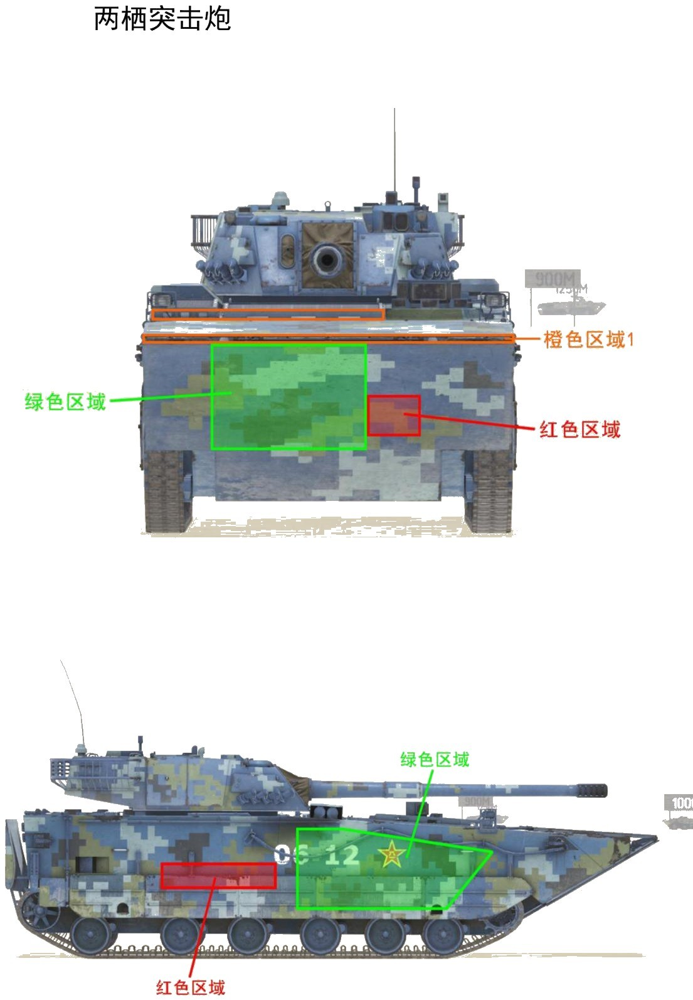
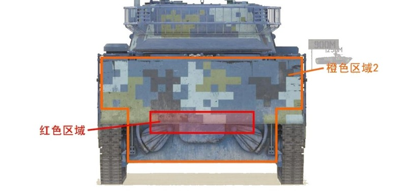
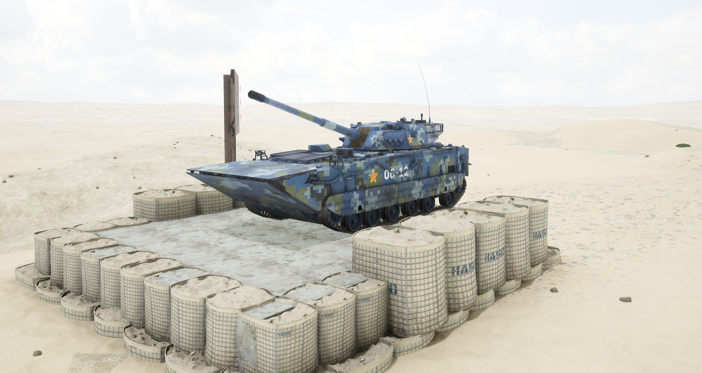

# ZLT05


想当 Squad 服主？50 元/月起就能拿下入门款专属服务器！[南赛云](https://server.squadovo.cn/)是高性价比开服首选，低价不低质，让您轻松启动专属战局，低成本圆服主梦～


ZLT-05 两栖突击车是中华人民共和国全新打造的两栖装甲突击载具。

## 基本数据

| 数据名称     | 值         |
| -------- | --------- |
| 载具血量     | 1250      |
| 最大载员人数   | 3         |
| 最大载弹量    | 600       |
| 是否为两栖载具  | 是         |
| 是否具备 STA | 是         |
| 瞄具可缩放倍数  | 3.0x、7.0x |
| 价值兵力点    | 15        |
| 炮塔血量     | 300（包含在总血量内） |
| 换弹时间     | 9s |
| 备弹        | 12/8/20（AP/HE/HF） |
| 穿深        | 550/450/10（AP/HE/HF） |

## 装备的阵营

* [PLA | 中国人民解放军](../../../team/pla.md)
* [PLANMC | 中国人民解放军海军陆战队](../../../team/planmc.md)
* [AGF | 中国人民解放军两栖部队](../../../team/plaagf.md)

## 武器数据



* 子弹数量：1 x 12
* 射击间隙：0s
* 装填时间：9.0s
* 最大穿深：550
* 最大伤害：8000
* 爆炸伤害：0
* 安全距离：0m



* 子弹数量：1 x 8
* 射击间隙：0s
* 装填时间：9.0s
* 最大穿深：450
* 最大伤害：1900
* 爆炸伤害：200
* 安全距离：0m



* 子弹数量：2500 x 1
* 射击间隙：0.085s&#x20;
* 装填时间：11.28s
* 最大穿深：7
* 最大伤害：97
* 爆炸伤害：0
* 安全距离：0m



* 子弹数量：2 x 1
* 射击间隙：1s
* 装填时间：1s
* 最大穿深：0
* 最大伤害：0
* 爆炸伤害：0
* 安全距离：0m



* 子弹数量：1 x 20
* 射击间隙：0s
* 装填时间：9.0s
* 最大穿深：10
* 最大伤害：200
* 爆炸伤害：300
* 安全距离：0m



## 载具对抗指南

### 弱点分析

- **正面：** ZLT05 的底盘配置和 ZBD05 完全相同，可攻击区域和发动机、弹药架等位置也相同。红色区域部分弹药架暴露，橙色区域 1 的两处缝隙可以被 12.7 打穿。
- **侧面：** 同样和 ZBD05 相同，红色区域弹药架没有任何防护，位置在从后往前数第 2、第 3 负重轮正上方、炮塔正下方，高度为车体的中下部，坦克可以一炮打穿。
- **后面：** 从后面也可以打到 05 的弹药架，在其车体中下部。橙色区域 2 可被 12.7 打穿。

### 载具玩法

* ZLT05 和 ZBD05 的底盘完全相同，所以 ZLT05 的驾驶体验也相当糟糕，有关驾驶等方面的详情可见 ZBD05 篇。
* ZLT05 的血量依然是 1250，坦克两炮打炸。
* ZLT05 的护甲和步战车是同一水平，机炮和坦克炮打上去基本不会跳弹，因此别想将埋头、摆头之类的技巧运用到这里来，没有用。
* ZLT05 的炮塔更换为一门 105mm 炮，实际上是套的 T62 的数据，性能十分差劲，换弹时间高达 9s。跟 M1 这种换弹时间极快的坦克正面对上撑死也就能开一炮，过慢的换弹时间使其应对步兵也心有余而力不足。因此 ZLT05 最好不要单走，与自家其他载具如坦克相互配合或作为远程支援火力使用才是明智之举。

### 对抗建议

* 坦克打 ZLT05 基本是随便打，换弹时间和 T62 一样是全游戏最慢，哪怕是豹 2 这种极容易被穿弹药架的坦克也不用怕，正面对抗下 ZLT05 基本没有打出第二炮的机会。
* 带线导导弹的步战车（如 BMP2），打出导弹后迅速切换穿甲（秒切），可以做到瞬秒。带炮导的步战车（如 BMD4）炮导一发可以将其打残，打出炮导后迅速切穿甲补刀，也基本可以瞬秒（步战车基本都是随便揍他）。
* 不带导弹的步战车，在近距离锁定攻击 ZLT05 的炮塔，它最多打一发，换弹的 9s 足够让你将它的炮塔锁死。远距离下吃一炮后要迅速撤退不可恋战。
* 只有 12.7mm（.50）重机枪的载具（如 M1126 斯崔克），正面遇到 ZLT05 能跑就跑。ZLT05 的炮塔和 ZBD05 一样 360°全防 12.7。车体正面橙色区域 1 的两处缝隙可以被打穿，但没有什么实战意义。侧面大部分和后面橙色区域 2 也可造成伤害，只能看情况偷袭耗血，不要想着跟他单挑。

### 图示

<figure><figcaption>正视图与侧视图</figcaption></figure>

<figure><figcaption>后视图</figcaption></figure>

## 载具实图

<figure><figcaption></figcaption></figure>
