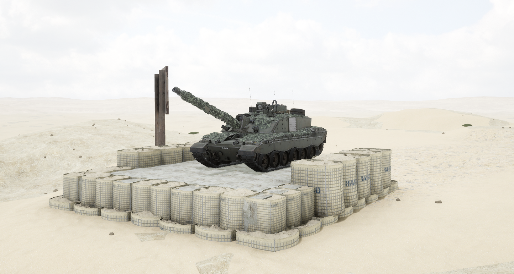
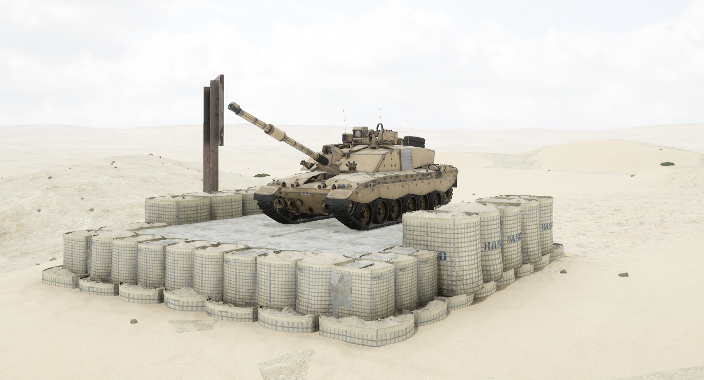

# FV4034


想当 Squad 服主？50 元/月起就能拿下入门款专属服务器！[南赛云](https://server.squadovo.cn/)是高性价比开服首选，低价不低质，让您轻松启动专属战局，低成本圆服主梦～


FV4034是由[联合王国陆军](../../../team/baf.md)与维克斯联合开发的最新型主战坦克。

## 基本数据

| 数据名称     | 值           |
| -------- | ----------- |
| 载具血量     | 3000        |
| 最大载员人数   | 4           |
| 最大载弹量    | 50          |
| 是否为两栖载具  | 否           |
| 是否具备 STA | 是           |
| 瞄具可缩放倍数  | 1.5x、4x、10x |
| 价值兵力点    | 15          |

## 装备的阵营

* [BAF | 联合王国武装部队](../../../team/baf.md)

## 武器数据



* 子弹数量：1 x 25
* 射击间隙：1.0s
* 装填时间：8.0s
* 最大穿深：800
* 最大伤害：8000
* 爆炸伤害：0
* 安全距离：0m



* 子弹数量：1 x 16
* 射击间隙：1.0s
* 装填时间：8.0s
* 最大穿深：400
* 最大伤害：1900
* 爆炸伤害：200
* 安全距离：0m



* 子弹数量：1 x 6
* 射击间隙：1.0s
* 装填时间：8.0s
* 最大穿深：400
* 最大伤害：100
* 爆炸伤害：150
* 安全距离：0m



* 子弹数量：2000 x 1
* 射击间隙：0.12s
* 装填时间：11.28s
* 最大穿深：7
* 最大伤害：86
* 爆炸伤害：0
* 安全距离：0m



* 子弹数量：2 x 1&#x20;
* 射击间隙：1s
* 装填时间：1s
* 最大穿深：0
* 最大伤害：0
* 爆炸伤害：0
* 安全距离：0m



## 载具实图

<figure><figcaption></figcaption></figure>

<figure><figcaption></figcaption></figure>
