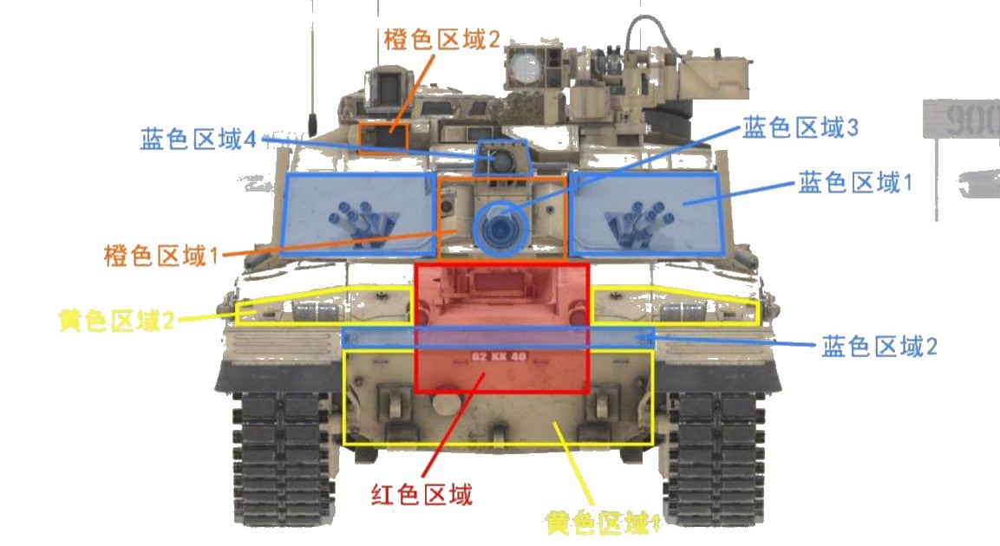
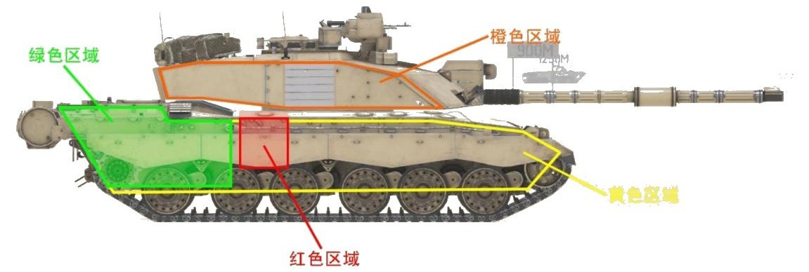
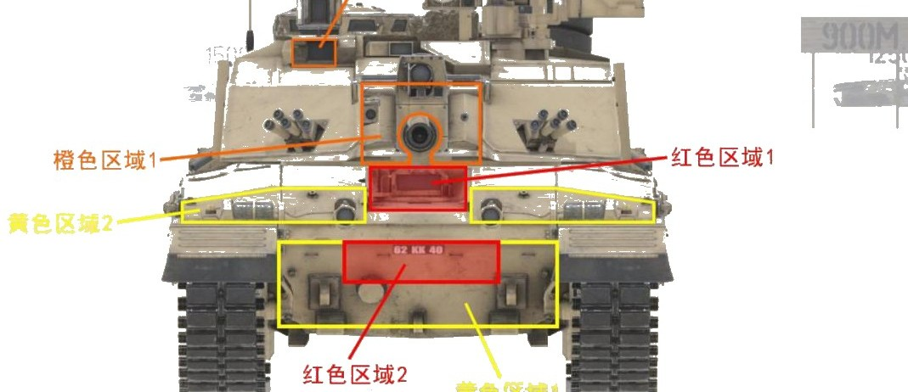
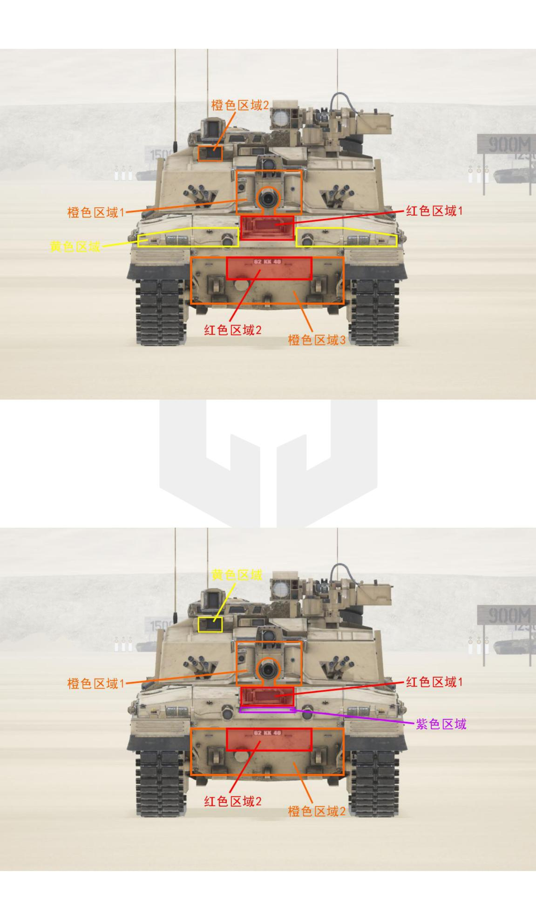
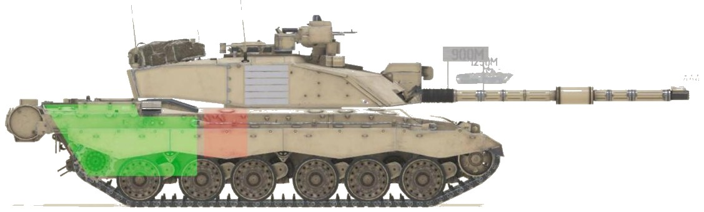
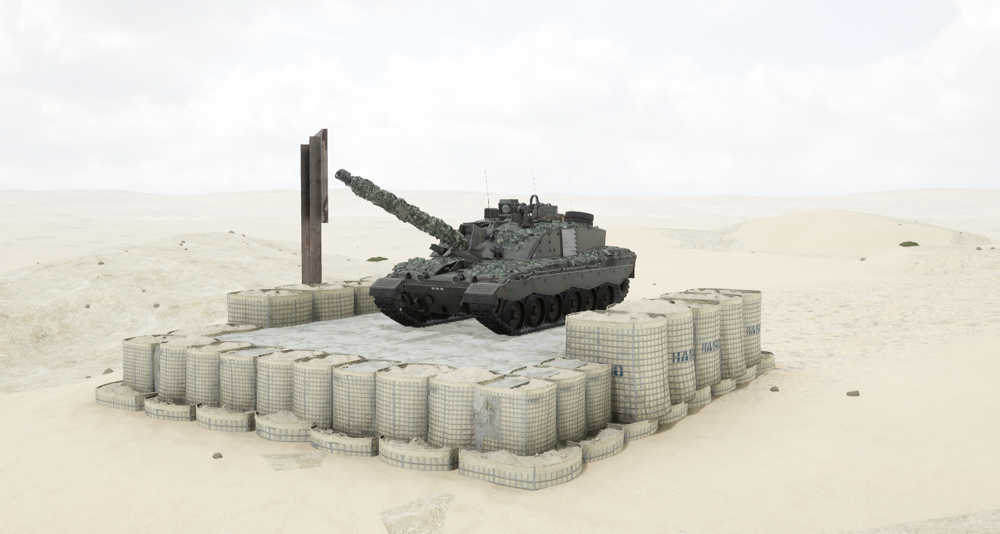
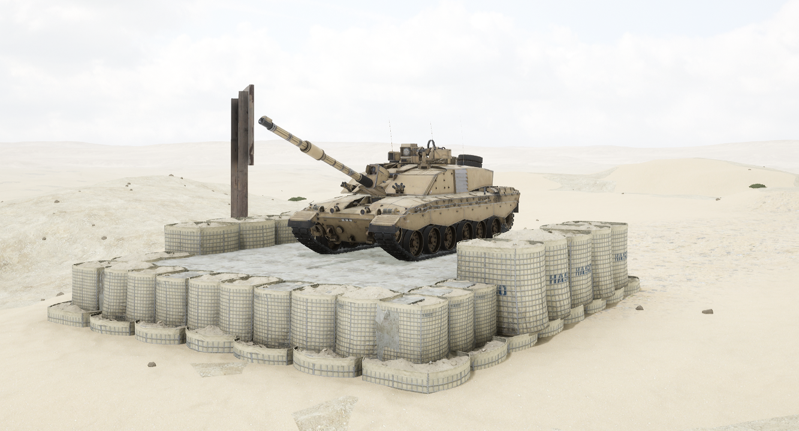

# FV4034


想当 Squad 服主？50 元/月起就能拿下入门款专属服务器！[南赛云](https://server.squadovo.cn/)是高性价比开服首选，低价不低质，让您轻松启动专属战局，低成本圆服主梦～


FV4034 是由[联合王国陆军](../../../team/baf.md)与维克斯联合开发的最新型主战坦克。

## 基本数据

| 数据名称     | 值           |
| -------- | ----------- |
| 载具血量     | 3000        |
| 最大载员人数   | 4           |
| 最大载弹量    | 50          |
| 是否为两栖载具  | 否           |
| 是否具备 STA | 是           |
| 瞄具可缩放倍数  | 1.5x、4x、10x |
| 价值兵力点    | 15          |
| 炮塔血量     | 2000（包含在总血量内） |
| 换弹时间     | 8s |
| 备弹       | AP 25 / HE 16 / WP 6 |
| 穿深       | AP 800 / HE 400 / WP 0 |

## 装备的阵营

* [BAF | 联合王国武装部队](../../../team/baf.md)

## 武器数据



* 子弹数量：1 x 25
* 射击间隙：1.0s
* 装填时间：8.0s
* 最大穿深：800
* 最大伤害：8000
* 爆炸伤害：0
* 安全距离：0m



* 子弹数量：1 x 16
* 射击间隙：1.0s
* 装填时间：8.0s
* 最大穿深：400
* 最大伤害：1900
* 爆炸伤害：200
* 安全距离：0m



* 子弹数量：1 x 6
* 射击间隙：1.0s
* 装填时间：8.0s
* 最大穿深：400
* 最大伤害：100
* 爆炸伤害：150
* 安全距离：0m



* 子弹数量：2000 x 1
* 射击间隙：0.12s
* 装填时间：11.28s
* 最大穿深：7
* 最大伤害：86
* 爆炸伤害：0
* 安全距离：0m



* 子弹数量：2 x 1&#x20;
* 射击间隙：1s
* 装填时间：1s
* 最大穿深：0
* 最大伤害：0
* 爆炸伤害：0
* 安全距离：0m



## 载具对抗指南

### 弱点分析

- **正面：** 炮塔主装甲无敌且完全不受角度限制，几乎没有任何手段能够击穿，包括全威力导弹；车体首上和首下的分界线同样几乎无法击穿，包括全威力导弹，要有意识避开；挑 2 是唯一一个可以用正面炮管抵挡坦克炮弹的坦克，击中炮管有概率跳弹，远距离时较高发；炮管上的战视镜被击中会出现正常受击特效但坦克不掉血，实际是击中了后方的倾斜跳弹区；大面积的首下攻击几乎不会跳弹；车体首上小面积区域可击穿但一般不打；炮闩脆弱、面积很大但有炮管保护；观瞄镜脆弱但面积很小，一般不打；正面弹药架投影中有一部分处在蓝色区域 2（首上/首下分界线）的保护之下。
- **侧面：** 车体侧面在裙板和履带完好的情况下有一定程度减伤；炮塔侧面脆弱，坦克炮攻击几乎不会跳弹；弹药架侧面位于从前往后数第 4、第 5 负重轮正上，高度为裙板的全部；侧面有面积很大的发动机体表投影，攻击可使其失去动力而瘫痪。

### 载具玩法

- 拥有不输 M1 的机动性和驾驶手感，可以充分发挥机动优势打游击战。
- 因正面弹药架暴露过多，不适合正面硬刚，战斗中尽量寻找埋头位，充分利用头铁优势；炮塔主装甲是无条件跳弹，可以毫无拘束地摆头迎弹。
- 紧急迎战难以迅速找到埋头位时，驾驶员可以采用发动机迎弹策略（注意俯角）。
- 尽力保护好弹药架，只要不被穿弹药架，挑 2 的上限还是很高的。

### 对抗建议

- 正面可攻击区域（坦克）优先级：红色区域 1 > 红色区域 2 > 橙色区域 1（炮闩）> 黄色区域 1（首下）。
- 全威力导弹：炮塔主装甲区域全防导弹，但炮管有一定几率将导弹拦截；红色区域依然是最优先的攻击目标，黄色区域能造成有效伤害但没什么意义。
- 非全威力导弹：红色区域弹药架依然最优先，但仅有"婴儿"和 AFT07C 能够从正面直接点燃弹药架，"竞赛"和所有炮射导弹都没有这个能力；注意不要打到紫色区域的斜面，会跳弹（坦克也一样）；求稳最好打橙色区域 2 的首下，这里所有导弹都可打穿且几乎不会跳弹。
- 侧面攻击弹药架：挑 2 同样是弹药架中置，无论左右，除了炮射导弹以外所有反坦克导弹都可以一发点燃弹药架；重筒在两侧可造成不小的伤害，但很难一发点燃。

### 图示

<figure><figcaption>图29-1 正视图1</figcaption></figure>

<figure><figcaption>图30-1 侧视图1</figcaption></figure>

<figure><figcaption>图31-1 正面可攻击区域（坦克）</figcaption></figure>

<figure><figcaption>图32-1/32-2 正面可攻击区域（全威力/非全威力导弹）</figcaption></figure>

<figure><figcaption>图33-1 侧面攻击弹药架</figcaption></figure>

## 载具实图

<figure><figcaption></figcaption></figure>

<figure><figcaption></figcaption></figure>
