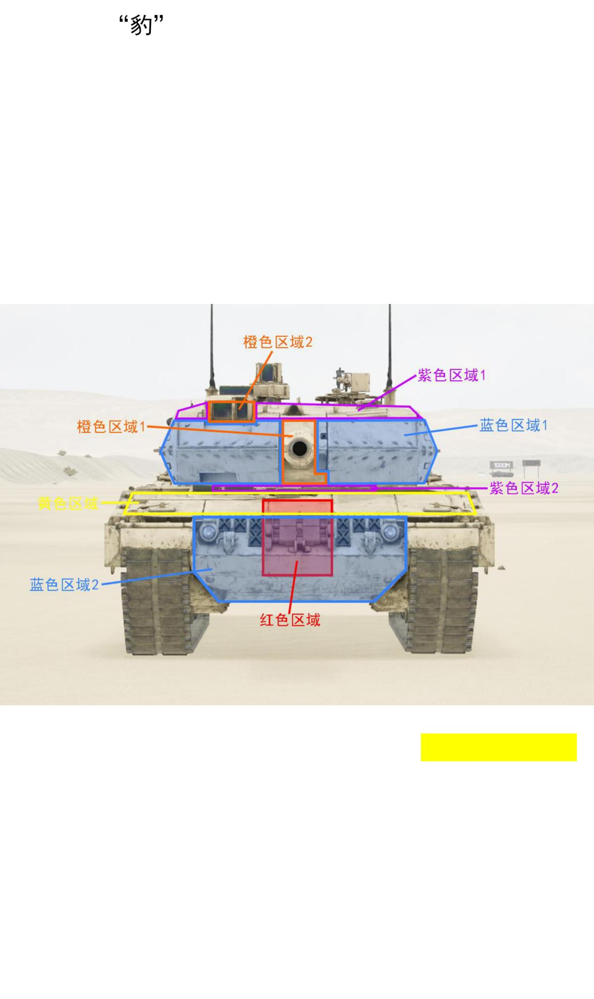
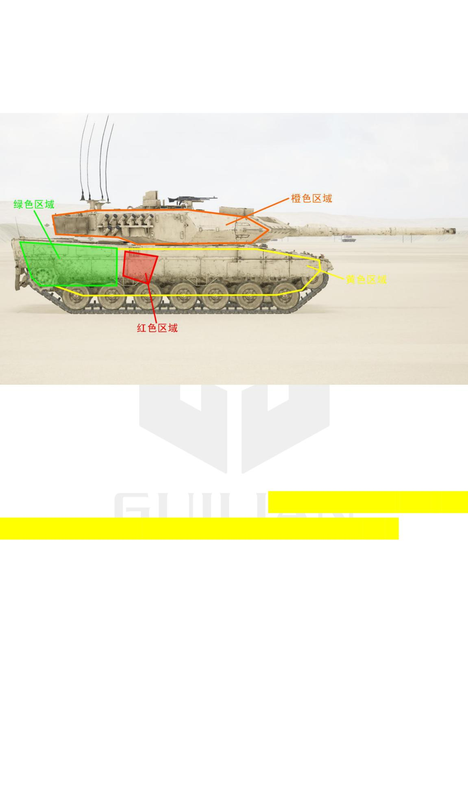
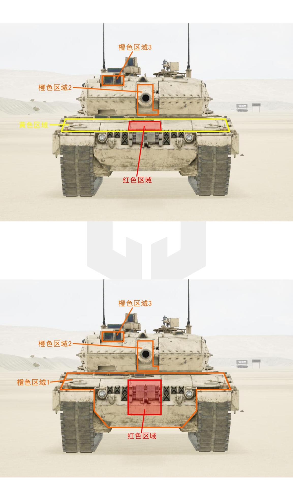
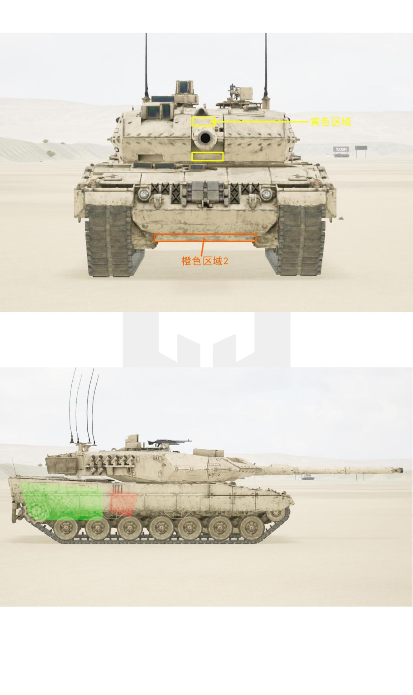
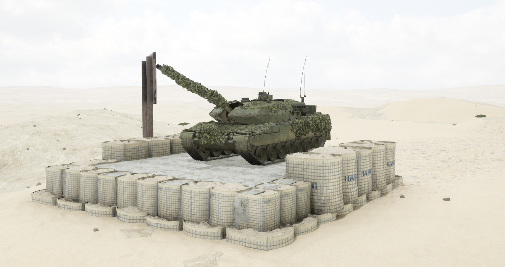
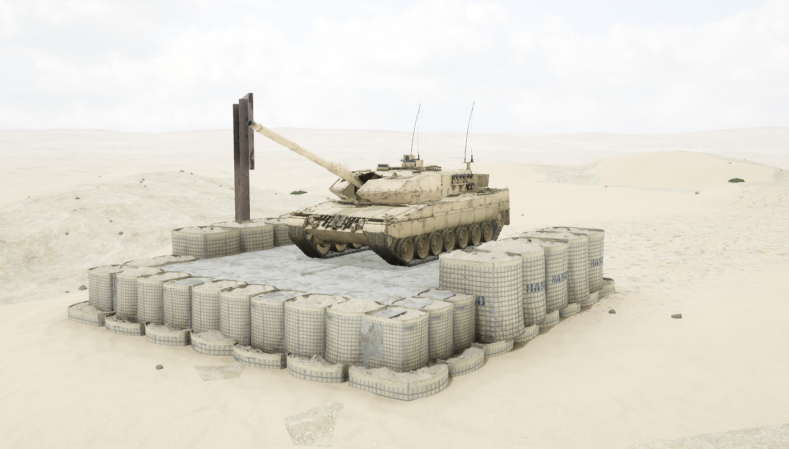

# Leopard 2A6M CAN


想当 Squad 服主？50 元/月起就能拿下入门款专属服务器！[南赛云](https://server.squadovo.cn/)是高性价比开服首选，低价不低质，让您轻松启动专属战局，低成本圆服主梦～


Leopard 2A6M CAN 是德国豹 2A6 主战坦克的加拿大版本。

## 基本数据

| 数据名称     | 值      |
| -------- | ------ |
| 载具血量     | 3000   |
| 最大载员人数   | 4      |
| 最大载弹量    | 50     |
| 是否为两栖载具  | 否      |
| 是否具备 STA | 是      |
| 瞄具可缩放倍数  | 3x、12x |
| 价值兵力点    | 15     |
| 炮塔血量     | 2000（包含在总血量内） |
| 换弹时间     | 8s |
| 备弹       | AP 21 / HE 21 |
| 穿深       | AP 800 / HE 400 |

## 装备的阵营

* [CAF | 加拿大武装部队](../../../team/caf.md)

## 武器数据



* 子弹数量：1 x 21
* 射击间隙：1.0s
* 装填时间：8.0s
* 最大穿深：800
* 最大伤害：8000
* 爆炸伤害：0
* 安全距离：0m



* 子弹数量：1 x 21
* 射击间隙：1.0s
* 装填时间：8.0s
* 最大穿深：400
* 最大伤害：1900
* 爆炸伤害：200
* 安全距离：0m



* 子弹数量：2000 x 1
* 射击间隙：0.07s
* 装填时间：11.28s
* 最大穿深：7
* 最大伤害：86
* 爆炸伤害：0
* 安全距离：0m



* 子弹数量：2 x 1
* 射击间隙：1s
* 装填时间：1s
* 最大穿深：0
* 最大伤害：0
* 爆炸伤害：0
* 安全距离：0m



## 载具对抗指南

### 弱点分析

- **正面：** 炮塔主装甲无敌且完全不受角度限制，几乎没有任何武器能够击穿，同轴机枪区域同样不可击穿；v9.0 后出现的 bug 区域坦克炮完全无法打穿；炮闩脆弱，但炮管有极小概率挡住来袭坦克炮弹，概率小到几乎可忽略；炮手观瞄可击穿但一般没人打；车体上半部分为可击穿区域；巨大的正面弹药架投影在 v9.0 后大部分处于蓝色区域 2（bug 区域）保护之下；炮塔顶面近乎平行的入射角度都能打穿；炮塔座圈攻击造成伤害的同时还能穿掉后方的发动机。
- **侧面：** 车体侧面在裙板和履带完好的情况下有一定程度减伤；炮塔侧面脆弱，坦克炮攻击几乎不会跳弹；弹药架侧面位于从前往后数第 1、第 2 负重轮正上（或第二块装甲+第三块装甲的一半），高度为车体上部 2/3；侧面发动机体表投影面积极大，占整个车体长度的 3/5，攻击可使其失去动力而瘫痪。

### 载具玩法

- 拥有无敌且大面积的炮塔主装甲和面积极大的正面坦克炮不可击穿区域。
- 埋头的豹 2 不必多说，正常对敌时唯一的短板在于首上的可击穿区域。
- 驾驶员需要尽量保证自己所处的地势比敌方略高，或找缓坡将车头垫起，总之要将首上可击穿区域藏起来。

### 对抗建议

- 正面可攻击区域（坦克）优先级：红色区域 1（弹药架）> 橙色区域 1（炮闩）> 黄色区域 > 橙色区域 3。
- 侧面攻击弹药架：豹 2 弹药架中置后，无论全威力导弹、非全威力导弹还是重筒都有几率一发将其点燃，带有侧面装防护格栅的版本情况会稍微好一点。

### 图示

<figure><figcaption>图34-1 正视图1</figcaption></figure>

<figure><figcaption>图35-1 侧视图1</figcaption></figure>

<figure><figcaption>图36-1 正面可攻击区域（坦克/全威力导弹）</figcaption></figure>

<figure><figcaption>图37-2/37-1 正面可攻击区域（非全威力导弹）与侧面攻击弹药架</figcaption></figure>

## 载具实图

<figure><figcaption></figcaption></figure>

<figure><figcaption></figcaption></figure>
