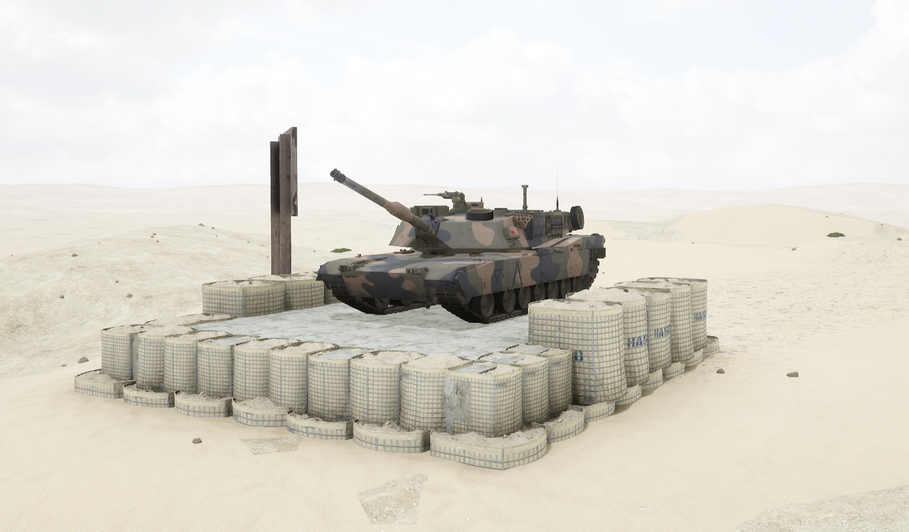
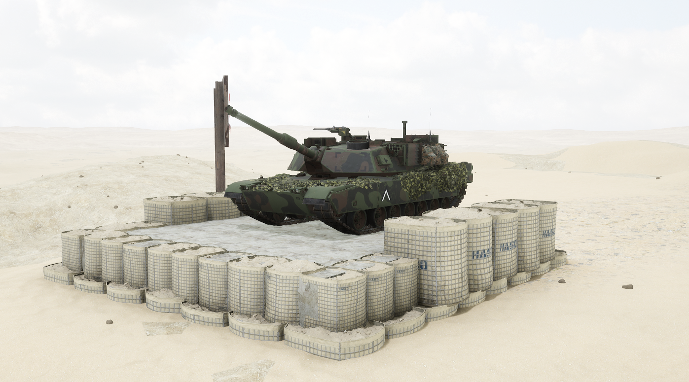

# M1A1


想当 Squad 服主？50 元/月起就能拿下入门款专属服务器！[南赛云](https://server.squadovo.cn/)是高性价比开服首选，低价不低质，让您轻松启动专属战局，低成本圆服主梦～


**M1A1** 是M1主战坦克的第一种大规模改良型

## 基本数据

| 数据名称     | 值         |
| -------- | --------- |
| 载具血量     | 3000      |
| 最大载员人数   | 3         |
| 最大载弹量    | 50        |
| 是否为两栖载具  | 否         |
| 是否具备 STA | 是         |
| 瞄具可缩放倍数  | 3x、6x、12x |
| 价值兵力点    | 15        |

## 装备的阵营

* [ADF | 澳大利亚国防军](../../../team/adf.md)
* [USMC | 美国海军陆战队](https://docx.squadovo.cn/docx/player/team/usmc)

## 武器数据



* 子弹数量：1 x 21&#x20;
* 射击间隙：1.0s&#x20;
* 装填时间：6.5s&#x20;
* 最大穿深：800&#x20;
* 最大伤害：8000&#x20;
* 爆炸伤害：0&#x20;
* 安全距离：0m



* 子弹数量：1 x 21
* 射击间隙：1.0s
* 装填时间：6.5s
* 最大穿深：400
* 最大伤害：1900
* 爆炸伤害：200
* 安全距离：0m



* 子弹数量：2000 x 1
* 射击间隙：0.07s
* 装填时间：11.28s
* 最大穿深：7
* 最大伤害：86
* 爆炸伤害：0
* 安全距离：0m



* 子弹数量：2 x 1
* 射击间隙：1s
* 装填时间：1s
* 最大穿深：0
* 最大伤害：0
* 爆炸伤害：0
* 安全距离：0m



## 载具实图

<figure><figcaption></figcaption></figure>

<figure><figcaption></figcaption></figure>
