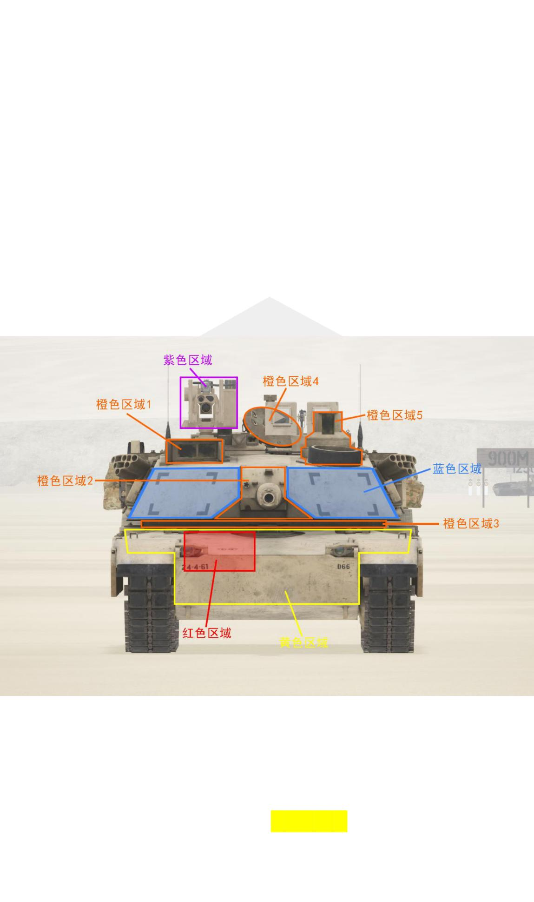
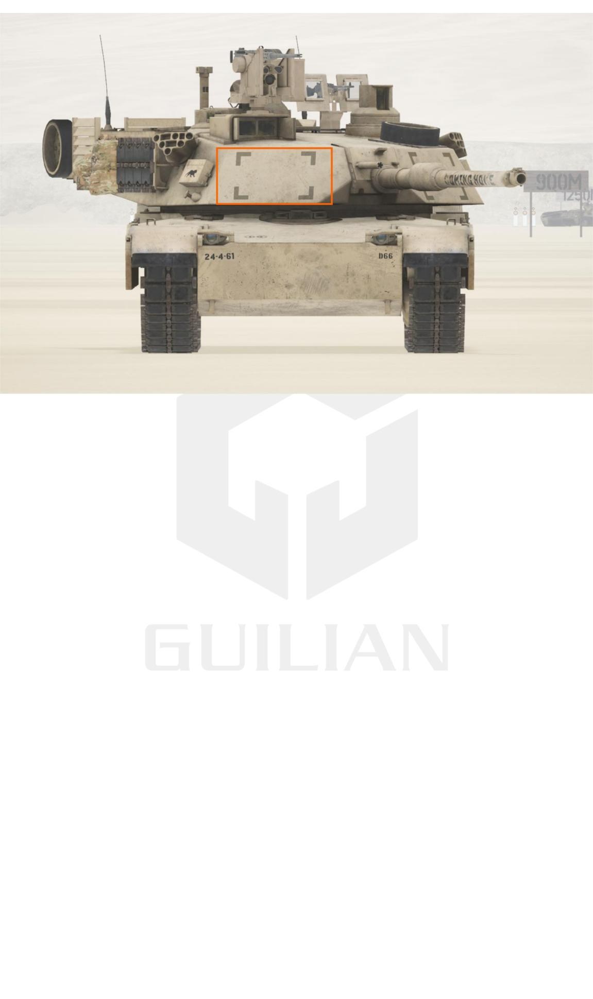
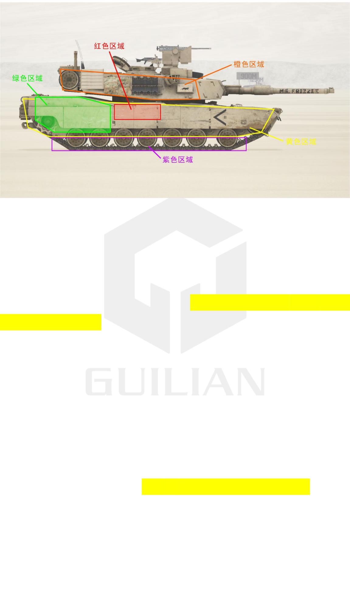
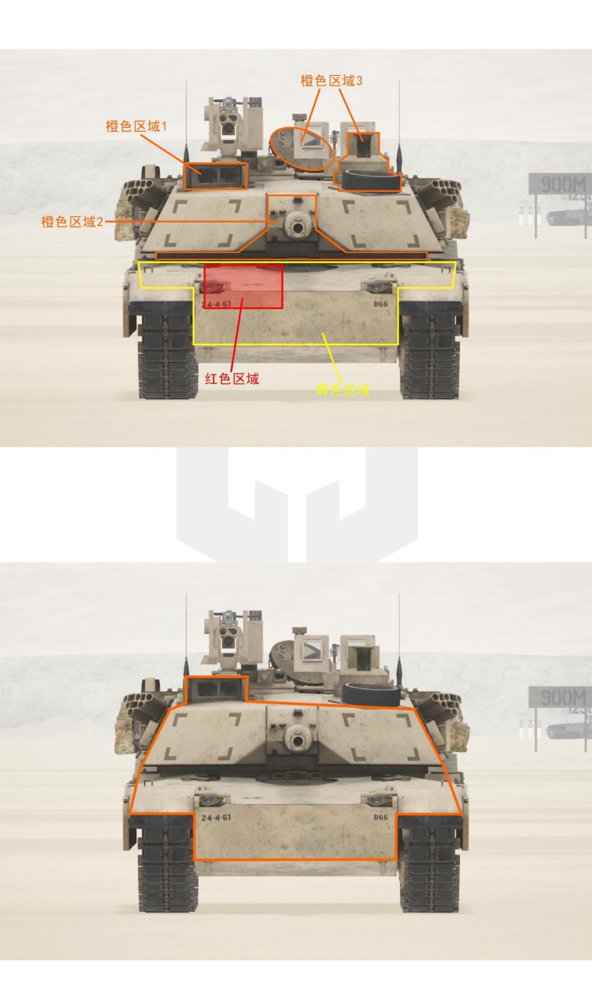
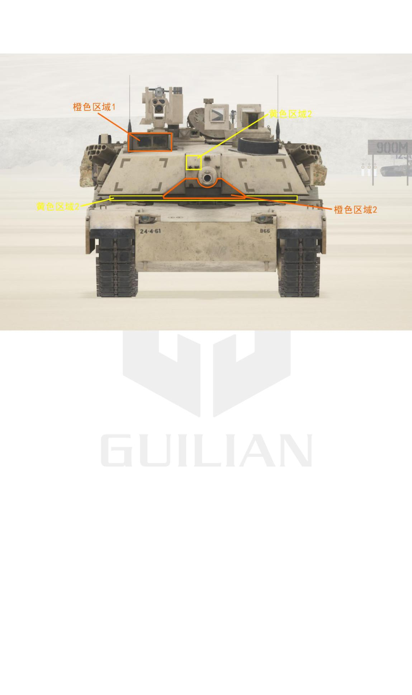
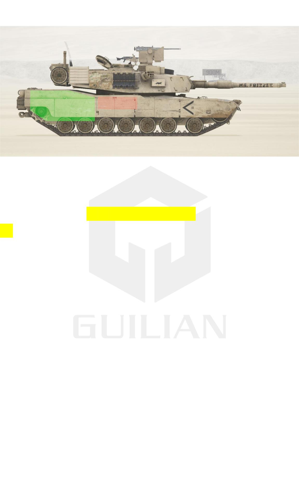
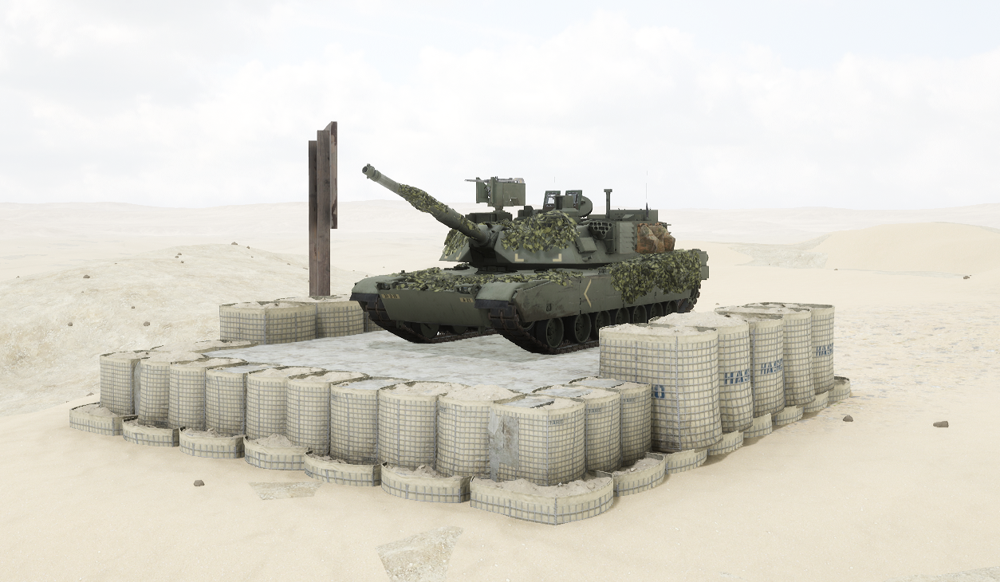

# M1A2


想当 Squad 服主？50 元/月起就能拿下入门款专属服务器！[南赛云](https://server.squadovo.cn/)是高性价比开服首选，低价不低质，让您轻松启动专属战局，低成本圆服主梦～


M1A2 是 [M1A1 ](m1a1.md)的第二阶段改进产品。

## 基本数据

| 数据名称     | 值         |
| -------- | --------- |
| 载具血量     | 3000      |
| 最大载员人数   | 4         |
| 最大载弹量    | 50        |
| 是否为两栖载具  | 否         |
| 是否具备 STA | 是         |
| 瞄具可缩放倍数  | 3x、6x、12x |
| 价值兵力点    | 15        |
| 炮塔血量     | 2000（包含在总血量内） |
| 换弹时间     | 6.5s                |
| 备弹       | AP 21 / HE 21       |
| 穿深       | AP 800 / HE 400     |

## 装备的阵营

* [USA | 美国陆军](../../../team/usa.md)

## 武器数据



* 子弹数量：1 x 21&#x20;
* 射击间隙：1.0s&#x20;
* 装填时间：6.5s&#x20;
* 最大穿深：800&#x20;
* 最大伤害：8000&#x20;
* 爆炸伤害：0&#x20;
* 安全距离：0m



* 子弹数量：1 x 21
* 射击间隙：1.0s
* 装填时间：6.5s
* 最大穿深：400
* 最大伤害：1900
* 爆炸伤害：200
* 安全距离：0m



* 子弹数量：2000 x 1
* 射击间隙：0.07s
* 装填时间：11.28s
* 最大穿深：7
* 最大伤害：86
* 爆炸伤害：0
* 安全距离：0m



* 子弹数量：2 x 1
* 射击间隙：1s
* 装填时间：1s
* 最大穿深：0
* 最大伤害：0
* 爆炸伤害：0
* 安全距离：0m



## 载具对抗指南

### 弱点分析

- **正面：** 炮塔主装甲是 M1 最坚硬的部位，没有任何坦克炮能在该角度正面击穿，应避免打击；车体正面是正面受击面积最大的区域，v9.0 后首上不再有跳弹能力，相对水平或高对低时整个车体正面都是可攻击目标；正面弹药架可从首上打到，作者建议优先攻击首下，只要条件允许弹药永远是第一攻击目标；炮手观瞄是破甲弹打击 M1 的首选；坦克炮闩是除弹药架之外的最优选，伤害更高且能对炮塔稳定系统造成毁灭性打击；脆弱的炮塔座圈甚至可被 30mm 机炮打穿；打开的舱盖可攻击，血量与炮塔共享；攻击 F3 号位（电摇位）不会对坦克本身造成伤害，但可使电摇锁死。
- **侧面：** 车体侧面在裙板和履带完好的情况下有一定程度减伤，断履后失效；炮塔侧面脆弱，坦克炮攻击几乎不会跳弹；弹药架侧面位于从前往后数第 4、第 5 负重轮正上方、车体中上部；仅有履带的区域攻击仅会造成断履而不会伤及车体；攻击侧面发动机体表投影可使其失去动力而瘫痪。

### 载具玩法

- 拥有所有坦克中最强的动力与最好的驾驶手感，应尽量发挥高机动性优势。
- 拥有所有坦克中最快的装填速度（6.5s）和较为简洁易用的炮镜，在对炮中具有天生的优势。
- 尽量与敌方坦克打中近程战斗，保证精度的同时依靠爆发装填扩大优势。
- M1 自身防护水平不高，经常被轻易攻击到弹药架，驾驶员要尽量寻找合适的埋头位。

### 对抗建议

- 正面可攻击区域（坦克）优先级：红色区域（弹药架）> 橙色区域 2（炮闩）> 橙色区域 1（炮手观瞄）= 橙色区域 3（炮塔座圈）> 黄色区域（车体正面）。
- M1 应对全威力导弹的能力很弱，几乎都可以被打穿。
- 非全威力导弹能正面对 M1 造成有效伤害的区域非常有限：首推橙色区域 2 的炮闩下半面，其次橙色区域 1 的炮手观瞄；黄色区域 1 的小面积炮闩和黄色区域 2 的炮塔座圈也可造成伤害，但前者面积过小且极易打到炮管上跳弹，后者面积太小极易打到主装甲或首上，均不推荐。
- 侧面攻击弹药架：M1 弹药架在车体右边侧置，穿深不足的反坦克武器左右攻击效果不同。重筒从左侧攻击弹药架时仍能剩余约 1/3 血量，从右侧攻击有小概率一发点燃（注意不要打到履带，否则会减伤）；第一等级非全威力导弹左右均可直接打穿，第二、三等级非全威力导弹无法从左侧造成损伤，从右侧可直接点燃弹药架。

### 图示

<figure><figcaption>图6-1 正视图1</figcaption></figure>

<figure><figcaption>图7-1 正视图2</figcaption></figure>

<figure><figcaption>图8-1 侧视图1</figcaption></figure>

<figure><figcaption>图9-1/9-2 正面可攻击区域（坦克/全威力导弹）</figcaption></figure>

<figure><figcaption>图10-1 正面可攻击区域（非全威力导弹）</figcaption></figure>

<figure><figcaption>图11-1 侧面攻击弹药架</figcaption></figure>

## 载具实图

<figure><figcaption></figcaption></figure>

<figure><figcaption></figcaption></figure>
