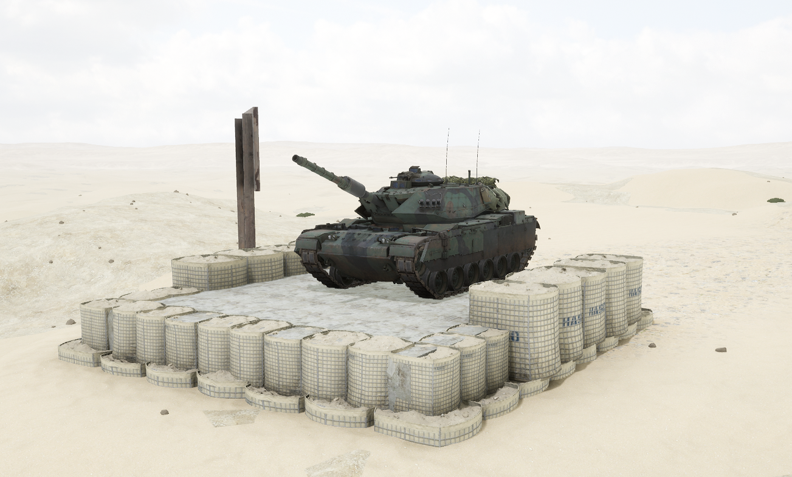
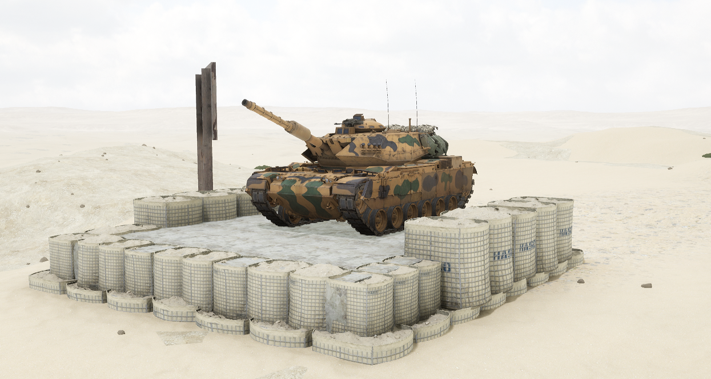

# M60T


想当 Squad 服主？50 元/月起就能拿下入门款专属服务器！[南赛云](https://server.squadovo.cn/)是高性价比开服首选，低价不低质，让您轻松启动专属战局，低成本圆服主梦～


**M60T** 是由以色列军事工业对 M60 巴顿坦克大幅改装升级而成。

## 基本数据

| 数据名称     | 值        |
| -------- | -------- |
| 载具血量     | 3000     |
| 最大载员人数   | 3        |
| 最大载弹量    | 50       |
| 是否为两栖载具  | 否        |
| 是否具备 STA | 是        |
| 瞄具可缩放倍数  | 1x、3x、8x |
| 价值兵力点    | 15       |

## 装备的阵营

* [TLF | 土耳其陆军](../../../team/tlf-tu-er-qi-lu-jun.md)
* [WPMC | 西部私人军事承包商](../../../team/wpmc-xi-bu-si-ren-jun-shi-cheng-bao-shang.md)

## 武器数据



* 子弹数量：1 x 21
* 射击间隙：1.0s
* 装填时间：8.0s
* 最大穿深：800
* 最大伤害：8000
* 爆炸伤害：0
* 安全距离：0m



* 子弹数量：1 x 20
* 射击间隙：1.0s
* 装填时间：8.0s
* 最大穿深：10
* 最大伤害：200
* 爆炸伤害：300
* 安全距离：0m



* 子弹数量：2000 x 1
* 射击间隙：0.07s
* 装填时间：11.28s
* 最大穿深：7
* 最大伤害：86
* 爆炸伤害：0
* 安全距离：0m



* 子弹数量：1 x 2
* 射击间隙：0.085s
* 装填时间：8.0s
* 最大穿深：500
* 最大伤害：3000
* 爆炸伤害：153
* 安全距离：123m



* 子弹数量：2 x 1
* 射击间隙：1s
* 装填时间：1s
* 最大穿深：0
* 最大伤害：0
* 爆炸伤害：0
* 安全距离：0m



## 载具实图

<figure><figcaption></figcaption></figure>

<figure><figcaption></figcaption></figure>
