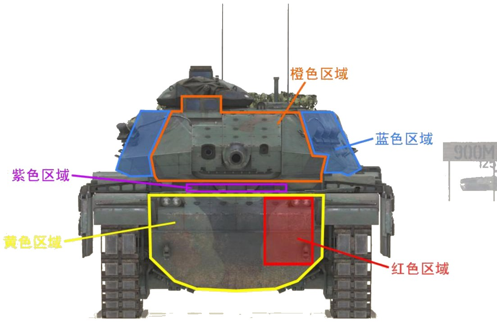
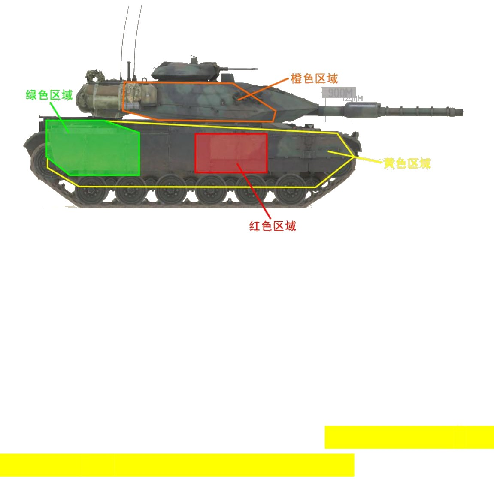
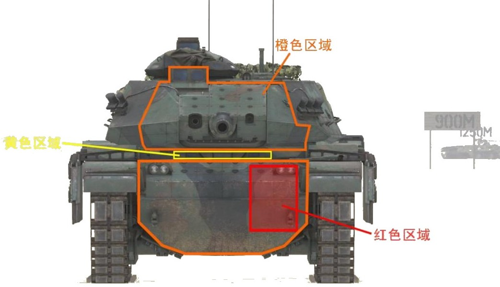
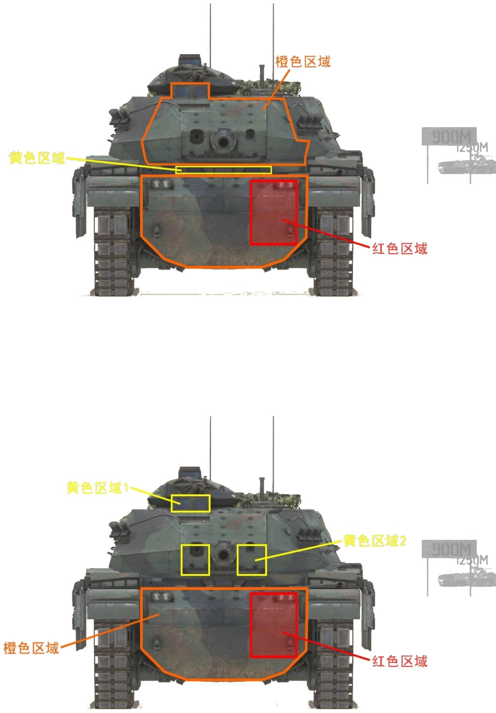
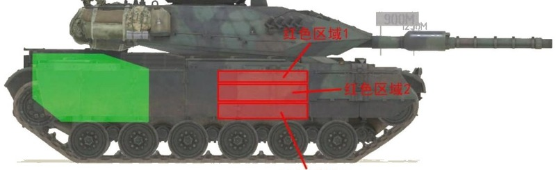
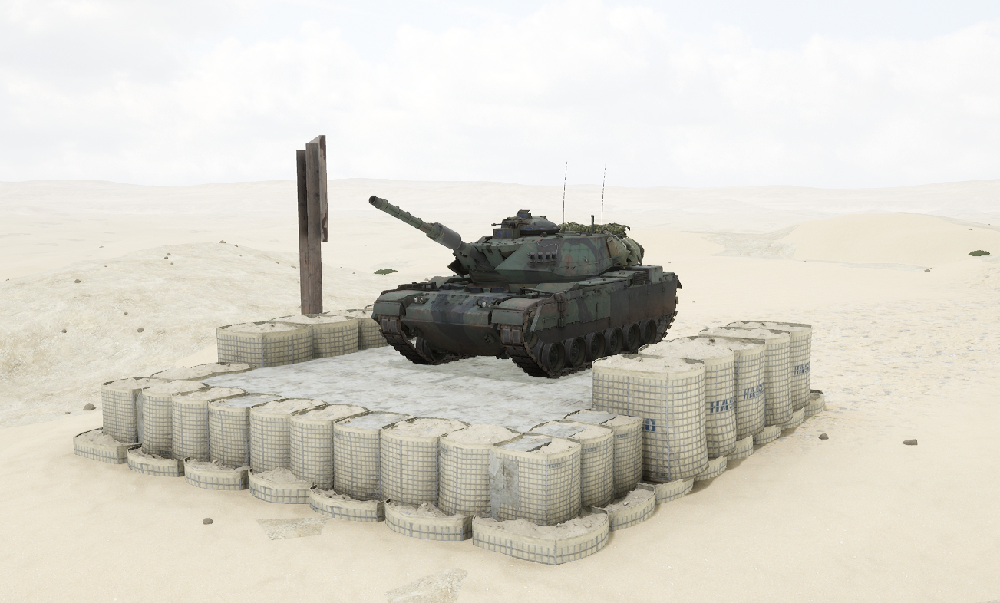
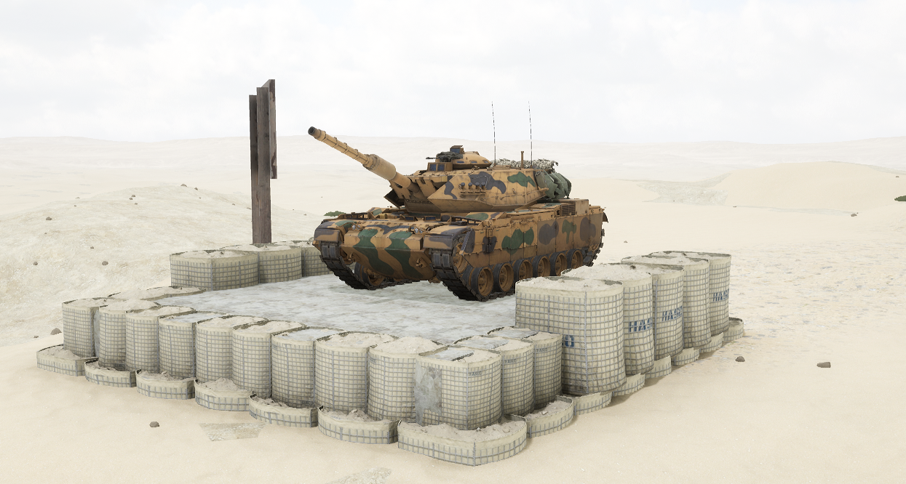

# M60T


想当 Squad 服主？50 元/月起就能拿下入门款专属服务器！[南赛云](https://server.squadovo.cn/)是高性价比开服首选，低价不低质，让您轻松启动专属战局，低成本圆服主梦～


**M60T** 是由以色列军事工业对 M60 巴顿坦克大幅改装升级而成。

## 基本数据

| 数据名称     | 值        |
| -------- | -------- |
| 载具血量     | 3000     |
| 最大载员人数   | 3        |
| 最大载弹量    | 50       |
| 是否为两栖载具  | 否        |
| 是否具备 STA | 是        |
| 瞄具可缩放倍数  | 1x、3x、8x |
| 价值兵力点    | 15       |
| 炮塔血量     | 2000（包含在总血量内） |
| 换弹时间     | 8s |
| 备弹       | AP 21 / HF 20 / GM 2 |
| 穿深       | AP 800 / HF 10 / GM 500 |

## 装备的阵营

* [TLF | 土耳其陆军](../../../team/tlf-tu-er-qi-lu-jun.md)
* [WPMC | 西部私人军事承包商](../../../team/wpmc-xi-bu-si-ren-jun-shi-cheng-bao-shang.md)

## 武器数据



* 子弹数量：1 x 21
* 射击间隙：1.0s
* 装填时间：8.0s
* 最大穿深：800
* 最大伤害：8000
* 爆炸伤害：0
* 安全距离：0m



* 子弹数量：1 x 20
* 射击间隙：1.0s
* 装填时间：8.0s
* 最大穿深：10
* 最大伤害：200
* 爆炸伤害：300
* 安全距离：0m



* 子弹数量：2000 x 1
* 射击间隙：0.07s
* 装填时间：11.28s
* 最大穿深：7
* 最大伤害：86
* 爆炸伤害：0
* 安全距离：0m



* 子弹数量：1 x 2
* 射击间隙：0.085s
* 装填时间：8.0s
* 最大穿深：500
* 最大伤害：3000
* 爆炸伤害：153
* 安全距离：123m



* 子弹数量：2 x 1
* 射击间隙：1s
* 装填时间：1s
* 最大穿深：0
* 最大伤害：0
* 爆炸伤害：0
* 安全距离：0m



## 载具对抗指南

### 弱点分析

- **正面：** 炮塔主装甲侧面是炮塔唯一能够有效防御的区域，但那只是外挂装甲延伸出来的区域而非炮塔本体；炮塔正面是可击穿面积巨大的区域；车体正面面积巨大且可击穿，堂堂坦克正面车体竟然可以被轻筒击穿；正面弹药架投影位置和豹 2 相同但面积相对小一些，不过仍然相当好打；炮塔座圈和豹 2 一样，攻击造成伤害的同时还能穿掉后方发动机。
- **侧面：** 车体侧面在裙板和履带完好的情况下有一定程度减伤；炮塔侧面脆弱，可攻击区域相对较小但也够用；侧面巨大的弹药架投影位于炮塔座圈下方（或从前往后数第 2、第 3 负重轮正上），高度为裙板的全部；侧面有面积很大的发动机体表投影，攻击可使其失去动力而瘫痪。

### 载具玩法

- 尽量避免近距离接敌，可以选择打伸缩炮弥补劣势。
- 紧急情况下果断卖屁股，优先保住弹药架（注意俯角）。
- 不埋头的情况下正面还是后面迎敌都没有太大区别，两边都没啥跳弹区域，卖屁股还能保住弹药架。
- 尽量埋头打远程，尤其是植被较多的地图，不错的涂装和平整外表使其隐蔽性极佳。
- 作者建议：能别玩就别玩。

### 对抗建议

- 正面可攻击区域（坦克）优先级：红色区域（弹药架）> 橙色区域（炮塔正面）> 黄色区域（车体正面）。
- 非全威力导弹：橙色区域面积极大完全没有失手的可能，"婴儿"和 AFT07C 可以直接从正面穿掉其红色区域弹药架，其他非全威力导弹则不能从正面对弹药架造成任何损伤；黄色区域可以打但不推荐。
- 侧面攻击弹药架：基本原理同豹 2。重筒无法从车体左边将其一发点燃，在不断履的情况下仍能剩余约 1/3 血量，从右侧则完全无法对弹药架造成任何伤害。非全威力导弹攻击左侧红色区域 1（仅侧装甲保护）和红色区域 3（仅履带保护）时皆可一发点燃弹药架；攻击红色区域 2（装甲+履带双重保护）时无法一发点燃，弹药架会剩余约 1/12-1/20 血量。"婴儿"和 AFT07C 攻击右侧红色区域 1 和红色区域 3 时可一发点燃，攻击红色区域 2 时会剩余约 1/20 血量；"竞赛"和炮射导弹则完全无法从右侧对弹药架造成任何伤害。

### 图示

<figure><figcaption>图38-1 正视图1</figcaption></figure>

<figure><figcaption>图39-1 侧视图1</figcaption></figure>

<figure><figcaption>图40-1 正面可攻击区域（坦克）</figcaption></figure>

<figure><figcaption>图41-1/41-2 正面可攻击区域（全威力/非全威力导弹）</figcaption></figure>

<figure><figcaption>图42-1 侧面攻击弹药架</figcaption></figure>

## 载具实图

<figure><figcaption></figcaption></figure>

<figure><figcaption></figcaption></figure>
