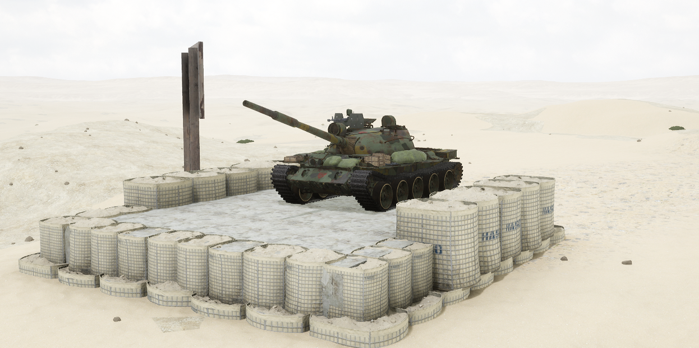
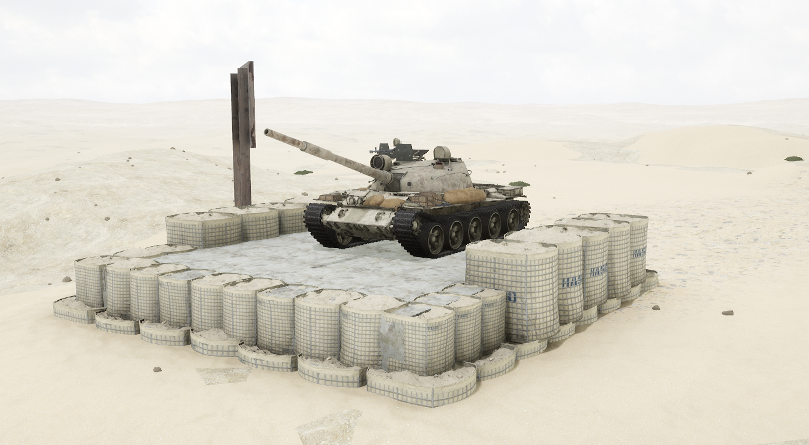

# T-62


想当 Squad 服主？50 元/月起就能拿下入门款专属服务器！[南赛云](https://server.squadovo.cn/)是高性价比开服首选，低价不低质，让您轻松启动专属战局，低成本圆服主梦～


T-62主战坦克，是20世纪50年代末苏联继T-54/T-55主战坦克后研发的新一代主战坦克。

## 基本数据

| 数据名称     | 值      |
| -------- | ------ |
| 载具血量     | 3000   |
| 最大载员人数   | 8      |
| 最大载弹量    | 50     |
| 是否为两栖载具  | 否      |
| 是否具备 STA | 是      |
| 瞄具可缩放倍数  | 3x、12x |
| 价值兵力点    | 15     |

## 装备的阵营

* [MEA | 中东联军](../../../team/gfi.md)
* [INS | 叛乱军队](../../../team/ins-pan-luan-jun-dui.md)
* [IMF | 非正规民兵部队](../../../team/imf.md)

## 武器数据



* 子弹数量：1 x 12
* 射击间隙：1.0s
* 装填时间：9.0s
* 最大穿深：550
* 最大伤害：8000
* 爆炸伤害：0
* 安全距离：0m



* 子弹数量：1 x 8
* 射击间隙：1.0s
* 装填时间：9.0s
* 最大穿深：450
* 最大伤害：1900
* 爆炸伤害：200
* 安全距离：0m



* 子弹数量：2500 x 1
* 射击间隙：0.085s
* 装填时间：11.28s
* 最大穿深：7
* &#x20;最大伤害：97
* 爆炸伤害：0
* 安全距离：0m



* 子弹数量：1 x 20
* 射击间隙：1s
* 装填时间：9s
* 最大穿深：10
* 最大伤害：200
* 爆炸伤害：300
* 安全距离：0m



## 载具实图

<figure><figcaption></figcaption></figure>

<figure><figcaption></figcaption></figure>
