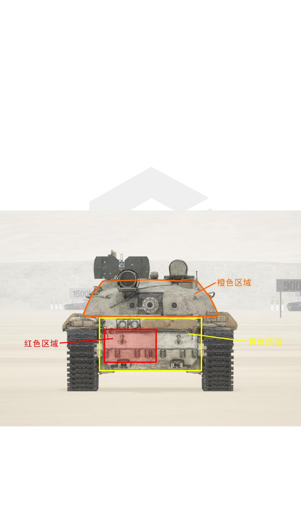
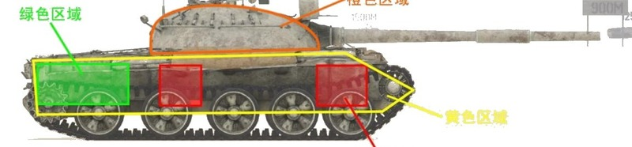
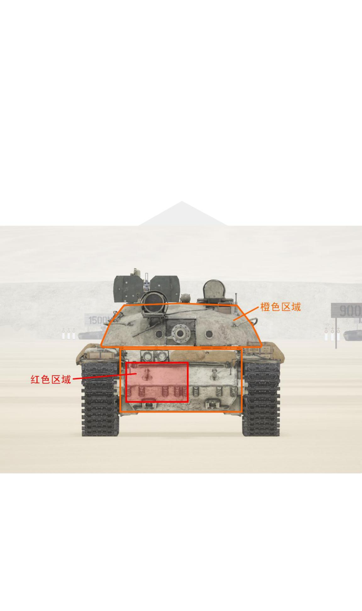
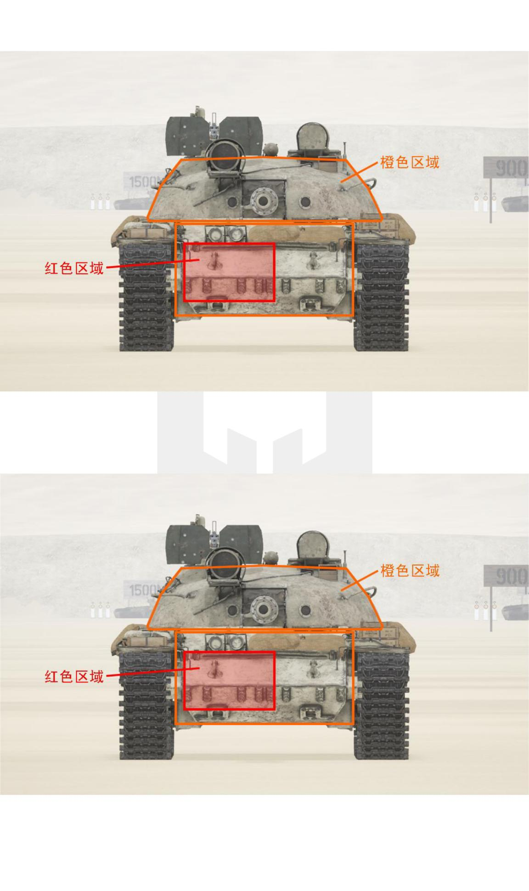
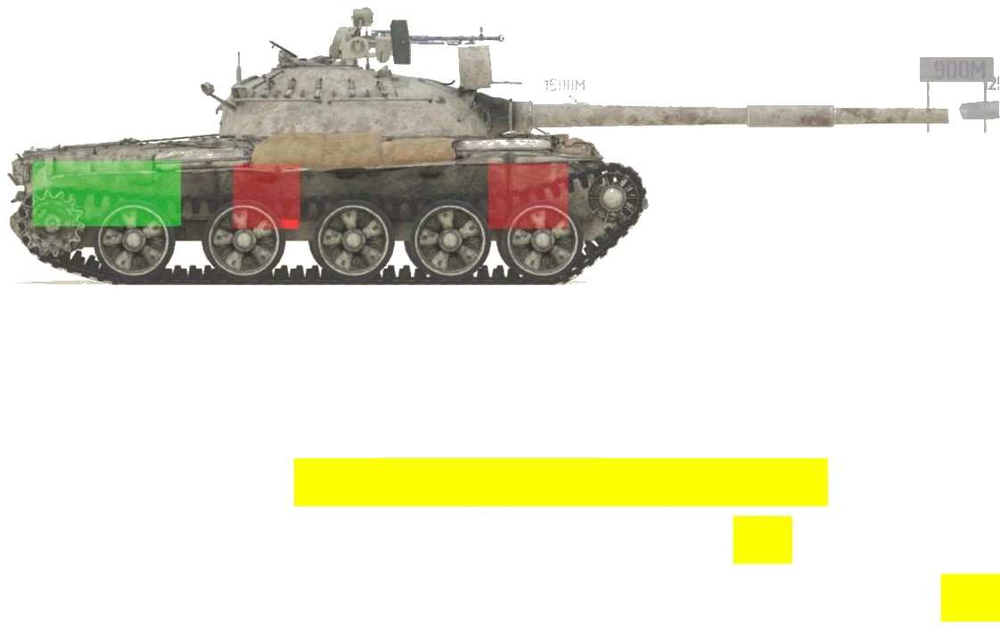
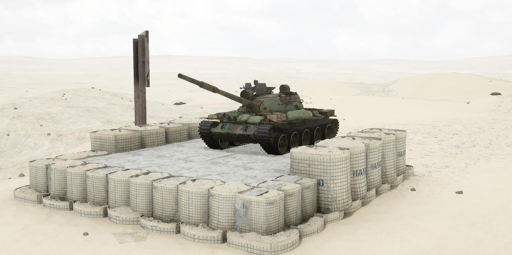
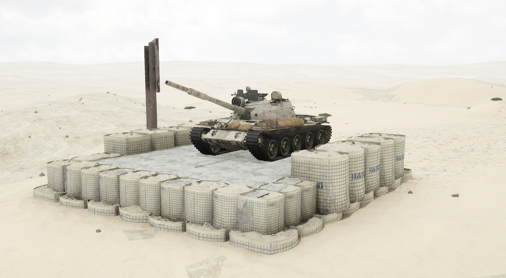

# T-62


想当 Squad 服主？50 元/月起就能拿下入门款专属服务器！[南赛云](https://server.squadovo.cn/)是高性价比开服首选，低价不低质，让您轻松启动专属战局，低成本圆服主梦～


T-62 主战坦克，是 20 世纪 50 年代末苏联继 T-54/T-55 主战坦克后研发的新一代主战坦克。

## 基本数据

| 数据名称     | 值      |
| -------- | ------ |
| 载具血量     | 3000   |
| 最大载员人数   | 8      |
| 最大载弹量    | 50     |
| 是否为两栖载具  | 否      |
| 是否具备 STA | 是      |
| 瞄具可缩放倍数  | 3x、12x |
| 价值兵力点    | 15     |
| 炮塔血量     | 2000（包含在总血量内） |
| 换弹时间     | 9s |
| 备弹       | AP 12 / HE 8 / HF 20 |
| 穿深       | AP 550 / HE 450 / HF 10 |

## 装备的阵营

* [MEA | 中东联军](../../../team/gfi.md)
* [INS | 叛乱军队](../../../team/ins-pan-luan-jun-dui.md)
* [IMF | 非正规民兵部队](../../../team/imf.md)

## 武器数据



* 子弹数量：1 x 12
* 射击间隙：1.0s
* 装填时间：9.0s
* 最大穿深：550
* 最大伤害：8000
* 爆炸伤害：0
* 安全距离：0m



* 子弹数量：1 x 8
* 射击间隙：1.0s
* 装填时间：9.0s
* 最大穿深：450
* 最大伤害：1900
* 爆炸伤害：200
* 安全距离：0m



* 子弹数量：2500 x 1
* 射击间隙：0.085s
* 装填时间：11.28s
* 最大穿深：7
* &#x20;最大伤害：97
* 爆炸伤害：0
* 安全距离：0m



* 子弹数量：1 x 20
* 射击间隙：1s
* 装填时间：9s
* 最大穿深：10
* 最大伤害：200
* 爆炸伤害：300
* 安全距离：0m



## 载具对抗指南

### 弱点分析

- **正面：** 炮塔区域和车身正面区域内都可被击穿；正面巨大的弹药架投影和豹 2 一样前置，炮射导弹都能轻易将其一发点燃，位于车体右半部分（你的左边）。
- **侧面：** 车体侧面上半部分完全裸奔，下半部分有履带保护，履带完好时攻击下半部分有一定程度减伤但几乎可忽略；炮塔侧面脆弱，区域内都可被击穿；T62 是唯一拥有双弹药架的坦克，一个位于从前往后数第 1 负重轮正上靠后，一个位于从前往后数第 4 负重轮正上靠前，高度为车体的全部；攻击侧面发动机体表投影可使其失去动力而瘫痪。

### 载具玩法

- 尽量避免近距离接敌，紧急情况下果断卖屁股，优先保住弹药架。
- 浑身上下没有可跳弹的区域，与敌方坦克对炮根据距离不同仅有吃 3-4 发的机会，十分考验炮手素质并考验驾驶员与炮手的沟通，沟通良好完全可以打伸缩炮弥补一定劣势。
- 尽量安静地蹲在某个地方埋头打伏击或等待队友给信息，绕后绕侧偷袭打先手；正面硬刚几乎没有胜算。
- 作者建议：能别玩就别玩。

### 对抗建议

- 正面可攻击区域（坦克/全威力/非全威力导弹）：三张图完全一样，T62 就是这样，随便打；坦克穿甲弹可一发从特定角度击穿其两个弹药架。
- 侧面攻击弹药架：基本原理同上面俩。重筒无法从车体右边和正前将其一发点燃，从左侧则完全无法对弹药架造成任何伤害。所有非全威力导弹均可从其左侧一发点燃弹药架；"婴儿"和 AFT07C 无论左右均可以一发点燃；"竞赛"和炮射导弹在左侧攻击时需避开履带方可一发点燃，否则将无法对弹药架造成任何伤害。

### 图示

<figure><figcaption>图43-1 正视图1</figcaption></figure>

<figure><figcaption>图44-1 侧视图1</figcaption></figure>

<figure><figcaption>图45-1 正面可攻击区域（坦克）</figcaption></figure>

<figure><figcaption>图46-1/46-2 正面可攻击区域（全威力/非全威力导弹）</figcaption></figure>

<figure><figcaption>图47-1 侧面攻击弹药架</figcaption></figure>

## 载具实图

<figure><figcaption></figcaption></figure>

<figure><figcaption></figcaption></figure>
