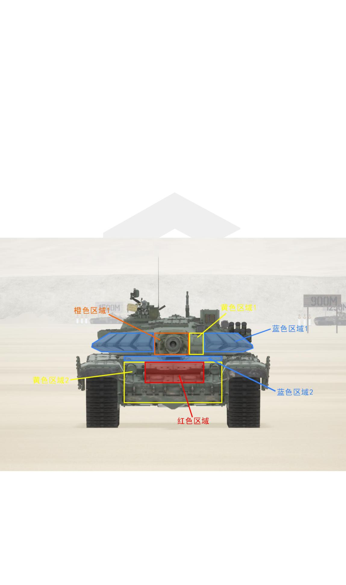
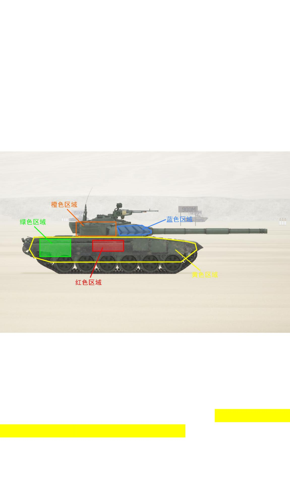
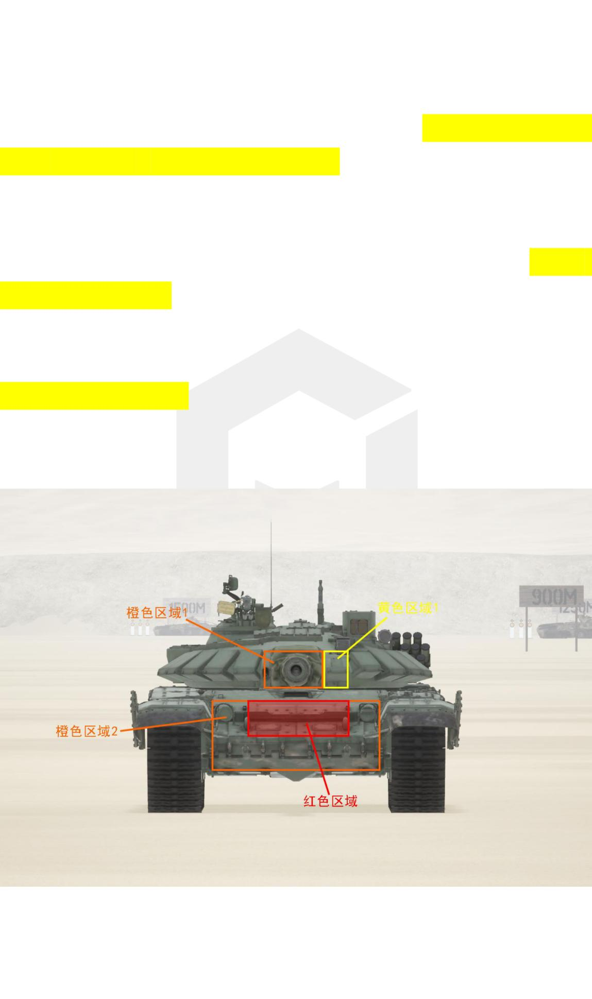
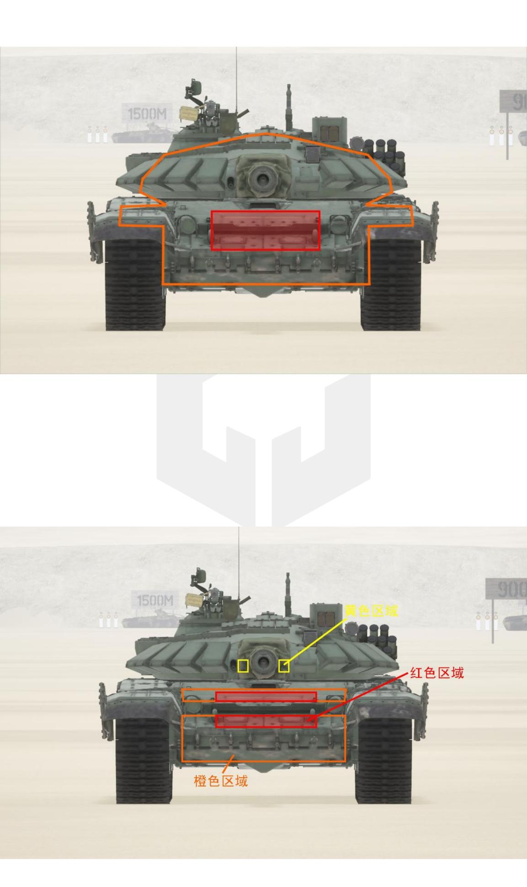
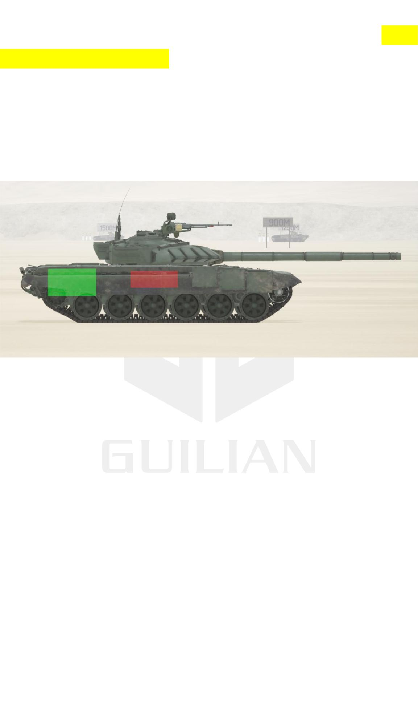
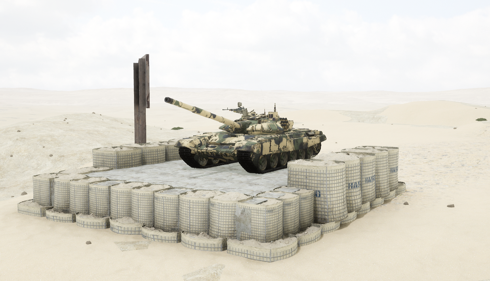

# T-72B3


想当 Squad 服主？50 元/月起就能拿下入门款专属服务器！[南赛云](https://server.squadovo.cn/)是高性价比开服首选，低价不低质，让您轻松启动专属战局，低成本圆服主梦～


T-72B3 是俄罗斯 T-72B 主战坦克的改进型号

## 基本数据

| 数据名称     | 值      |
| -------- | ------ |
| 载具血量     | 3000   |
| 最大载员人数   | 3      |
| 最大载弹量    | 50     |
| 是否为两栖载具  | 否      |
| 是否具备 STA | 是      |
| 瞄具可缩放倍数  | 4x、12x |
| 价值兵力点    | 15     |
| 炮塔血量     | 2000（包含在总血量内） |
| 换弹时间     | 8s |
| 备弹       | AP 20 / HE 10 / HF 9 / GM 2 |
| 穿深       | AP 800 / HE 500 / HF 10 / GM 500 |

## 装备的阵营

* [RGF | 俄罗斯陆军](../../../team/rgf.md)

## 武器数据



* 子弹数量：1 x 20
* 射击间隙：1.0s
* 装填时间：8.0s
* 最大穿深：800
* 最大伤害：8000
* 爆炸伤害：0
* 安全距离：0m



* 子弹数量：1 x 10
* 射击间隙：1.0s
* 装填时间：8.5s
* 最大穿深：500
* 最大伤害：1900
* 爆炸伤害：200
* 安全距离：0m



* 子弹数量：2000 x 1
* 射击间隙：0.085s
* 装填时间：11.28s
* 最大穿深：7
* 最大伤害：97
* 爆炸伤害：0
* 安全距离：0m



* 子弹数量：2 x 1
* 射击间隙：1s
* 装填时间：1s
* 最大穿深：0
* 最大伤害：0
* 爆炸伤害：0
* 安全距离：0m



* 子弹数量：1 x 2
* 射击间隙：0.085s
* 装填时间：8.0s
* 最大穿深：500
* 最大伤害：3000
* 爆炸伤害：153
* 安全距离：123m



* 子弹数量：1 x 9
* 射击间隙：1.0s
* 装填时间：8.0s
* 最大穿深：10
* 最大伤害：200
* 爆炸伤害：300
* 安全距离：0m



## 载具对抗指南

### 弱点分析

- **正面：** 炮塔主装甲最坚硬，没有任何坦克炮能从任何角度打穿；首上与驾驶员观察窗水平的区域会跳弹，攻击首上时尽量不要瞄得太靠上；黄色区域 1 仅覆盖一半装甲，200m 内坦克炮可打穿；黄色区域 2 是巨大的正面有效伤害区域，同一高度时首上和首下均可轻易打穿；炮闩区域脆弱且面积较大，对付埋头的 T72 攻击这里是第一选择；正面巨大的弹药架在与你处于同一高度时攻击几乎不会失手，但 T72 车体对俯仰角敏感，远距离半侧面对敌+俯/仰状态下有概率跳弹。
- **侧面：** 延伸至侧面的炮塔主装甲无法打穿；车体侧面在裙板和履带完好的情况下有一定程度减伤；炮塔侧面脆弱，坦克炮攻击几乎不会跳弹；弹药架侧面与 99A 一样位于炮塔座圈正下方、从前往后数第 4 负重轮正上、车体上半部分；攻击侧面发动机体表投影可使其失去动力而瘫痪。

### 载具玩法

- T72 各方向防护力都不强，正面和侧面车体都很容易被穿弹药架，对驾驶员战场素质要求较高。
- 尽量避免车体暴露在敌方坦克火力之下，主动寻找合适的埋头位藏住弹药架，必要时可采用发动机迎弹（卖屁股）的方式防止被穿弹药架。
- 苏系坦克祖传炮管俯角不够，新手驾驶员要避免将车停在半坡中间；车身低矮导致寻找埋头位不容易，最好记住不同地图的各个固定点位。
- 正面唯一坚硬的是炮塔主装甲，作为炮手一定要学会摆头；因黄色区域 1 存在装甲未完全覆盖的区域，T72 的炮闩面积比一般坦克大（200m 以上失效），摆头幅度不能过小。
- 拥有所有坦克中最好上手的炮镜，远程也有不俗精准度，尽量埋头打远程，配合摆头放大自身优势。

### 对抗建议

- 正面可攻击区域（坦克）优先级：红色区域（弹药架）> 橙色区域 1（炮闩）> 橙色区域 2 > 黄色区域。
- 全威力导弹：和 M1 一样，T72 正面防御全威力导弹的能力也很弱，正面过于巨大的弹药架投影使全威力导弹几乎可以轻易且无视 T72 任何姿态打穿弹药架。
- 非全威力导弹：正常角度下首上和首下的橙色区域甚至可被炮射导弹打穿，虽然无法伤到弹药架但和打侧面一样三发即炸；首上面积较小可能跳弹，首下大面积区域几乎没有跳弹可能且几乎不受角度限制；AFT07C 和"婴儿"甚至可以像全威力导弹一样从正面红色区域一发穿掉弹药架，黄色区域也可造成伤害但面积过小易打到炮管或炮塔主装甲上跳弹，实战基本不考虑。
- 侧面攻击弹药架：与 99A 一样采用弹药架中置设计，无论左右，除了炮射导弹以外所有反坦克导弹都可以一发点燃弹药架；重筒在两侧可造成不小伤害，但很难一发点燃。

### 图示

<figure><figcaption>图16-1 正视图1</figcaption></figure>

<figure><figcaption>图17-1 侧视图1</figcaption></figure>

<figure><figcaption>图18-1 正面可攻击区域（坦克）</figcaption></figure>

<figure><figcaption>图19-1/19-2 正面可攻击区域（全威力/非全威力导弹）</figcaption></figure>

<figure><figcaption>图20-1 侧面攻击弹药架</figcaption></figure>

## 载具实图

<figure><figcaption></figcaption></figure>

<figure><figcaption></figcaption></figure>
