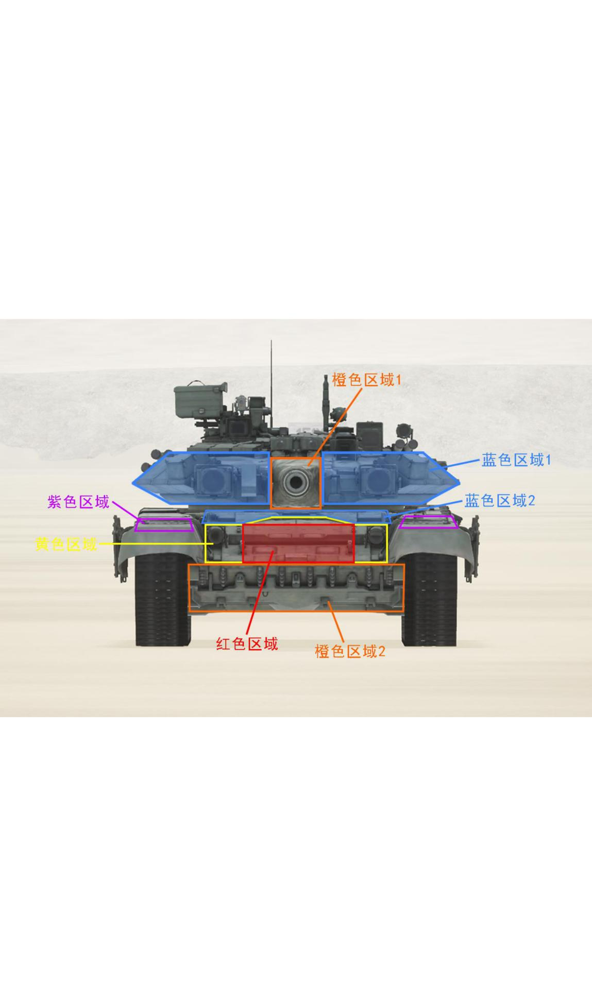
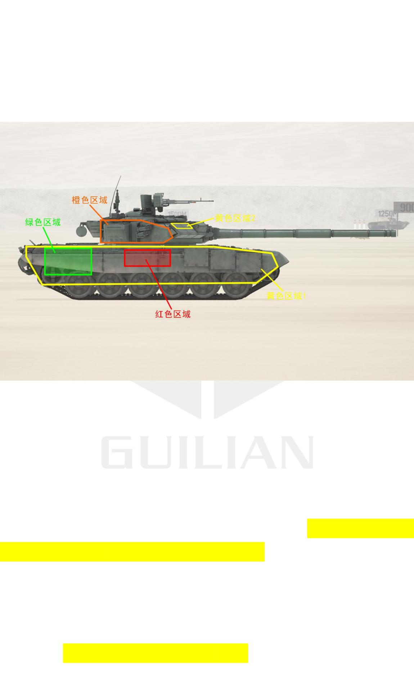
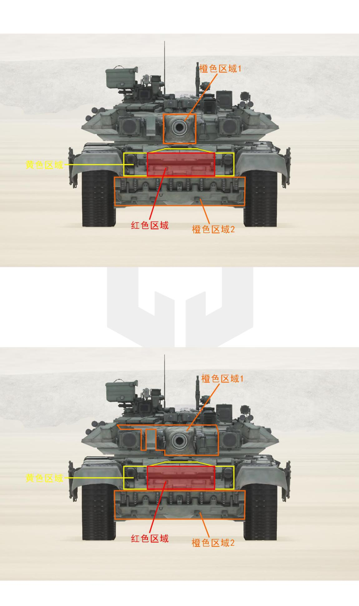
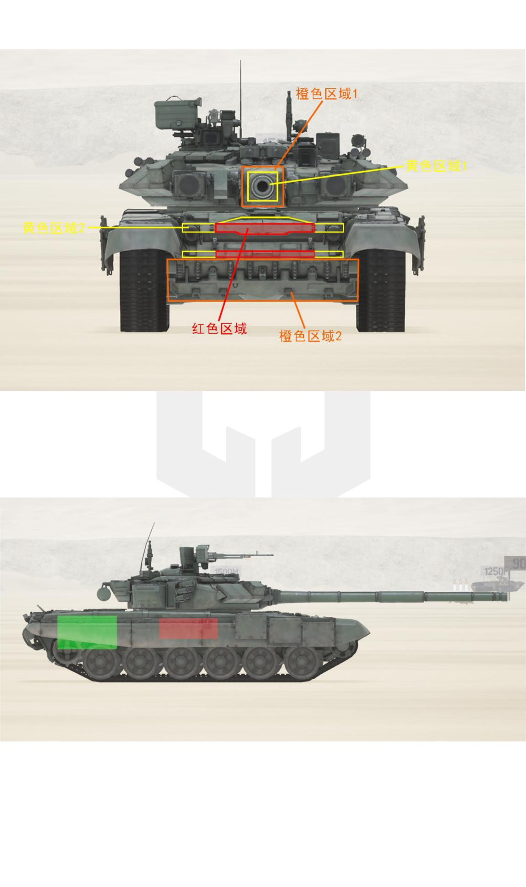

# T-90A


想当 Squad 服主？50 元/月起就能拿下入门款专属服务器！[南赛云](https://server.squadovo.cn/)是高性价比开服首选，低价不低质，让您轻松启动专属战局，低成本圆服主梦～


T-90A 是俄罗斯 T-90 主战坦克系列中的一个重要型号

## 基本数据

| 数据名称     | 值      |
| -------- | ------ |
| 载具血量     | 3000   |
| 最大载员人数   | 3      |
| 最大载弹量    | 50     |
| 是否为两栖载具  | 否      |
| 是否具备 STA | 是      |
| 瞄具可缩放倍数  | 4x、12x |
| 价值兵力点    | 15     |
| 炮塔血量     | 2000（包含在总血量内） |
| 换弹时间     | 8s |
| 备弹       | AP 20 / HE 10 / HF 9 / GM 2 |
| 穿深       | AP 800 / HE 500 / HF 10 / GM 500 |

## 装备的阵营

* [RGF | 俄罗斯陆军](../../../team/rgf.md)

## 武器数据



* 子弹数量：1 x 20
* 射击间隙：1.0s
* 装填时间：8.0s
* 最大穿深：800
* 最大伤害：8000
* 爆炸伤害：0
* 安全距离：0m



* 子弹数量：1 x 10
* 射击间隙：1.0s
* 装填时间：8.0s
* 最大穿深：500
* 最大伤害：200
* 爆炸伤害：300
* 安全距离：0m



* 子弹数量：2000 x 1
* 射击间隙：0.085s
* 装填时间：11.28s
* 最大穿深：7
* 最大伤害：97
* 爆炸伤害：0
* 安全距离：0m



* 子弹数量：2 x 1
* 射击间隙：1s
* 装填时间：1s
* 最大穿深：0
* 最大伤害：0
* 爆炸伤害：0
* 安全距离：0m



* 子弹数量：1 x 2
* 射击间隙：0.085s
* 装填时间：8.0s
* 最大穿深：500
* 最大伤害：3000
* 爆炸伤害：153
* 安全距离：123m



* 子弹数量：1 x 9
* 射击间隙：1.0s
* 装填时间：8.0s
* 最大穿深：10
* 最大伤害：200
* 爆炸伤害：300
* 安全距离：0m



## 载具对抗指南

### 弱点分析

- **正面：** 炮塔主装甲几乎无敌，可挡住所有炮弹，甚至全威力导弹都无法从覆盖装甲的区域击穿，但命中很多时候呈现正常命中特效而非跳弹特效，容易被迷惑；观察窗跳弹区域与 T72 如出一辙，面积比 T72 增大一些；首上强跳区出现 bug 后成为可击穿区域；炮闩区域脆弱且面积较大，对付埋头的 T90A 攻击这里是第一选择；首下是大面积可击穿区域，甚至可被轻筒轻易击穿，也是 T90A 正面面积最大的受击区域；正面弹药架投影面积和 T72 相同，bug 后几乎裸奔；紫色区域也可攻击但面积太小，没有实战价值。
- **侧面：** 车体侧面在裙板和履带完好的情况下有一定程度减伤；延伸至侧面的炮塔主装甲其上半部分在此角度下可以被打穿，但无实战价值可以忽略；炮塔侧面脆弱，坦克炮攻击几乎不会跳弹；弹药架侧面与 T72 一样位于炮塔座圈正下方、从前往后数第 4 负重轮正上、车体上半部分；攻击侧面发动机体表投影可使其失去动力而瘫痪。

### 载具玩法

- T90A 出现 bug 后强度与 T72 已经没有太大区别，玩法基本参考 T72 篇。
- 注意 T90A 的炮镜样式直接照搬了 T72 的，但弹道和 T72 并不相同，直接根据炮镜来打很大概率打偏。

### 对抗建议

- 正面可攻击区域（坦克）优先级：红色区域（弹药架）> 橙色区域 1（炮闩）> 橙色区域 2（首下）> 黄色区域。
- 非全威力导弹无法击穿炮管。
- 侧面攻击弹药架：T90A 弹药架位置和 T72 完全相同，无论左右，除了炮射导弹以外的所有反坦克导弹都可以一发点燃弹药架；重筒在两侧可造成不小的伤害，但很难一发点燃。

### 图示

<figure><figcaption>图21-1 正视图1</figcaption></figure>

<figure><figcaption>图22-1 侧视图1</figcaption></figure>

<figure><figcaption>图23-1/23-2 正面可攻击区域（坦克/全威力导弹）</figcaption></figure>

<figure><figcaption>图24-1/24-2 正面可攻击区域（非全威力导弹）与侧面攻击弹药架</figcaption></figure>

## 载具实图

<figure><figcaption></figcaption></figure>
