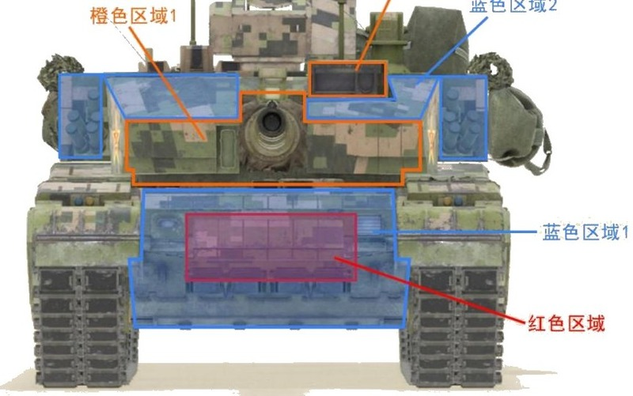
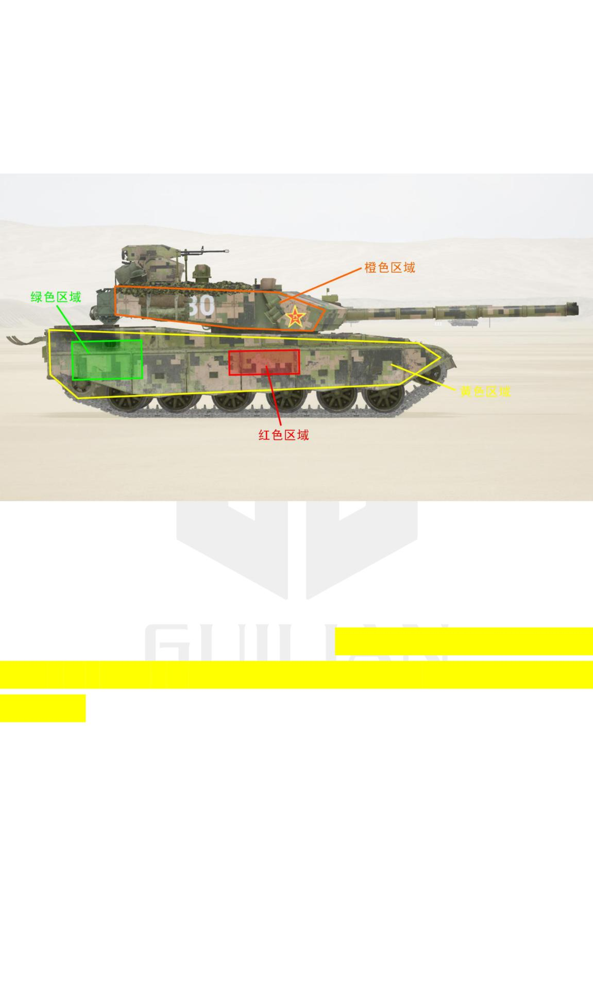
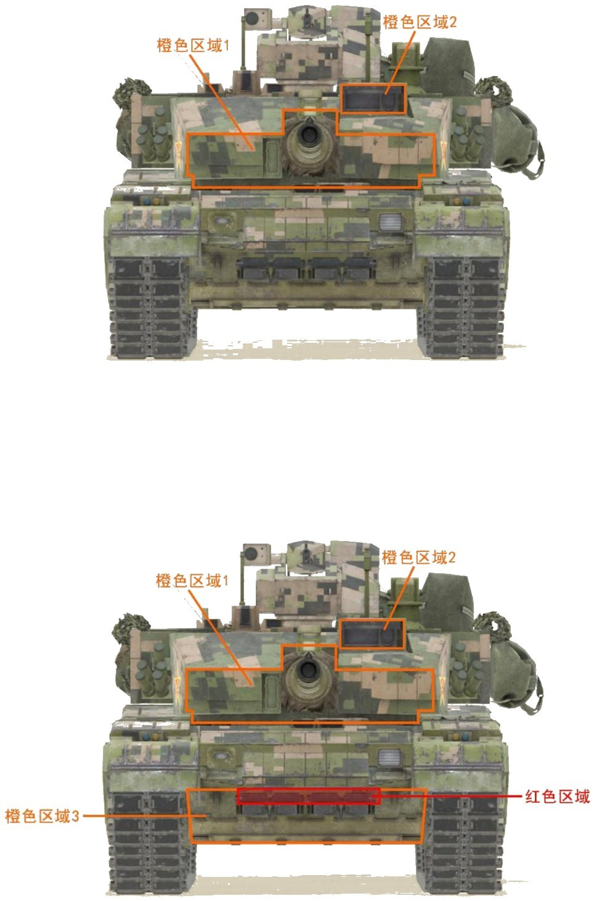
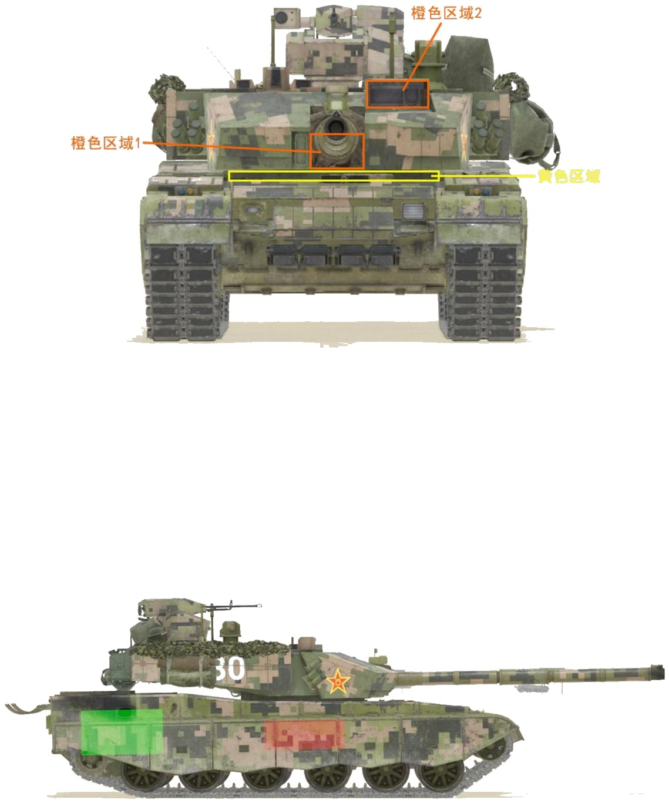
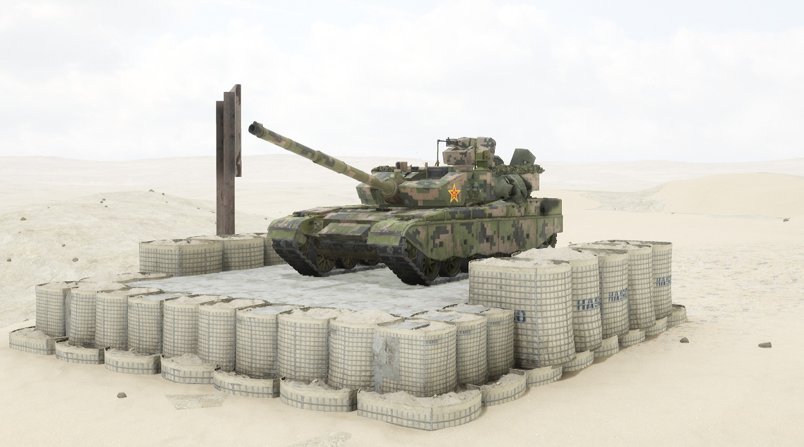
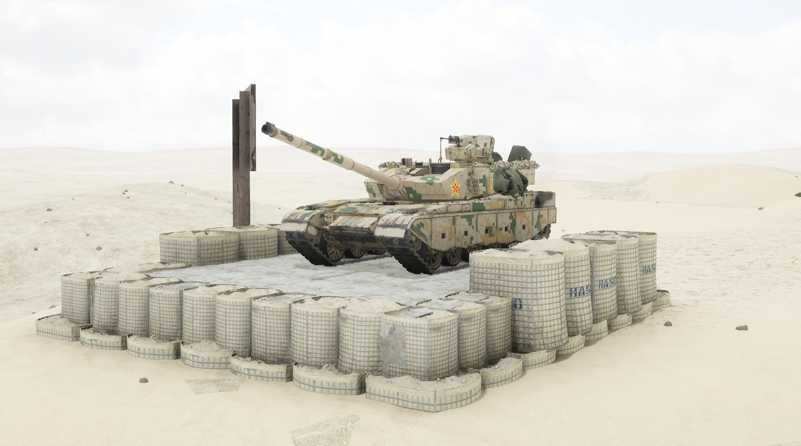

# ZTZ-99A


想当 Squad 服主？50 元/月起就能拿下入门款专属服务器！[南赛云](https://server.squadovo.cn/)是高性价比开服首选，低价不低质，让您轻松启动专属战局，低成本圆服主梦～


ZTZ-99A 是中华人民共和国自主研发的第三代主战坦克

## 基本数据

| 数据名称     | 值      |
| -------- | ------ |
| 载具血量     | 3000   |
| 最大载员人数   | 3      |
| 最大载弹量    | 50     |
| 是否为两栖载具  | 否      |
| 是否具备 STA | 是      |
| 瞄具可缩放倍数  | 4x、12x |
| 价值兵力点    | 15     |
| 炮塔血量     | 2000（包含在总血量内） |
| 换弹时间     | 8s |
| 备弹       | AP 15 / HE 12 / HF 12 / GM 4 |
| 穿深       | AP 800 / HE 500 / HF 10 / GM 500 |

## 装备的阵营

* [PLA | 中国人民解放军](../../../team/pla.md)
* [PLANMC | 中国人民解放军海军陆战队](../../../team/planmc.md)
* [PLAAGF | 中国人民解放军两栖部队](../../../team/plaagf.md)

## 武器数据



* 子弹数量：1 x 15
* 射击间隙：1.0s
* 装填时间：8.0s
* 最大穿深：800
* 最大伤害：8000
* 爆炸伤害：0
* 安全距离：0m



* 子弹数量：1 x 12
* 射击间隙：1.0s
* 装填时间：8.0s
* 最大穿深：500
* 最大伤害：1900
* 爆炸伤害：200
* 安全距离：0m



* 子弹数量：3000x 1
* 射击间隙：0.085s
* 装填时间：11.28s
* 最大穿深：7
* 最大伤害：97
* 爆炸伤害：0
* 安全距离：0m



* 子弹数量：2 x 1
* 射击间隙：1s
* 装填时间：1s
* 最大穿深：0
* 最大伤害：0
* 爆炸伤害：0
* 安全距离：0m



* 子弹数量：1 x 4
* 射击间隙：0.085s
* 装填时间：8.0s
* 最大穿深：500
* 最大伤害：3000
* 爆炸伤害：200
* 安全距离：123m



* 子弹数量：1 x 12
* 射击间隙：10s
* 装填时间：8.0s
* 最大穿深：10
* 最大伤害：200
* 爆炸伤害：300
* 安全距离：0m



## 载具对抗指南

### 弱点分析

- **正面：** 车体正面几乎无敌，首上覆盖极厚装甲，首下有显示击穿特效但实际上没有打穿的 bug，不要尝试攻击；炮塔上顶面无任何武器能够击穿；弹药架正面投影当前版本坦克炮完全无法从正面攻击到；炮塔主装甲 v8.0.1 后被削废，正面朝向你时可在 1000 米距离击穿，摆头约 20°时可延长至 1200 余米；炮手观瞄全距离皆可击穿，但容易误打到炮塔上顶面造成跳弹。
- **侧面：** 车体侧面在裙板和履带完好的情况下有一定程度减伤；炮塔侧面脆弱，坦克炮攻击几乎不会跳弹；弹药架侧面位于炮塔座圈正下方、从前往后数第 3、第 4 负重轮（第 4 块裙板）正上、车体中上部；攻击侧面发动机体表投影可使其失去动力而瘫痪。

### 载具玩法

- v9.0 后车体首下存在显示击穿特效但实际没有打穿的 bug，完全不用担心正面被坦克炮击穿弹药架，但炮塔主装甲仍可在 1000 米距离被乱穿，炮塔和车体形成两个极端。
- 更适合与敌方坦克贴身拼刺刀，只要保证正面对敌，敌方想打炸你就必须打四炮，而你可以从容攻击敌方弹药架，容错率非常高。
- 炮塔非常脆弱，远距离毫无优势；依托超高机动性近距离拼刺刀是首选项，哪怕面对 M1 那种换弹快的坦克也不怕。

### 对抗建议

- 对坦克：正面可攻击区域以炮塔为主，炮塔主装甲在 1000 米距离即可击穿（摆头约 20°时延长至 1200 余米），炮手观瞄全距离皆可击穿，但注意避免误打到炮塔上顶面造成跳弹。
- 非全威力导弹优先攻击橙色区域 1 的炮闩，其次是橙色区域 2 的炮手观瞄，注意不要打到炮管上。
- 侧面攻击弹药架：99A 弹药架中置，防护力略逊于 M1，无论左右，除了炮射导弹以外的所有反坦克导弹都可以一发点燃弹药架；重筒在两侧也能造成不小的伤害，但很难一发点燃。

### 图示

<figure><figcaption>图12-1 正视图1</figcaption></figure>

<figure><figcaption>图13-1 侧视图1</figcaption></figure>

<figure><figcaption>图14-1 正面可攻击区域（坦克）</figcaption></figure>

<figure><figcaption>图15-1/15-2 正面可攻击区域（导弹）与侧面攻击弹药架</figcaption></figure>

## 载具实图

<figure><figcaption></figcaption></figure>

<figure><figcaption></figcaption></figure>
