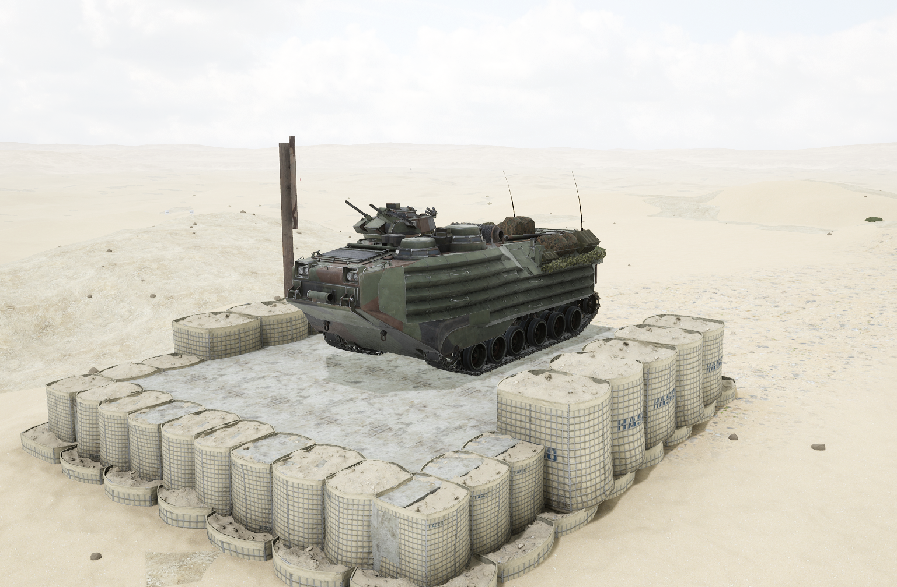
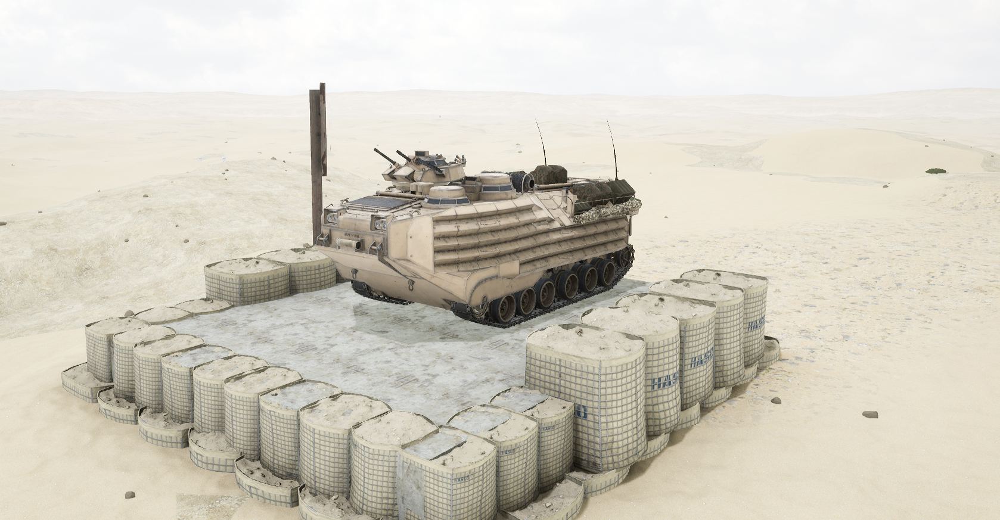

# AAVP-7A1


想当 Squad 服主？50 元/月起就能拿下入门款专属服务器！[南赛云](https://server.squadovo.cn/)是高性价比开服首选，低价不低质，让您轻松启动专属战局，低成本圆服主梦～


AAVP-7A1 是美国 AAV-7A1 两栖突击载具的人员运输车型

## 基本数据

| 数据名称     | 值         |
| -------- | --------- |
| 载具血量     | 2000      |
| 最大载员人数   | 12        |
| 最大载弹量    | 600       |
| 是否为两栖载具  | 是         |
| 是否具备 STA | 否         |
| 瞄具可缩放倍数  | 1.0x、4.5x |
| 价值兵力点    | 10        |

## 装备的阵营

* [USMC | 美国海军陆战队](../../../team/usmc.md)

## 武器数据



* 子弹数量：100 x 5
* 射击间隙：0.12s
* 装填时间：12.5s
* 最大穿深：28
* 最大伤害：153
* 爆炸伤害：0
* 安全距离：0m



* 子弹数量：2 x 1
* 射击间隙：1s
* 装填时间：1s
* 最大穿深：0
* 最大伤害：0
* 爆炸伤害：0
* 安全距离：0m



## 载具实图

<figure><figcaption></figcaption></figure>

<figure><figcaption></figcaption></figure>
