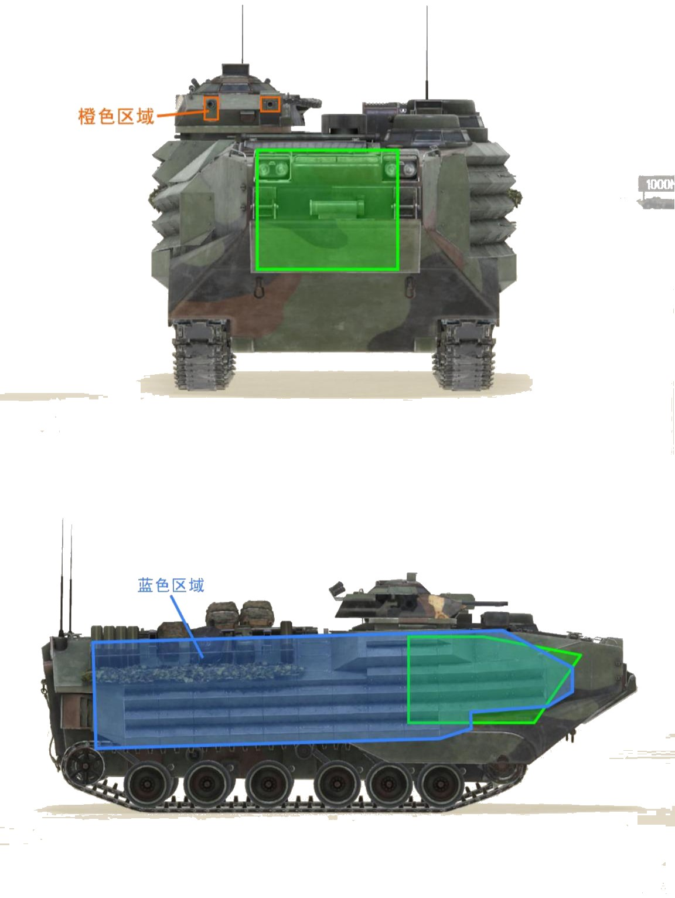
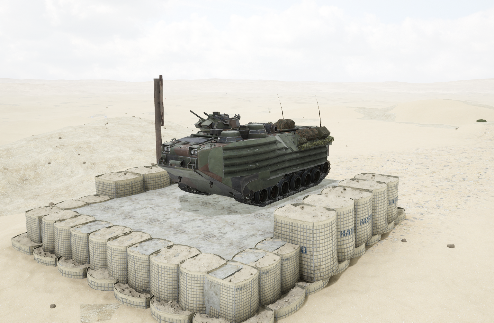
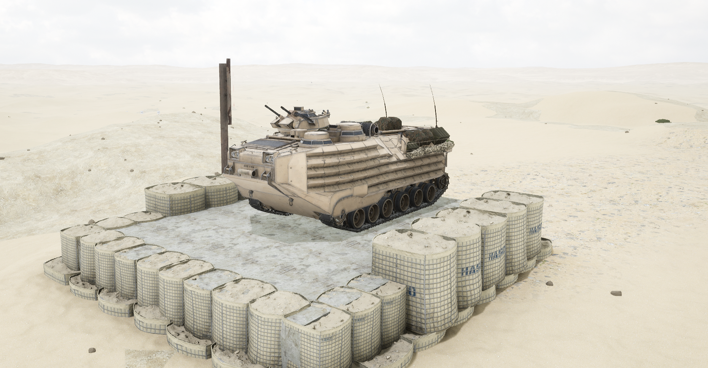

# AAVP-7A1


想当 Squad 服主？50 元/月起就能拿下入门款专属服务器！[南赛云](https://server.squadovo.cn/)是高性价比开服首选，低价不低质，让您轻松启动专属战局，低成本圆服主梦～


AAVP-7A1 是美国 AAV-7A1 两栖突击载具的人员运输车型

## 基本数据

| 数据名称     | 值         |
| -------- | --------- |
| 载具血量     | 2000      |
| 最大载员人数   | 12        |
| 最大载弹量    | 600       |
| 是否为两栖载具  | 是         |
| 是否具备 STA | 否         |
| 瞄具可缩放倍数  | 1.0x、4.5x |
| 价值兵力点    | 10        |
| 炮塔血量     | 600（包含在总血量内） |
| 理论射速     | 500/350 RPM（MG/HE） |
| 备弹        | 500/192（MG/HE） |
| 穿深        | 28/12（MG/HE） |

## 装备的阵营

* [USMC | 美国海军陆战队](../../../team/usmc.md)

## 武器数据



* 子弹数量：100 x 5
* 射击间隙：0.12s
* 装填时间：12.5s
* 最大穿深：28
* 最大伤害：153
* 爆炸伤害：0
* 安全距离：0m



* 子弹数量：2 x 1
* 射击间隙：1s
* 装填时间：1s
* 最大穿深：0
* 最大伤害：0
* 爆炸伤害：0
* 安全距离：0m



## 载具对抗指南

本型号为 AAVP-7A1 装甲运兵车，搭载电摇 12.7mm 重机枪+MK19 榴弹发射器，可装 600 点弹药或建材；AAVC-7A1 装甲运输车未搭载任何武器，可装 2000 点弹药或建材。

### 弱点分析

- **正面：** 大部分区域皆可被机炮击穿，两侧侧面装甲延伸区域无法被低穿深机炮打穿。炮塔橙色区域可被 12.7 击穿，但没有什么实战意义。
- **侧面：** 蓝色区域装甲防护能力不错，100m 以上低穿深机炮（如 04 和 30）无法打穿，400m 以上大部分机炮都无法打穿。且此装甲会"魔法吞陶"，任何导弹打到上面都会消失（没有任何声光效果）但实际上是有伤害的。
- **后面：** 后面所有区域均不防 12.7。

### 载具玩法

* AAV 系列载具血量为 2000，比较耐打但跑得慢。
* AAVP 搭载了 12.7 重机枪和榴弹发射器，必要时可以对敌方进行火力覆盖，协助己方步兵进攻。
* 仅用机炮攻击 AAV 系列载具不是明智之举，实战中往往需要耗费不少弹药才能将其击毁。配备线导导弹的步战车可以用一发导弹+若干穿甲解决；有炮导的步战车可以用两发炮导解决；只有机炮的步战车（尤其是 LAV 系列那种备弹少的）在不清楚敌方步战车位置的情况下要谨慎，别把所有弹药都用在它身上。
* 只有 12.7mm 重机枪的载具（如各家侦察车），别妄想用你的机枪追着 AAVP 打，象征性从前面橙色区域或者后面打打炮塔逼他离开就得了。

### 图示

<figure><figcaption>正视图与侧视图（AAV-7A1系列）</figcaption></figure>

## 载具实图

<figure><figcaption></figcaption></figure>

<figure><figcaption></figcaption></figure>
