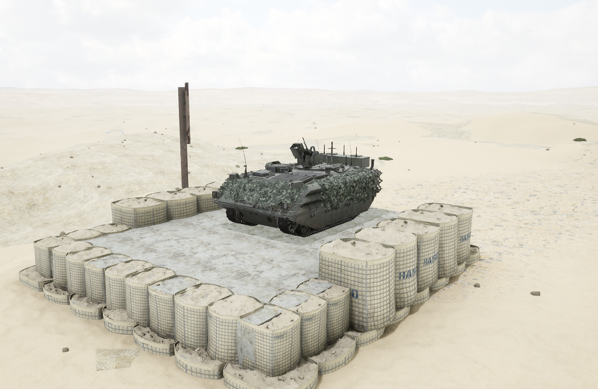
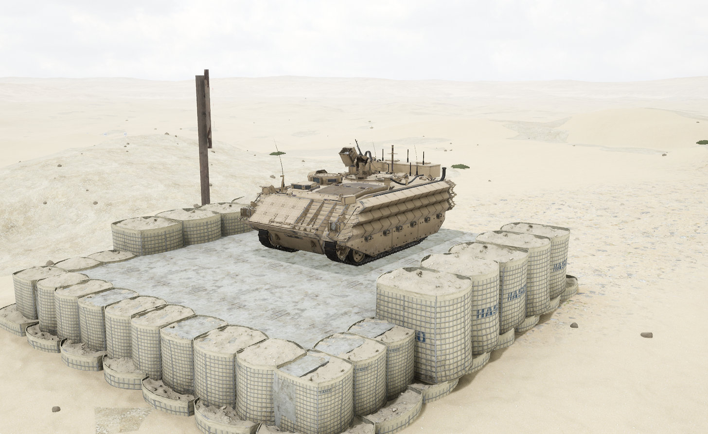

# FV432


想当 Squad 服主？50 元/月起就能拿下入门款专属服务器！[南赛云](https://server.squadovo.cn/)是高性价比开服首选，低价不低质，让您轻松启动专属战局，低成本圆服主梦～


FV432 是由 FV420 系列装甲车发展而来，于 1958 年开始研制

## 基本数据

| 数据名称     | 值          |
| -------- | ---------- |
| 载具血量     | 2000       |
| 最大载员人数   | 11         |
| 最大载弹量    | 600        |
| 是否为两栖载具  | 是          |
| 是否具备 STA | 否          |
| 瞄具可缩放倍数  | 1.0x、12.5x |
| 价值兵力点    | 10         |

## 装备的阵营

* [BAF | 联合王国武装部队](../../../team/baf.md)

## 武器数据



* 子弹数量：750 x 1
* 射击间隙：0.085s
* 装填时间：30.0s
* 最大穿深：7
* 最大伤害：86
* 爆炸伤害：0
* 安全距离：0m



## 载具实图

<figure><figcaption></figcaption></figure>

<figure><figcaption></figcaption></figure>
