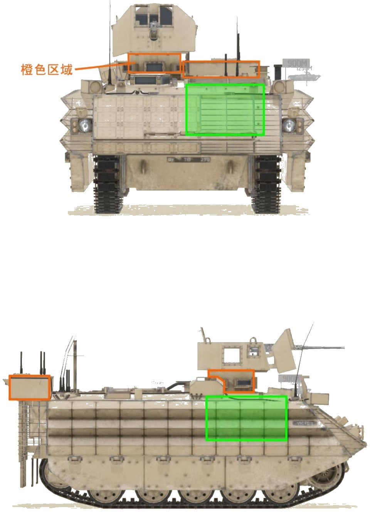
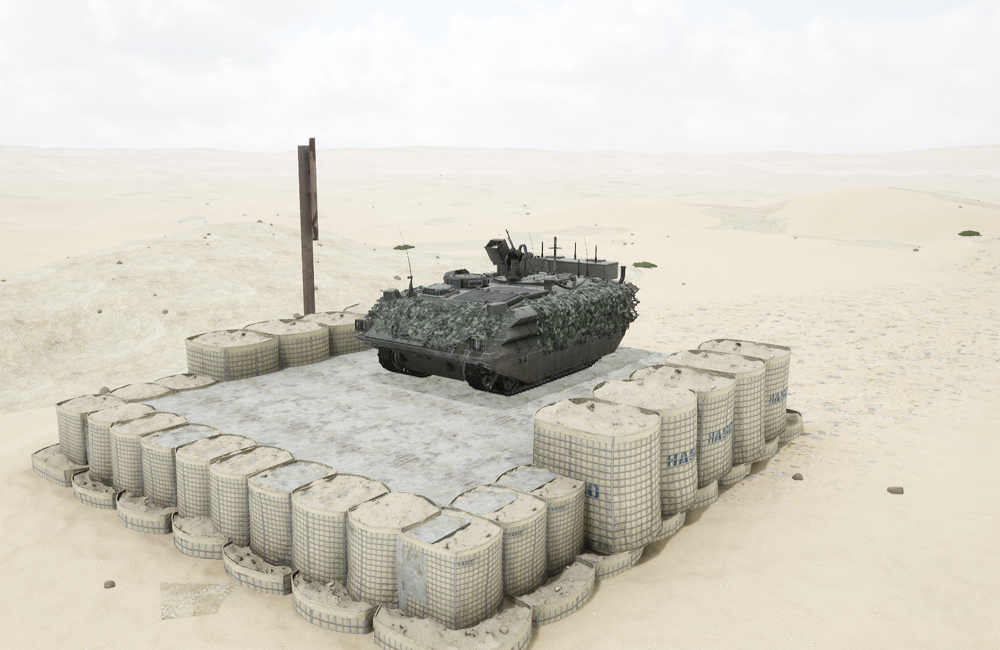
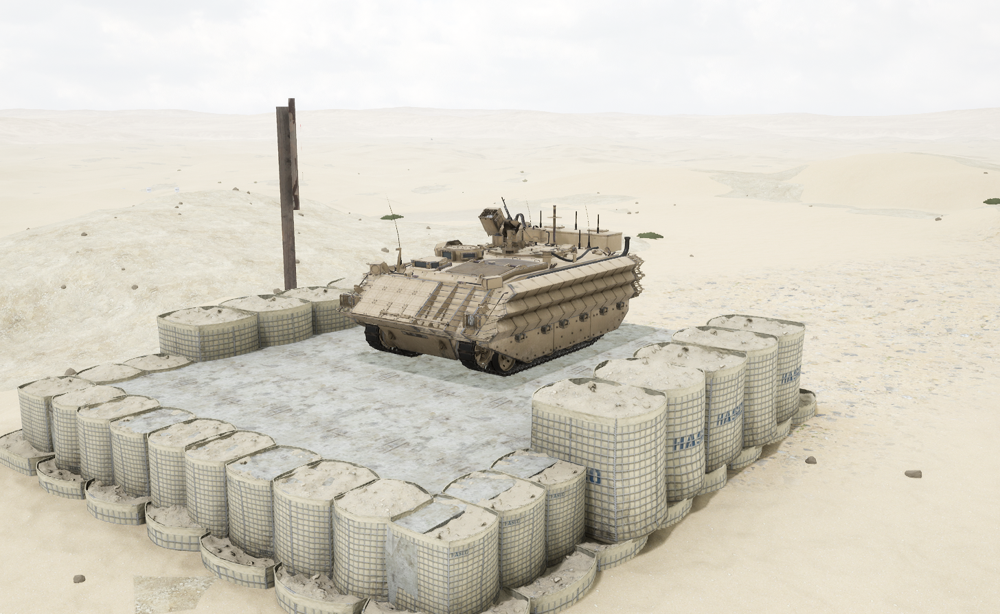

# FV432


想当 Squad 服主？50 元/月起就能拿下入门款专属服务器！[南赛云](https://server.squadovo.cn/)是高性价比开服首选，低价不低质，让您轻松启动专属战局，低成本圆服主梦～


FV432 是由 FV420 系列装甲车发展而来，于 1958 年开始研制

## 基本数据

| 数据名称     | 值          |
| -------- | ---------- |
| 载具血量     | 2000       |
| 最大载员人数   | 11         |
| 最大载弹量    | 600        |
| 是否为两栖载具  | 是          |
| 是否具备 STA | 否          |
| 瞄具可缩放倍数  | 1.0x、12.5x |
| 价值兵力点    | 10         |
| 炮塔血量     | 300（独立血量） |
| 理论射速     | 500（L11A1）/705（L37A2）RPM |
| 备弹        | 400（L11A1）/750（L37A2） |
| 穿深        | 28（L11A1）/7（L37A2） |

## 装备的阵营

* [BAF | 联合王国武装部队](../../../team/baf.md)

## 武器数据



* 子弹数量：750 x 1
* 射击间隙：0.085s
* 装填时间：30.0s
* 最大穿深：7
* 最大伤害：86
* 爆炸伤害：0
* 安全距离：0m



## 载具对抗指南

### 弱点分析

- **正面：** FV432 正面车体全防 12.7，仅有橙色区域炮塔座圈和后方露出的工具箱可造成伤害（类似 LAV6）。
- **侧面：** 侧面车体同样全防 12.7，仅有炮塔座圈和后方工具箱可造成伤害。FV432 侧面装甲区没有 AAV 系列那么抽象，即使是 30 的机炮在中远距离也能造成伤害。
- **后面：** 后面车体可被 12.7 击穿。

### 载具玩法

* FV432 系列载具血量为 2000，比较耐打但跑得慢。
* FV432 系列相比 AAV 系列火力要弱得多，几乎没有什么进攻能力，更适合侦察或带步兵转点。
* 使用机炮攻击 FV432，参考 AAV 系列篇；使用机枪攻击 FV432，同样参考 AAV 系列篇。

### 图示

<figure><figcaption>正视图与侧视图（FV432系列）</figcaption></figure>

## 载具实图

<figure><figcaption></figcaption></figure>

<figure><figcaption></figcaption></figure>
