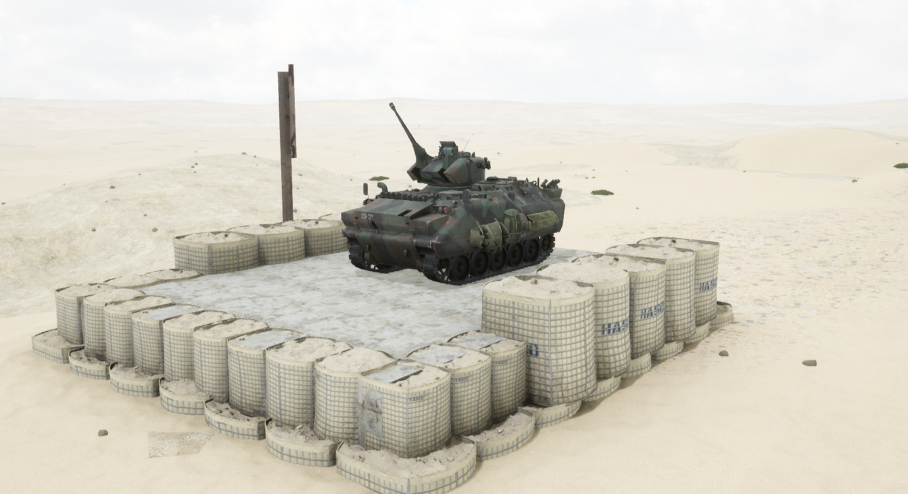
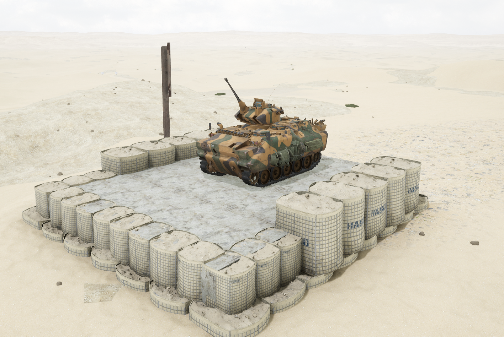

# ACV-15 25mm

ACV-15 IFV 是土耳其 FNSS 公司开发的一款两栖步兵战车

## 基本数据

| 数据名称     | 值      |
| -------- | ------ |
| 载具血量     | 1250   |
| 最大载员人数   | 11     |
| 最大载弹量    | 600    |
| 是否为两栖载具  | 是      |
| 是否具备 STA | 是      |
| 瞄具可缩放倍数  | 1x、10x |
| 价值兵力点    | 10     |

## 装备的阵营

* [TLF | 土耳其陆军](../../../team/tlf-tu-er-qi-lu-jun.md)

## 武器数据



* 子弹数量：70 x 1
* 射击间隙：0.3s
* 装填时间：12.5s
* 最大穿深：95
* 最大伤害：400
* 爆炸伤害：0
* 安全距离：0m



* 子弹数量：230 x 1
* 射击间隙：0.3s
* 装填时间：12.5s
* 最大穿深：8
* 最大伤害：100
* 爆炸伤害：125
* 安全距离：0m



* 子弹数量：800 x 2
* 射击间隙：0.07s
* 装填时间：11.28s
* 最大穿深：7
* 最大伤害：86
* 爆炸伤害：0
* 安全距离：0m



* 子弹数量：2 x 1&#x20;
* 射击间隙：1s
* 装填时间：1s
* 最大穿深：0
* 最大伤害：0
* 爆炸伤害：0
* 安全距离：0



## 载具实图

<figure><figcaption></figcaption></figure>

<figure><figcaption></figcaption></figure>
