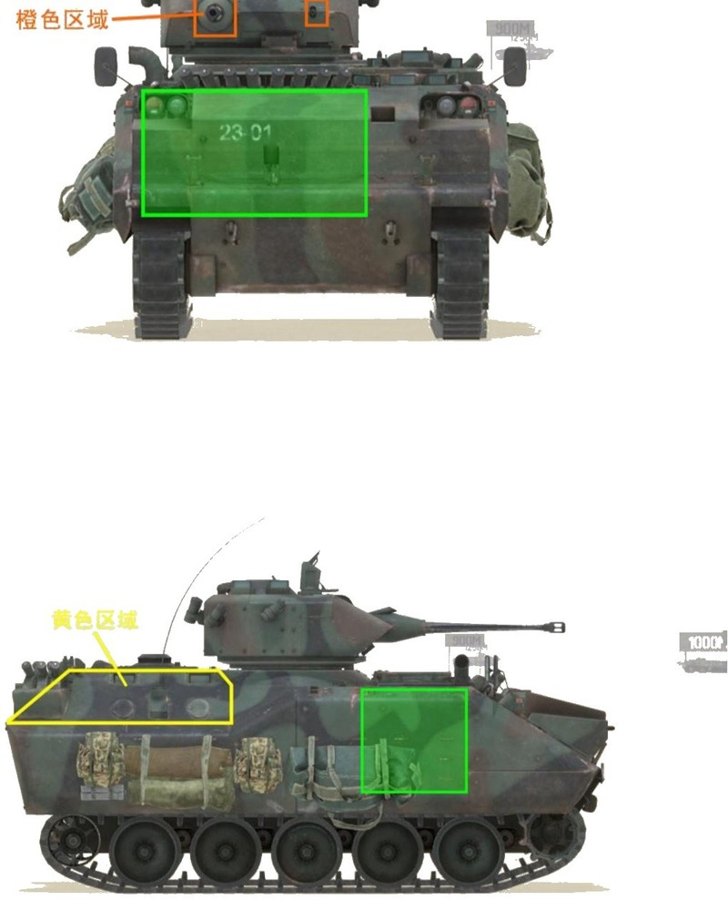
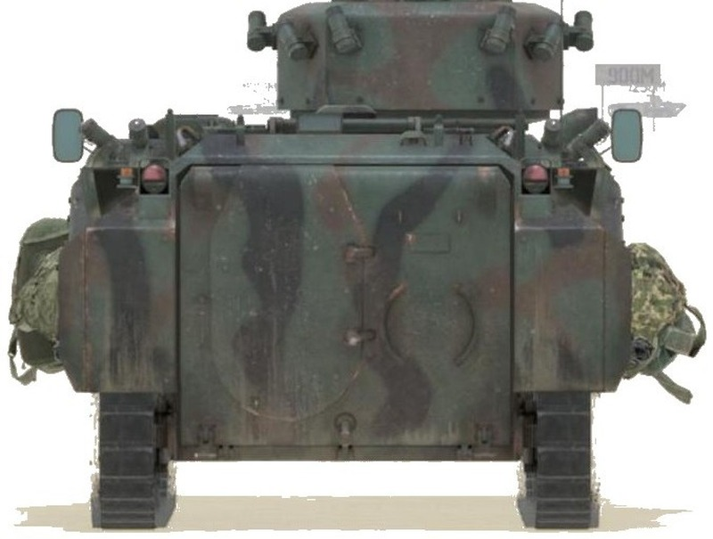
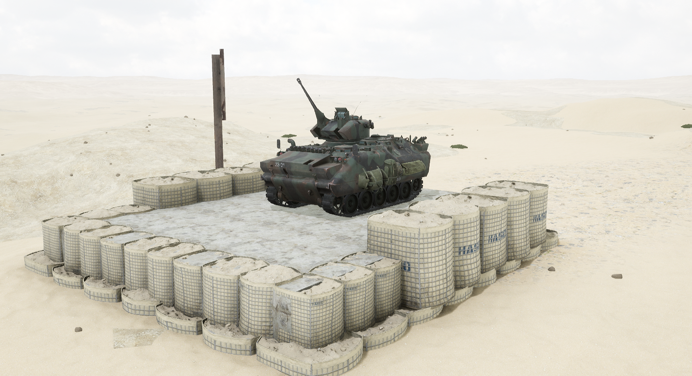
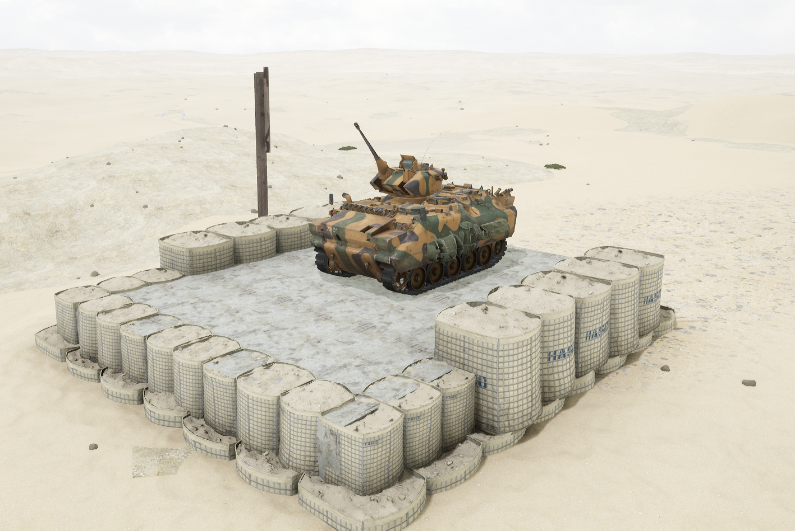

# ACV-15 25mm

ACV-15 IFV 是土耳其 FNSS 公司开发的一款两栖步兵战车

## 基本数据

| 数据名称     | 值      |
| -------- | ------ |
| 载具血量     | 1250   |
| 最大载员人数   | 11     |
| 最大载弹量    | 600    |
| 是否为两栖载具  | 是      |
| 是否具备 STA | 是      |
| 瞄具可缩放倍数  | 1x、10x |
| 价值兵力点    | 10     |
| 炮塔血量      | 400（包含在总血量内） |
| 理论射速      | 200 RPM |
| 备弹        | AP 70 / HE 230 |
| 穿深        | AP 95 / HE 8 |

## 装备的阵营

* [TLF | 土耳其陆军](../../../team/tlf-tu-er-qi-lu-jun.md)

## 武器数据



* 子弹数量：70 x 1
* 射击间隙：0.3s
* 装填时间：12.5s
* 最大穿深：95
* 最大伤害：400
* 爆炸伤害：0
* 安全距离：0m



* 子弹数量：230 x 1
* 射击间隙：0.3s
* 装填时间：12.5s
* 最大穿深：8
* 最大伤害：100
* 爆炸伤害：125
* 安全距离：0m



* 子弹数量：800 x 2
* 射击间隙：0.07s
* 装填时间：11.28s
* 最大穿深：7
* 最大伤害：86
* 爆炸伤害：0
* 安全距离：0m



* 子弹数量：2 x 1&#x20;
* 射击间隙：1s
* 装填时间：1s
* 最大穿深：0
* 最大伤害：0
* 爆炸伤害：0
* 安全距离：0



## 载具对抗指南

ACV-15 系列：1.ACV-15 M2 运兵车，搭载手摇 12.7mm 重机枪；2.ACV-15 MG3 运兵车，搭载手摇 7.62mm 轻机枪；3.ACV-15 25mm 步兵战车（简称 ACV25），搭载 25mm 机炮。图示为 ACV-15 25mm 步兵战车。

### 弱点分析

ACV-15 系列底盘相同，仅有炮塔有所区别：

- **正面：** 25 正面大部分全防 12.7，仅有两块橙色区域可打穿，实战意义不大，机炮则不受限制。
- **侧面：** ACV-15 系列侧面大部分全防 12.7，仅有黄色区域在 150m 内可被 12.7 打穿。
- **后面：** 后面车体和炮塔均可被 12.7 打穿。

### 载具玩法

1. ACV-15 系列驾驶体验在履带式中最差（之一），速度慢稳定性差，甩尾漂移或碰到凸起物都可能侧翻甚至飞天。驾驶员避免大幅动作，尽量走平坦道路，不要硬钻树林。
2. ACV25 主武器、车体血量与 LAV25 系列一致，但机动性太差劲，单打独斗表现一般，抱团或远程用高爆洗步兵更适合。

### 对抗建议

1. 坦克打 ACV-15 系列跟打 LAV25 系列差不多，两炮即炸。
2. 带导弹步战车参考布莱德利篇。
3. 不带导弹步战车面对 ACV25 锁定攻击炮塔，其他两个手摇型号在打掉机枪手后攻击其车体（手摇车辆攻击炮塔无伤）。
4. 只有 12.7mm（.50）重机枪的载具不可与 ACV25 硬刚，其正面和侧面大部分区域都防 12.7。

### 图示

<figure><figcaption>正视图与侧视图</figcaption></figure>

<figure><figcaption>后视图</figcaption></figure>

## 载具实图

<figure><figcaption></figcaption></figure>

<figure><figcaption></figcaption></figure>
