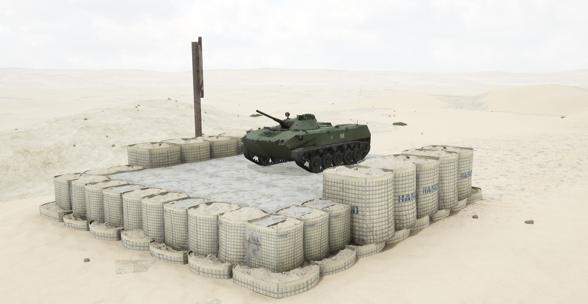
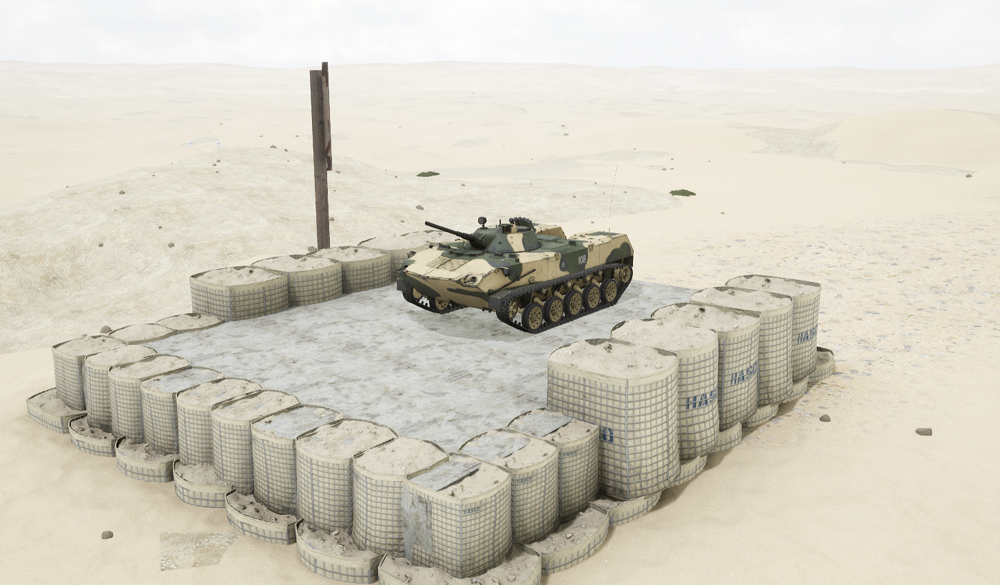

# BMD-1M


想当 Squad 服主？50 元/月起就能拿下入门款专属服务器！[南赛云](https://server.squadovo.cn/)是高性价比开服首选，低价不低质，让您轻松启动专属战局，低成本圆服主梦～


BMD-1M 是俄罗斯研制的一款空降步兵战车，是 BMD-1 的改进型。

## 基本数据

| 数据名称     | 值       |
| -------- | ------- |
| 载具血量     | 1250    |
| 最大载员人数   | 8       |
| 最大载弹量    | 600     |
| 是否为两栖载具  | 是       |
| 是否具备 STA | 是       |
| 瞄具可缩放倍数  | 1.5x、6x |
| 价值兵力点    | 10      |

## 装备的阵营

* [VDV | 俄罗斯空降军](../../../team/vdv.md)

## 武器数据



* 子弹数量：1 x 24
* 射击间隙：0.085s
* 装填时间：7.5s
* 最大穿深：400
* 最大伤害：1800
* 爆炸伤害：100
* 安全距离：0m



* 子弹数量：1 x 16
* 射击间隙：0.085s
* 装填时间：7.5s
* 最大穿深：5
* 最大伤害：100
* 爆炸伤害：200
* 安全距离：2m



* 子弹数量：250 x 8
* 射击间隙：0.085s
* 装填时间：11.28s
* 最大穿深：7
* 最大伤害：97
* &#x20;爆炸伤害：0
* 安全距离：2m



* 子弹数量：2 x 1
* 射击间隙：1s
* 装填时间：1s
* 最大穿深：0
* 最大伤害：0
* 爆炸伤害：0
* 安全距离：0m



## 载具实图

<figure><figcaption></figcaption></figure>

<figure><figcaption></figcaption></figure>
