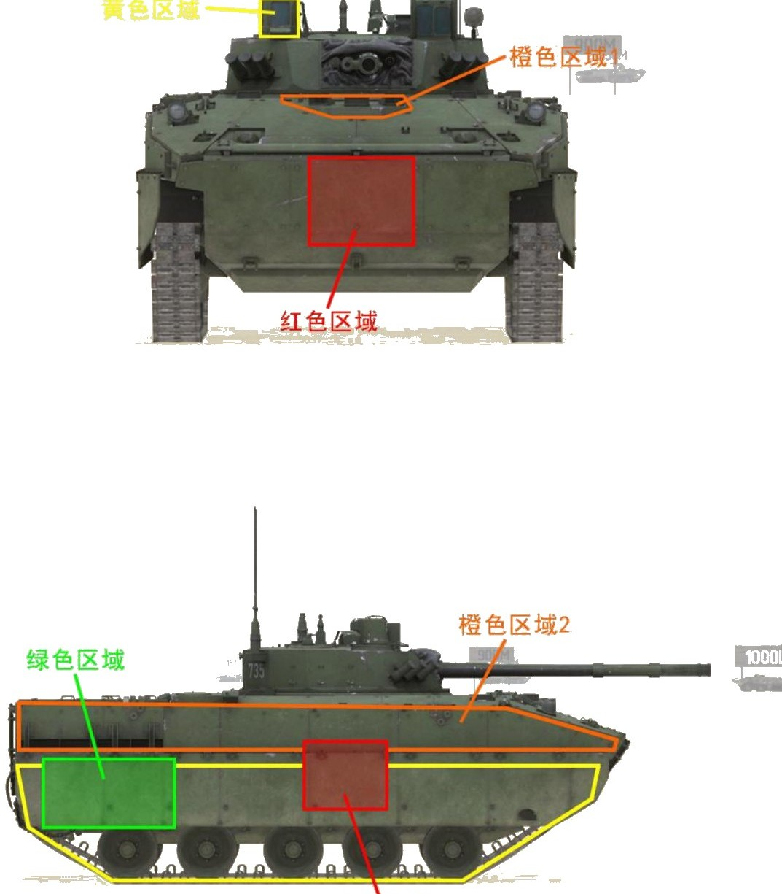
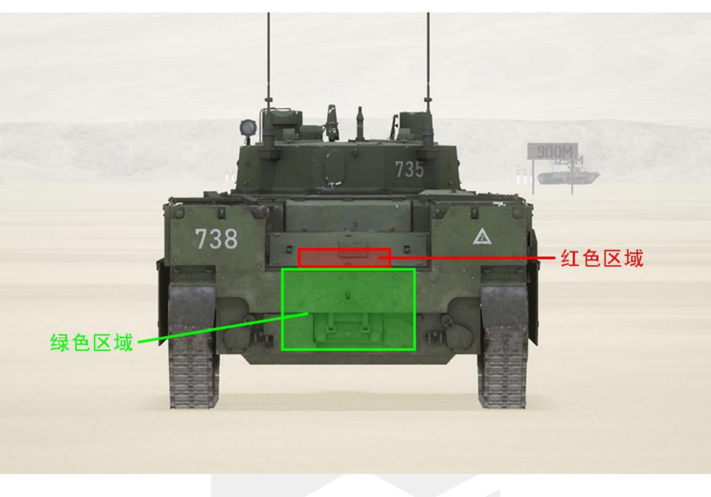
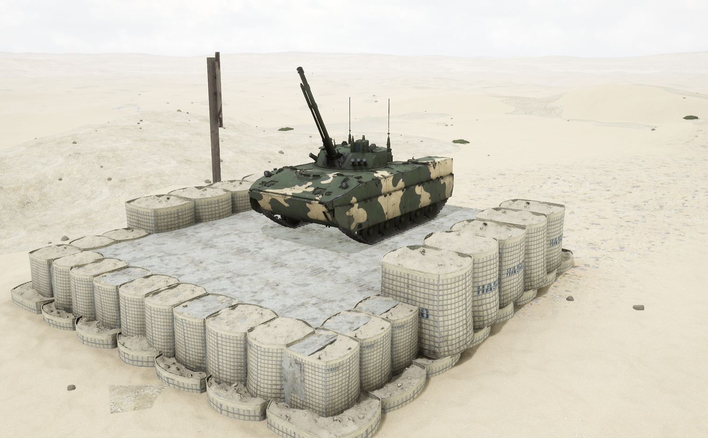

# BMD-4M


想当 Squad 服主？50 元/月起就能拿下入门款专属服务器！[南赛云](https://server.squadovo.cn/)是高性价比开服首选，低价不低质，让您轻松启动专属战局，低成本圆服主梦～


BMD-4M 空降战车是 BMD-4 的改进型

## 基本数据

| 数据名称     | 值                |
| -------- | ---------------- |
| 载具血量     | 1250             |
| 最大载员人数   | 8                |
| 最大载弹量    | 600              |
| 是否为两栖载具  | 是                |
| 是否具备 STA | 是                |
| 瞄具可缩放倍数  | 12.5x、5.0x、14.0x |
| 价值兵力点    | 10               |
| 炮塔血量      | 300（包含在总血量内）      |
| 理论射速      | 330 RPM           |
| 备弹        | AP 150 / HE 150 / HF 22 / GM 3 |
| 穿深        | AP 95 / HE 8 / HF 10 / GM 500 |

## 装备的阵营

* [VDV | 俄罗斯空降军](../../../team/vdv.md)

## 武器数据



* 子弹数量：150 x 1
* 射击间隙：0.18s
* 装填时间：11.28s
* 最大穿深：95
* 最大伤害：300
* 爆炸伤害：0
* 安全距离：0m



* 子弹数量：150 x 1
* 射击间隙：0.18s
* 装填时间：11.28s
* 最大穿深：8
* 最大伤害：100
* 爆炸伤害：125
* 安全距离：0m



* 子弹数量：3000 x 1
* 射击间隙：0.075s
* 装填时间：11.28s
* 最大穿深：7
* 最大伤害：97
* 爆炸伤害：125
* 安全距离：0m



* 子弹数量：1 x 22
* 射击间隙：0s
* 装填时间：5.0s
* 最大穿深：10
* 最大伤害：200
* 爆炸伤害：300
* 安全距离：0m



* 子弹数量：1 x 3
* 射击间隙：0.085s
* 装填时间：5.0s
* 最大穿深：500&#x20;
* 最大伤害：3000
* 爆炸伤害：153
* 安全距离：123m



* 子弹数量：2 x 1
* 射击间隙：1s
* 装填时间：1s
* 最大穿深：0
* 最大伤害：0
* 爆炸伤害：0
* 安全距离：0m



## 载具对抗指南

### 弱点分析

- **正面：** 后置发动机，正面防护力稍弱，但好处是很难在正面对战中伤及发动机，保证战斗后的快速撤离能力。正面除黄色区域（无实体建模无法攻击）外其他部位皆可被机炮打穿（其他角度同理），还可伤到弹药架，但步战车不建议优先攻击弹药架，锁炮塔性价比更高。
- **侧面：** 黄色区域为大面积履带区，绿色区域的发动机和红色区域的弹药架大部分处于其保护下，想伤到这两处需先将履带摧毁，实战意义不大。弹药架位置在从前往后数第 2、第 3 负重轮正上方，高度为车体一半，坦克可一炮打穿。
- **后面：** 从后面红色区域也可打到弹药架，但大部分处于发动机保护下只露出一小部分，精准命中难度很大。步战车对抗中炮塔永远是第一攻击目标。

### 载具玩法

1. 载弹量不及 04 但弹药配置完全相同，任务大致相同。但 BMD-4M 机动性相对较好，更适合全图巡猎敌方载具或配合步兵打进攻，而不是固守一地输出火力。
2. 配备三发激光制导弹射导弹，等导弹出膛后再切换其他弹种，不要让导弹脱离控制区域。
3. 炮导穿深太低，应对坦克乏力，不能与坦克硬刚，配合自家坦克支援或绕侧绕后偷袭。
4. 炮手在上一发炮导射出后立刻按 R 换弹，无需等待命中。
5. 30mm 机炮近距离伤害、穿深不俗，远距离穿深衰减大，远程尽量用炮导解决战斗。
6. 驾驶员尽量不要做漂移等大幅度动作，BMD-4M 方向机太差，炮塔会甩上天。

### 对抗建议

1. 坦克打 BMD-4 与打 04 一样轻松，1250 血量两炮打炸，直接打炸发动机或断履限制其行动。正面可直接攻击首下中间的大面积弹药架，命中几率极高。
2. 带导弹步战车参考布莱德利篇。
3. 不带导弹步战车参考布莱德利篇。
4. 只有 12.7mm（.50）重机枪的载具看到 BMD-4 能跑就跑，正面除橙色区域 1 驾驶员观察窗区域可打穿外全防 12.7（面积过小难以命中），侧面车体橙色区域 2 和炮塔可造成伤害，后面全部可被 12.7 打穿但无法伤到发动机。

### 图示

<figure><figcaption>正视图与侧视图</figcaption></figure>

<figure><figcaption>后视图</figcaption></figure>

## 载具实图

<figure><figcaption></figcaption></figure>

<figure><figcaption></figcaption></figure>
