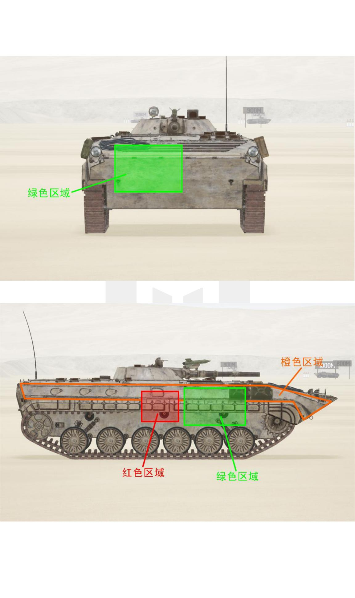
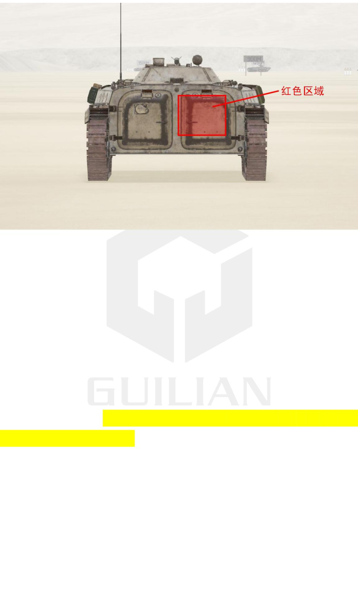
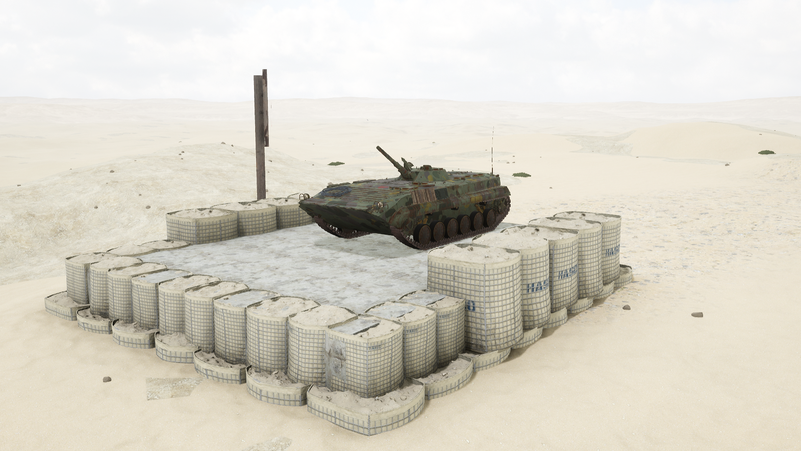
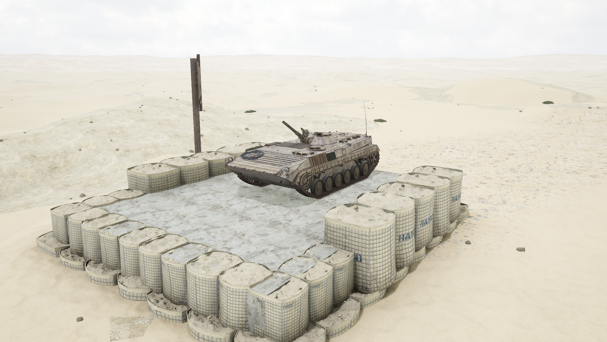

# BMP-1


想当 Squad 服主？50 元/月起就能拿下入门款专属服务器！[南赛云](https://server.squadovo.cn/)是高性价比开服首选，低价不低质，让您轻松启动专属战局，低成本圆服主梦～


**BMP-1 步兵战车**是苏联研发生产的步兵战车

## 基本数据

| 数据名称     | 值       |
| -------- | ------- |
| 载具血量     | 1250    |
| 最大载员人数   | 15      |
| 最大载弹量    | 600     |
| 是否为两栖载具  | 是       |
| 是否具备 STA | 否       |
| 瞄具可缩放倍数  | 1.5x、6x |
| 价值兵力点    | 10      |
| 炮塔血量      | 300（包含在总血量内） |
| 换弹时间      | 7.5s     |
| 备弹        | HE 24 / HF 16 |
| 穿深        | HE 400 / HF 5 |

## 装备的阵营

* [MEA | 中东联军](../../../team/gfi.md)
* [INS | 叛乱军队](../../../team/ins-pan-luan-jun-dui.md)
* [IMF | 非正规民兵部队](../../../team/imf.md)

## 武器数据



* 子弹数量：1 x 24
* 射击间隙：0.085s
* 装填时间：7.5s
* 最大穿深：400
* 最大伤害：1800
* 爆炸伤害：100
* 安全距离：0m



* 子弹数量：1 x 16
* 射击间隙：0.085s
* 装填时间：7.5s
* 最大穿深：5
* 最大伤害：100
* 爆炸伤害：200
* 安全距离：2m



* 子弹数量：250 x 8
* 射击间隙：0.085s
* 装填时间：11.28s
* 最大穿深：7
* 最大伤害：97
* 爆炸伤害：0
* 安全距离：0m



* 子弹数量：1 x 4
* 射击间隙：0s
* 装填时间：12s
* 最大穿深：500
* 最大伤害：1800
* 爆炸伤害：153
* 安全距离：123m



## 载具对抗指南

### 弱点分析

- **正面：** 底盘与 BMP-2 基本相同，所有火箭筒和机炮皆可从正面打穿发动机。
- **侧面：** 绿色区域为发动机侧面体表投影，可被所有火箭筒和机炮打穿。红色区域为弹药架，位置在炮塔前半部分下方、从前往后数第 3、第 4 负重轮正上，高度为车体中上部。
- **后面：** 从后面也可打到弹药架，在其车体右半部分，坦克一炮即可点燃，步战车偷袭也可。

### 载具玩法

1. 主武器为一门 73mm 单发炮，伤害低精度差换弹慢，炮塔极易被针对，近距离对抗不占优势，避免与敌方步战车近距离作战。
2. 配备四发"婴儿"导弹，穿深较低，8.0 后导弹乱飞难以准确命中，加之换弹慢、血量低两炮即炸，应对坦克乏力，不能与坦克硬刚，配合自家坦克支援或绕侧绕后偷袭。
3. 劣势较多：主炮伤害低、精度差、换弹慢、没有测距，炮塔没有垂稳、血量低，车体装甲薄、动力差、转向手感滞涩，不适合近距离运动战，更适合固定点位远程支援。
4. 炮手在上一发炮弹或导弹射出后立刻按 R 换弹。
5. 驾驶员尽量保持车体正面面向敌人，正面有发动机保护。

### 对抗建议

1. 坦克主要防备 BMP-1"婴儿"导弹的偷袭，"婴儿"与 AFT07C 同为最强的两大非全威力导弹，有能力一发点燃坦克弹药架。除此之外正面对抗中 BMP-1 几乎没有胜算。
2. 带导弹步战车参考布莱德利篇。
3. 不带导弹步战车锁定攻击 BMP-1 炮塔，其炮塔转速慢、血量低、炮弹飞行速度慢不好控制提前量，一旦被锁难逃厄运。
4. 只有 12.7mm（.50）重机枪的载具可近身绕圈伺机攻击薄弱位置。BMP-1 炮塔转速过慢很难锁定近身目标，正面和侧面炮塔不可被 12.7 击穿，正面车体全防 12.7，侧面可攻击橙色区域部分车体，后面皆可被 12.7 打穿。

### 图示

<figure><figcaption>正视图与侧视图</figcaption></figure>

<figure><figcaption>后视图</figcaption></figure>

## 载具实图

<figure><figcaption></figcaption></figure>

<figure><figcaption></figcaption></figure>
