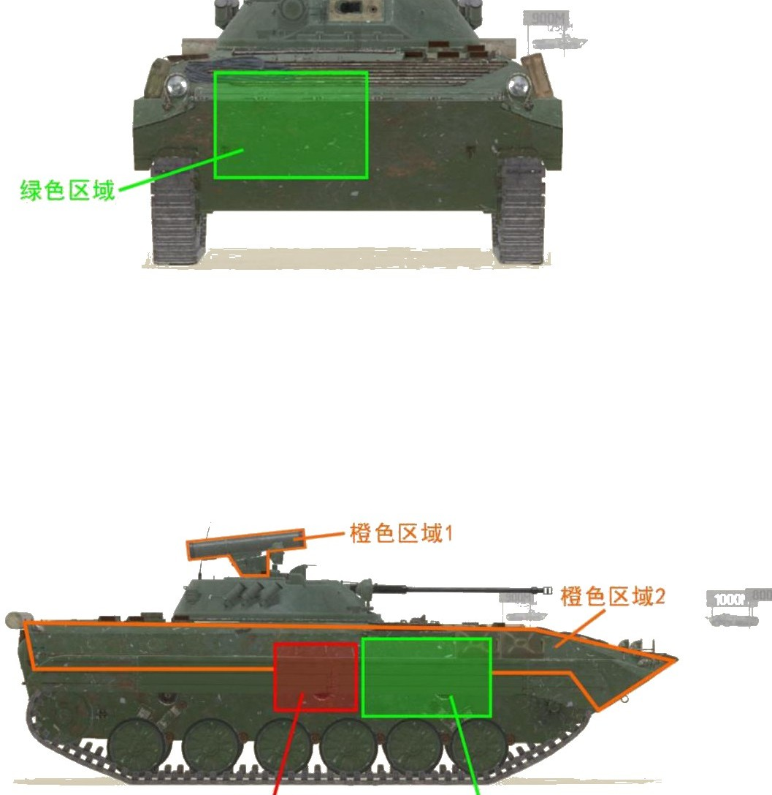
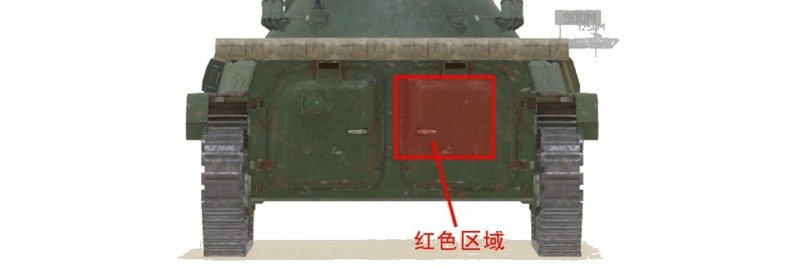
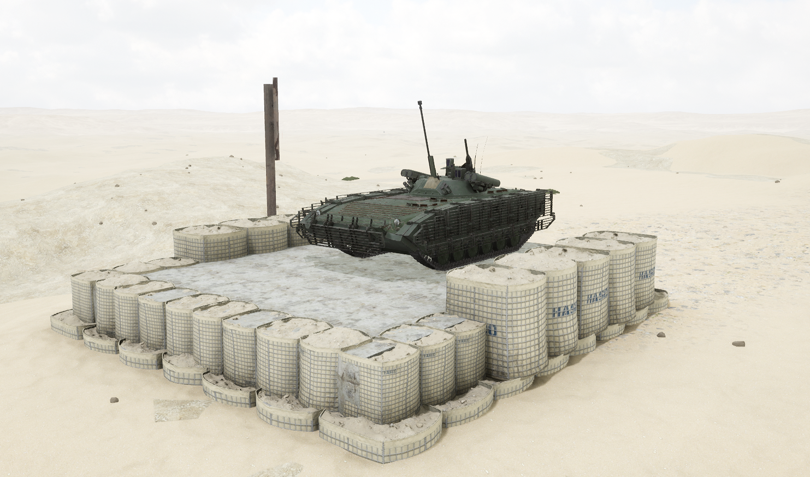
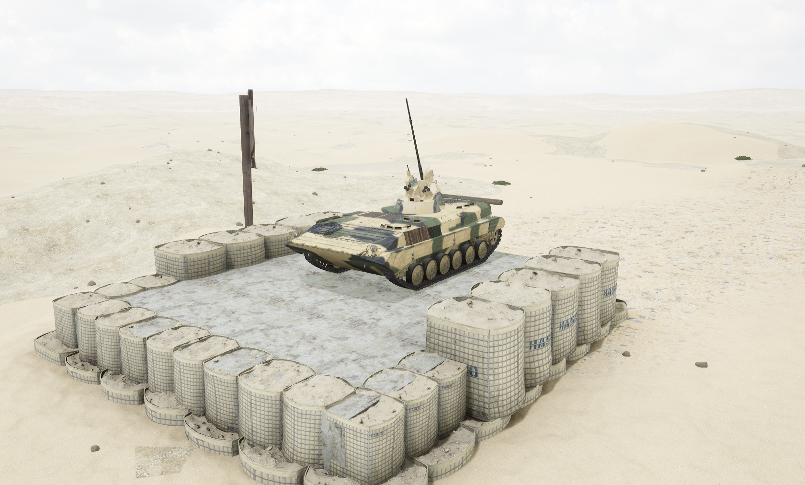

# BMP-2


想当 Squad 服主？50 元/月起就能拿下入门款专属服务器！[南赛云](https://server.squadovo.cn/)是高性价比开服首选，低价不低质，让您轻松启动专属战局，低成本圆服主梦～


BMP-2 是苏联于 20 世纪 70 年代在 BMP-1 的基础上研制并列装的第二代履带式步兵战车

## 基本数据

| 数据名称     | 值       |
| -------- | ------- |
| 载具血量     | 1250    |
| 最大载员人数   | 10      |
| 最大载弹量    | 600     |
| 是否为两栖载具  | 是       |
| 是否具备 STA | 是       |
| 瞄具可缩放倍数  | 1.5x、6x |
| 价值兵力点    | 10      |
| 炮塔血量      | 600（包含在总血量内） |
| 理论射速      | 550 RPM  |
| 备弹        | AP 160 / HE 340 / GM 4 |
| 穿深        | AP 95 / HE 8 / GM 500 |

## 装备的阵营

* [IMF | 非正规民兵部队](../../../team/imf.md)
* [MEA | 中东联军](../../../team/gfi.md)
* [RGF | 俄罗斯陆军](../../../team/rgf.md)

## 武器数据



* 子弹数量：160 x 1
* 射击间隙：0.109s
* 装填时间：11.28s
* 最大穿深：95
* 最大伤害：300
* 爆炸伤害：0
* 安全距离：0m



* 子弹数量：340 x 1
* 射击间隙：0.109s
* 装填时间：11.28s
* 最大穿深：8
* 最大伤害：100
* 爆炸伤害：125
* 安全距离：0m



* 子弹数量：2000 x 1
* 射击间隙：0.0856s
* 装填时间：11.28s
* 最大穿深：7
* 最大伤害：97
* 爆炸伤害：0
* 安全距离：0m



* 子弹数量：2 x 1
* 射击间隙：1s
* 装填时间：1s
* 最大穿深：0&#x20;
* 最大伤害：0
* 爆炸伤害：0
* 安全距离：0m



## 载具对抗指南

### 弱点分析

- **正面：** 发动机前置，正面拥有一定减伤，但防护力比布莱德利弱不少。
- **侧面：** 绿色区域为发动机侧面体表投影，可被所有火箭筒和机炮打穿。红色区域为弹药架，位置在炮塔前半部分下方、从前往后数第 3、第 4 负重轮正上，高度为车体中上部，坦克可一炮打穿。
- **后面：** 从后面也可打到弹药架，在其车体右半部分，坦克一炮即可点燃，步战车偷袭也可。

> **Ps：** 伊朗陆军 BMP-2 使用的 3UBR6 穿甲弹穿深比俄罗斯陆军 BMP-2 使用的 3UBR8 略逊，为 70。

### 载具玩法

1. 配备四发"竞赛"导弹，但穿深较低、飞行路径难以掌握，加之换弹慢、血量低两炮即炸，应对坦克乏力，不能与坦克硬刚，配合自家坦克支援或绕侧绕后偷袭。
2. 和布莱德利一样不能秒切、需停车开火。
3. 炮手养成上一发导弹射出后立刻按 R 换弹的习惯，无需等待命中。
4. 30mm 机炮远距离穿深衰减大、连续射击会过热，避免与远距离敌方步战车站桩互射。
5. 驾驶员尽量保持车体正面面向敌人，正面有发动机保护。
6. BMP-2 分为俄军/伊朗有导弹版本和民兵无导弹版本。

### 对抗建议

1. 坦克打 BMP-2 比打布莱德利轻松，第一发尽量命中炮塔使其丧失反击能力、打炸发动机或断履限制其行动。1250 血量两炮即可打炸，且导弹换弹很慢（12s）。
2. 带导弹步战车参考布莱德利篇。
3. 不带导弹步战车参考布莱德利篇。
4. 只有 12.7mm（.50）重机枪的载具（如 M1126 斯崔克），正面唯一可攻击的是橙色区域 1 的导弹发射筒（与炮塔共享血量），侧面可攻击橙色区域 2 部分车体，后面皆可被 12.7 打穿，但 12.7 无法伤到 BMP-2 的弹药架。

### 图示

<figure><figcaption>正视图与侧视图</figcaption></figure>

<figure><figcaption>后视图</figcaption></figure>

## 载具实图

<figure><figcaption></figcaption></figure>

<figure><figcaption></figcaption></figure>
