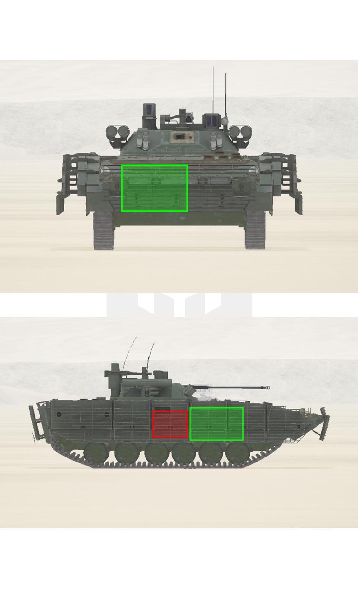
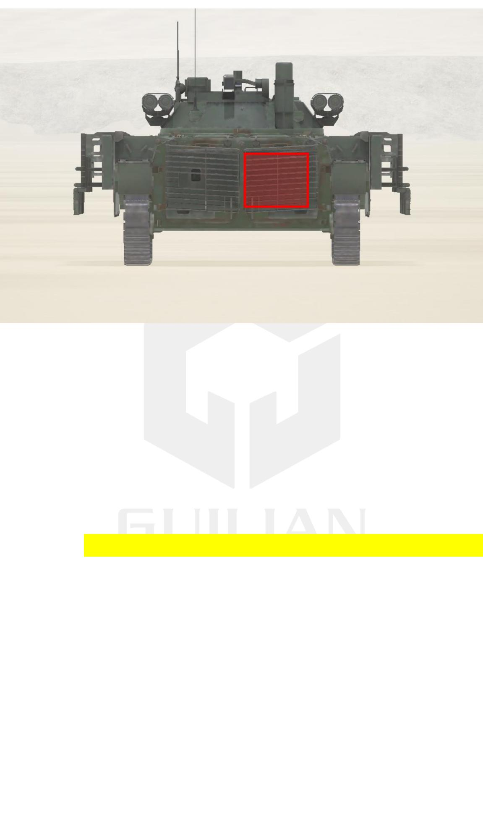
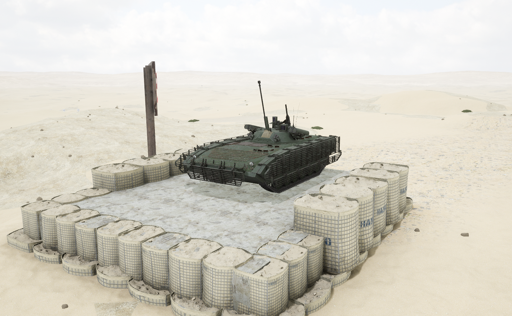
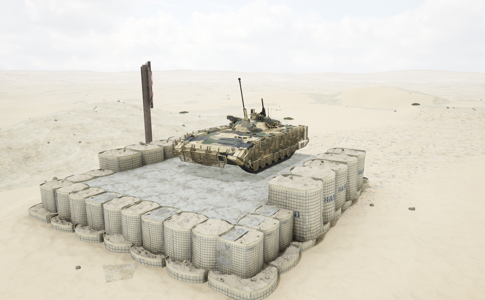

# BMP-2M


想当 Squad 服主？50 元/月起就能拿下入门款专属服务器！[南赛云](https://server.squadovo.cn/)是高性价比开服首选，低价不低质，让您轻松启动专属战局，低成本圆服主梦～


BMP-2M 是基于 [BMP-2](bmp-2.md) 推出的现代化升级版本，融入了新型武器系统与电子设备

## 基本数据

| 数据名称     | 值       |
| -------- | ------- |
| 载具血量     | 1250    |
| 最大载员人数   | 10      |
| 最大载弹量    | 600     |
| 是否为两栖载具  | 是       |
| 是否具备 STA | 是       |
| 瞄具可缩放倍数  | 1.5x、6x |
| 价值兵力点    | 10      |
| 炮塔血量      | 600（包含在总血量内） |
| 理论射速      | 550 RPM  |
| 备弹        | AP 160 / HE 340 / GL 120 / GM 4 |
| 穿深        | AP 95 / HE 8 / GL 0 / GM 900 |

## 装备的阵营

* [RGF | 俄罗斯陆军](../../../team/rgf.md)

## 武器数据



* 子弹数量：160 x 1
* 射击间隙：0.109s
* 装填时间：11.28s
* 最大穿深：95
* 最大伤害：300
* 爆炸伤害：0
* 安全距离：0m



* 子弹数量：340 x 1
* 射击间隙：0.109s
* 装填时间：11.28s
* 最大穿深：8
* 最大伤害：100
* 爆炸伤害：125
* 安全距离：0m



* 子弹数量：4 x 1
* 射击间隙：2.0s
* 装填时间：12.0s
* 最大穿深：900
* 最大伤害：1800
* 爆炸伤害：153
* 安全距离：123m



* 子弹数量：120 x 1
* 射击间隙：0.15s
* 装填时间：11.28s
* 最大穿深：0
* 最大伤害：10
* 爆炸伤害：115
* 安全距离：25m



* 子弹数量：2000 x 1
* 射击间隙：0.0856s
* 装填时间：11.28s
* 最大穿深：7
* 最大伤害：97
* 爆炸伤害：0
* 安全距离：0m



* 子弹数量：2 x 1
* 射击间隙：1s
* 装填时间：1s
* 最大穿深：0
* 最大伤害：0
* 爆炸伤害：0
* 安全距离：0m



## 载具对抗指南

### 弱点分析

- **正面：** BMP-2M 是 BMP-2 的现代化改进版，整体架构基本相同，最明显区别是四联装短号导弹和格栅装甲。在格栅装甲保护下，反坦克筒威胁大大降低，无论轻重筒都无法从正面拥有格栅装甲保护的区域击毁其发动机，甚至可能被直接拦截。
- **侧面：** 在格栅装甲保护下，重筒大部分情况下可从其右侧重创弹药架但无法直接点燃，轻筒可造成伤害但有减伤；从左侧只能对车体造成基础伤害。
- **后面：** 火箭筒无法从后面伤到 BMP-2M 的弹药架，只有坦克可以一炮点燃。

### 载具玩法

1. 四发"短号"导弹可连射无需换弹，任何载具与其硬刚都要掂量。注意要等导弹出膛后再切换其他弹种，否则导弹会直接消失。
2. 有四联短号也不意味着可随意与坦克单挑，8.0 后导弹轨迹难控制、自身较脆两炮即炸，依赖打先手；打伏击或远程狙击效果更好。
3. 使用 BMP-2 同款 30mm 机炮，远距离穿深衰减大，远距离尽量优先使用导弹。
4. 驾驶员尽量保持车体正面面向敌人，正面有发动机保护。
5. 绝大部分强度建立在四联短号能有效毁伤目标的前提下。

### 对抗建议

1. 坦克第一要务是限制四联短号，优先攻击炮塔使其直接失去反击能力。弹药架不是优先攻击目标，截至 v10.0，BMP-2M 弹药架起火后弹药依然不会烧毁、仍可正常射击。
2. 带导弹步战车参考布莱德利篇。
3. 不带导弹步战车参考布莱德利篇。
4. 只有 12.7mm（.50）重机枪的载具参考 BMP-2 篇，但注意不要攻击有格栅装甲保护的区域。

### 图示

<figure><figcaption>正视图与侧视图</figcaption></figure>

<figure><figcaption>后视图</figcaption></figure>

## 载具实图

<figure><figcaption></figcaption></figure>

<figure><figcaption></figcaption></figure>
