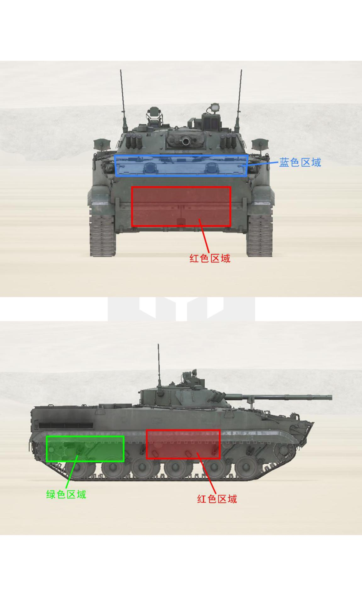
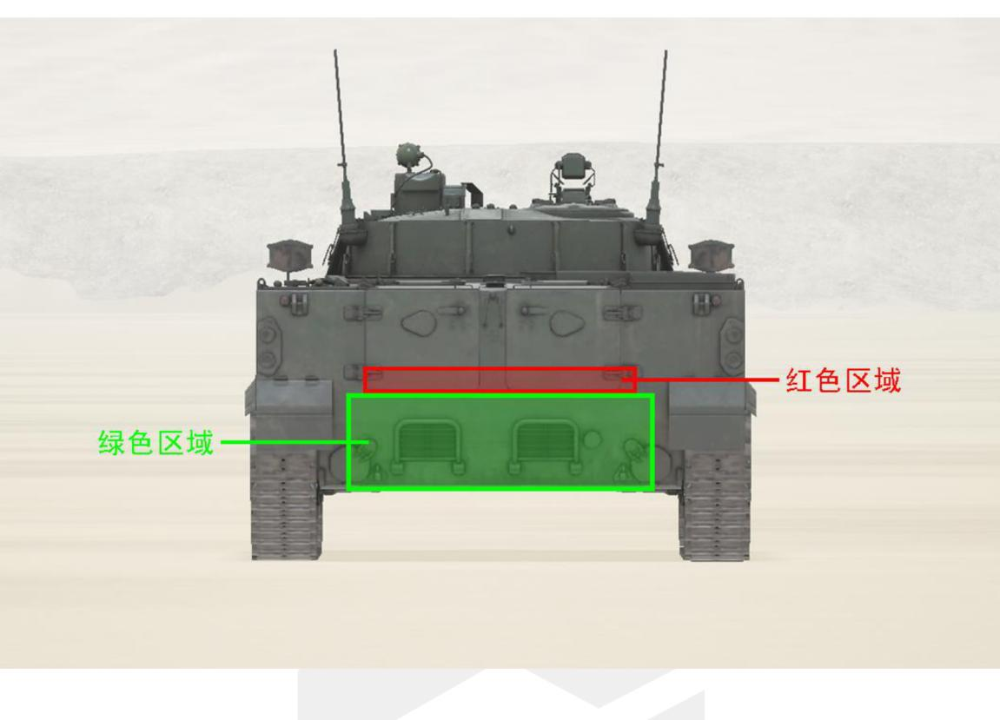
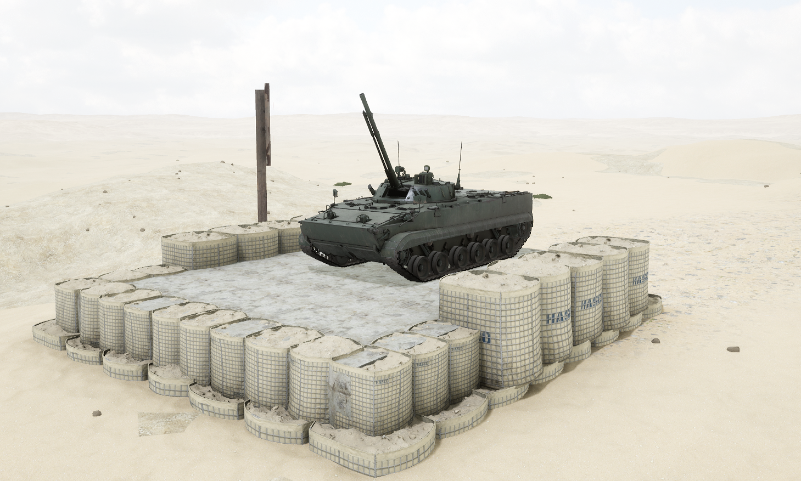
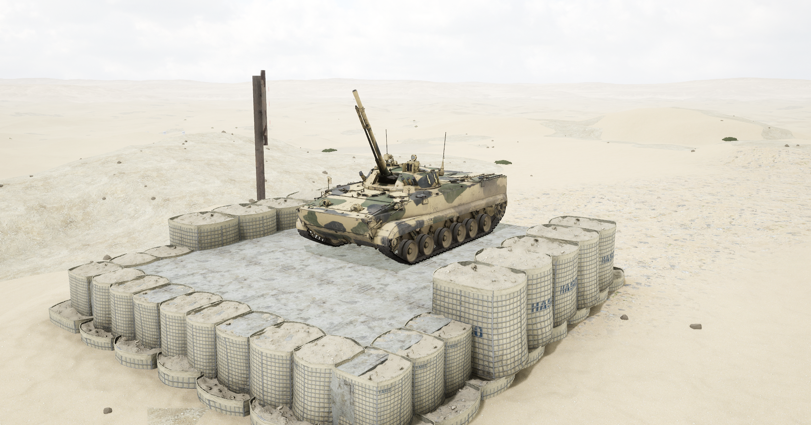

# BMP-3M


想当 Squad 服主？50 元/月起就能拿下入门款专属服务器！[南赛云](https://server.squadovo.cn/)是高性价比开服首选，低价不低质，让您轻松启动专属战局，低成本圆服主梦～


BMP-3M 是俄罗斯 BMP-3 步兵战车的现代化改进型号

## 基本数据

| 数据名称     | 值               |
| -------- | --------------- |
| 载具血量     | 1250            |
| 最大载员人数   | 12              |
| 最大载弹量    | 600             |
| 是否为两栖载具  | 是               |
| 是否具备 STA | 是               |
| 瞄具可缩放倍数  | 2.5x、4.0x、14.0x |
| 价值兵力点    | 10              |
| 炮塔血量      | 600（包含在总血量内）     |
| 理论射速      | 330 RPM          |
| 备弹        | AP 195 / HE 305 / HF 22 / GM 3 |
| 穿深        | AP 95 / HE 8 / HF 10 / GM 500 |

## 装备的阵营

* [RGF | 俄罗斯陆军](../../../team/rgf.md)

## 武器数据



* 子弹数量：195 x 1
* 射击间隙：0.18s
* 装填时间：11.28s
* 最大穿深：95
* 最大伤害：300
* 爆炸伤害：0
* 安全距离：0m



* 子弹数量：305 x 1
* &#x20;射击间隙：0.18s
* 装填时间：11.28s
* 最大穿深：8
* 最大伤害：100
* 爆炸伤害：125
* 安全距离：0m



* 子弹数量：1 x 22
* 射击间隙：0s
* 装填时间：5.0s
* 最大穿深：10
* 最大伤害：200
* 爆炸伤害：300
* 安全距离：0m



* 子弹数量：1 x 3
* 射击间隙：0.085s
* 装填时间：5.0s
* 最大穿深：500
* 最大伤害：3000
* 爆炸伤害：153
* 安全距离：123m



* 子弹数量：3000 x 1
* 射击间隙：0.075s
* 装填时间：11.28s
* 最大穿深：7
* 最大伤害：97
* 爆炸伤害：0
* 安全距离：0m



* 子弹数量：2 x 1
* 射击间隙：1s
* 装填时间：1s
* 最大穿深：0
* 最大伤害：0
* 爆炸伤害：0
* 安全距离：0m



## 载具对抗指南

### 弱点分析

- **正面：** BMP-3M 整体更像是 BMD-4M 和 04 的结合体。发动机后置，红色区域的超大面积弹药架暴露在前方几乎铺满整个首下且没有任何保护，坦克可十分轻易地一发点燃。正面首上蓝色区域有水平下全防机炮的跳弹区域，战斗中应避免攻击这里。
- **侧面：** 弹药架位置在从前往后数第 2、第 3、第 4 负重轮上方稍靠前，高度为车体中下部，坦克可一炮打穿。
- **后面：** 从后面红色区域也可打到弹药架，但大部分处于发动机保护下只露出一小部分，精准命中难度很大。BMP-3M 和布莱德利一样 360°全防 12.7，后背被偷袭也无需担心被 12.7 消耗血量。

### 载具玩法

1. 弹药配置与 04 几乎完全一样，机动性也相同，主要用途也相同。
2. 配备三发激光制导弹射导弹，等导弹出膛后再切换其他弹种，不要让导弹脱离控制区域。
3. 和其他的炮导步战车一样应对坦克乏力，配合自家坦克支援或绕侧绕后偷袭。
4. 炮手在上一发炮导射出后立刻按 R 换弹，无需等待命中。
5. 30mm 机炮火力持续性较好，射速比正常 30mm 稍快但秒伤无提升。

### 对抗建议

1. 坦克攻击 BMP-3M 正面时可直接选择攻击其首下，巨大的弹药架面积几乎不可能失手。
2. 带导弹步战车参考布莱德利篇。
3. 不带导弹步战车参考布莱德利篇，注意不要打到蓝色区域。
4. 只有 12.7mm（.50）重机枪的载具看到 BMP-3 直接开溜，BMP-3 与布莱德利一样全防 12.7。

### 图示

<figure><figcaption>正视图与侧视图</figcaption></figure>

<figure><figcaption>后视图</figcaption></figure>

## 载具实图

<figure><figcaption></figcaption></figure>

<figure><figcaption></figcaption></figure>
