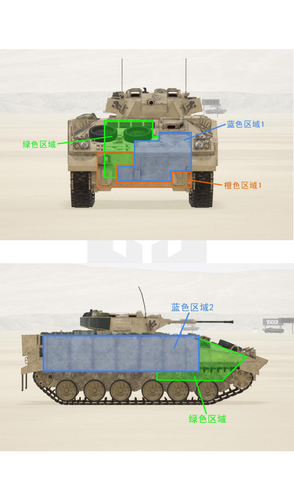
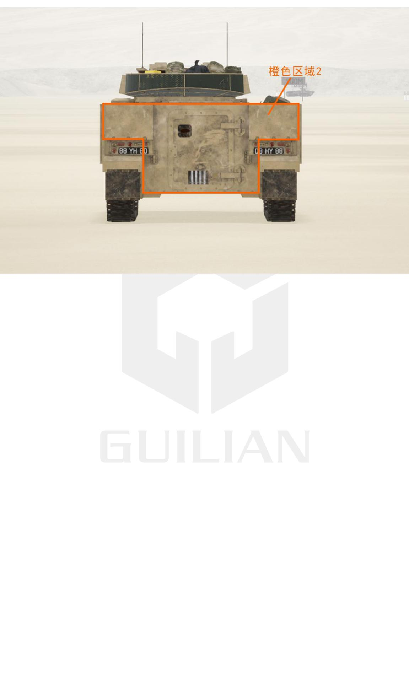

# FV510


想当 Squad 服主？50 元/月起就能拿下入门款专属服务器！[南赛云](https://server.squadovo.cn/)是高性价比开服首选，低价不低质，让您轻松启动专属战局，低成本圆服主梦～


FV510 是**联合王国陆军主要履带式装甲战斗车辆**之一，FV510 曾参与两次波斯湾战争以及之间的科索沃、波斯尼亚维和任务，表现十分优异。

## 基本数据

| 数据名称     | 值     |
| -------- | ----- |
| 载具血量     | 2000  |
| 最大载员人数   | 10    |
| 最大载弹量    | 600   |
| 是否为两栖载具  | 否     |
| 是否具备 STA | 否     |
| 瞄具可缩放倍数  | 1x、8x |
| 价值兵力点    | 10    |
| 炮塔血量      | 600（包含在总血量内） |
| 理论射速      | 90 RPM |
| 备弹        | AP 114 / HE 114 |
| 穿深        | AP 105 / HE 8 |

## 装备的阵营

* [BAF | 联合王国武装部队](../../../team/baf.md)

## 武器数据



* 子弹数量：6 x19
* 射击间隙：0.667s
* 装填时间：1.2s
* 最大穿深：105
* 最大伤害：600
* 爆炸伤害：0
* 安全距离：0m



* 子弹数量：6 x19
* 射击间隙：0.667s
* 装填时间：1.2s
* 最大穿深：8
* 最大伤害：100
* 爆炸伤害：125
* 安全距离：0m



* 子弹数量：200 x10
* 射击间隙：0.12s
* 装填时间：11.28s
* 最大穿深：7
* 最大伤害：86
* 爆炸伤害：0
* 安全距离：0m



* 子弹数量：2 x1
* 射击间隙：1s
* 装填时间：1s
* 最大穿深：0
* 最大伤害：0
* 爆炸伤害：0
* 安全距离：0m



## 载具对抗指南

### 弱点分析

- **正面：** 510 有两个型号：普通版 FV510 和带外挂装甲的 FV510UA（图示为 UA 型）。车体正面左侧蓝色区域 1 覆盖着机炮不可击穿的坚硬装甲，只有首下橙色区域 1 能造成伤害，实战意义不大。即使是不外挂装甲的普通版，也仅有 08 能在近距离对其首上造成伤害，其他机炮一律无法击穿其首上。炮塔可被所有机炮打穿，因此炮塔是第一攻击目标。
- **侧面：** 图示为 UA 型，蓝色区域 2 外挂装甲没有任何机炮能够打穿，战斗中不要攻击装甲区。普通 510 侧面可被机炮打穿。
- **后面：** 后面橙色区域 2 可被 12.7 击穿。

### 载具玩法

1. 拥有所有机炮中最高的单发伤害、穿深和最低的衰减，但射速过慢、需要手动换弹、炮塔极容易被针对，近距离对抗不占优势，避免与敌方步战车近距离作战。
2. 射速过慢、需要手动换弹，炮塔没有垂稳，行进中难以准确瞄准，不适合运动战，更适合在固定点位作为远程直射支援火力。
3. 弹匣供弹，每打 6 发需按 R 换一次弹才能继续射击。

### 对抗建议

1. 坦克打 510 随便打，510 没有携带任何导弹，仅有一门 30mm 机炮，不足以对坦克造成威胁。
2. 带导弹步战车参考布莱德利篇。注意 510 车体防御力非常高，避免用机炮攻击其车体，锁其炮塔事半功倍（打 510 一定要打炮塔）。
3. 不带导弹步战车锁定攻击 510 炮塔。510 基础血量极高（2000）且机炮伤害很高，硬拼不是明智之举。
4. 只有 12.7mm（.50）重机枪的载具正面遇到 510 能跑就跑。510 炮塔 360°全防 12.7，正面和侧面车体同样全防，只有后面橙色区域可造成有效伤害，只可配合友军袭扰。

### 图示

<figure><figcaption>正视图与侧视图</figcaption></figure>

<figure><figcaption>后视图</figcaption></figure>

## 载具实图

<figure><figcaption></figcaption></figure>

<figure><figcaption></figcaption></figure>

## 附加装甲

对于**UA**型号分别在车身两侧和前方加装了一块 **STANAG Level 6** 级的附加装甲（这意味着即使在 90° 下，游戏中也没有 **30 毫米弹**会穿透这些装甲板）

<figure><figcaption>
正面附加装甲
</figcaption></figure>

<figure><figcaption>
左侧附加装甲
</figcaption></figure>

<figure><figcaption>
右侧附加装甲
</figcaption></figure>

