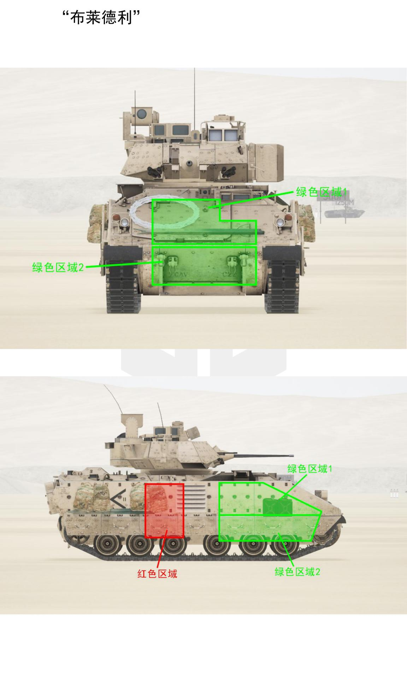
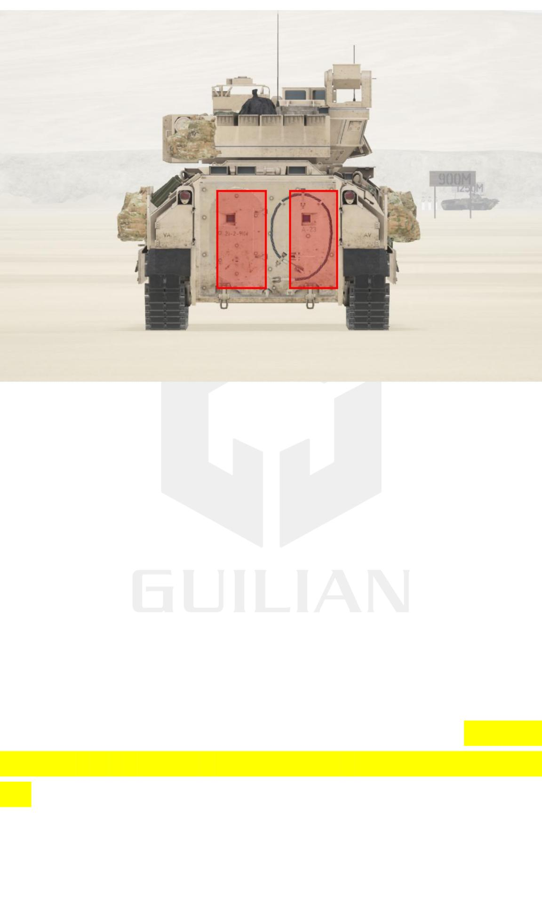
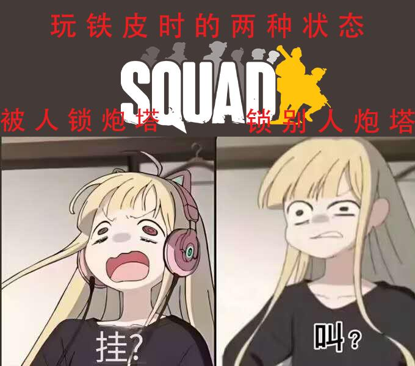
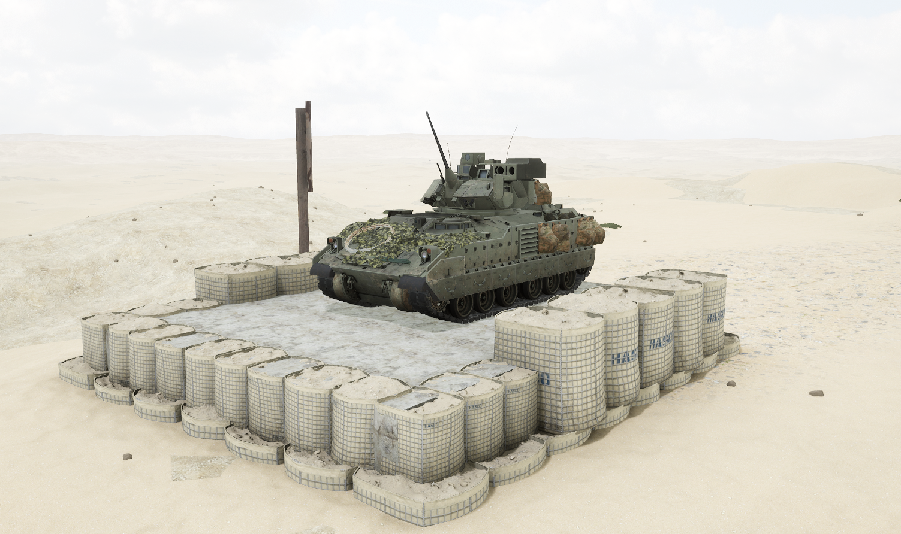
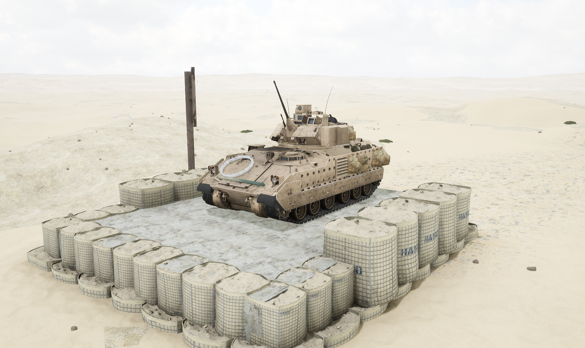

# M2A3


想当 Squad 服主？50 元/月起就能拿下入门款专属服务器！[南赛云](https://server.squadovo.cn/)是高性价比开服首选，低价不低质，让您轻松启动专属战局，低成本圆服主梦～


M2A3 是 M2/M3 系列步兵战车的最新改进车型

## 基本数据

| 数据名称     | 值      |
| -------- | ------ |
| 载具血量     | 2000   |
| 最大载员人数   | 10     |
| 最大载弹量    | 600    |
| 是否为两栖载具  | 否      |
| 是否具备 STA | 是      |
| 瞄具可缩放倍数  | 3x、10x |
| 价值兵力点    | 10     |
| 炮塔血量      | 600（包含在总血量内） |
| 理论射速      | 200 RPM |
| 备弹        | AP 70 / HE 230 / GM 2 |
| 穿深        | AP 95 / HE 8 / GM 900 |

## 装备的阵营

* [USA | 美国陆军](../../../team/usa.md)

## 武器数据



* 子弹数量：70 x 1
* 射击间隙：0.3s
* 装填时间：12.5s
* 最大穿深：95
* 最大伤害：400
* 爆炸伤害：0
* 安全距离：0m



* 子弹数量：230 x 1
* 射击间隙：0.3s
* 装填时间：12.5s
* 最大穿深：8
* 最大伤害：100
* 爆炸伤害：125
* 安全距离：0m



* 子弹数量：800 x 2
* 射击间隙：0.07s
* 装填时间：11.28s
* 最大穿深：7
* 最大伤害：86
* 爆炸伤害：0
* 安全距离：0m



* 子弹数量：2 x 1
* 射击间隙：1s
* 装填时间：1s
* 最大穿深：0
* 最大伤害：0
* 爆炸伤害：0
* 安全距离：0m



* 子弹数量：2 x 1
* 射击间隙：4.5s
* 装填时间：5.0s
* 最大穿深：900
* 最大伤害：1800
* 爆炸伤害：153
* 安全距离：0m



## 载具对抗指南

### 弱点分析

- **正面：** 采用步战车经典的发动机前置设计，正面拥有额外防护力。轻筒和重筒都可轻易击穿其发动机，但绝大部分机炮无法在远处从首上（绿色区域 1）伤到发动机，只可从首下（绿色区域 2）对发动机造成伤害。
- **侧面：** 防护比正面弱。绿色区域 1 可被所有 25mm 机炮和 FV510 的 30mm 机炮打穿，绿色区域 2 只有 FV510 可打穿，其他 30mm 机炮无法从侧面击穿发动机。红色区域为弹药架位置，在从前往后数第 4、第 5 负重轮正上，高度为车体全部，此处恰好有一个背包作为标识。
- **后面：** 从后面也可打到弹药架，面积很大几乎铺满整个车后。

### 载具玩法

1. 拥有两发车载"陶"式导弹（全威力），相当于移动的陶位，可轻松一发穿掉大部分坦克的弹药架。但 8.0 后陶的飞行轨迹难以控制，且线导导弹必须停车才能开火、命中前不能切换弹种，本版本大幅削弱。
2. 8.0 后线导步战车不再支持秒切，切换弹种导弹会断线失控。
3. 陶有约 5s 启动时间，非紧急情况炮手尽量全程捏着陶走，驾驶也要随时准备停车。
4. 25mm 机炮伤害、穿深和火力持续性可观且不过热，但载弹较少容错率不高，应节省用在敌方步战车等高价值目标上。
5. 驾驶员尽量保持车体正面面向敌人，正面有发动机保护。
6. 8.0 后布莱德利分为带陶的 M2A3 和不带陶的 M7A3 两个版本，抢车时注意规范载具名称。

### 对抗建议

1. 坦克第一发尽量命中炮塔使其丧失反击能力，2000 血量需三炮才能打炸。带炮导的坦克（如 99A）可一发穿甲+一发炮导两炮击毁。布莱德利侧面或后面朝向时可一炮点燃弹药架。
2. 带线导导弹的步战车（如 BMP-2）须停车后开火、等待命中再切换穿甲，或直接用机炮锁炮塔；带激光制导导弹的要等导弹出膛后再切换其他弹种。
3. 不带导弹的步战车锁定攻击炮塔，驾驶员尽快偏离原路径，炮手不间断攻击炮塔，躲开陶即胜利了一半。
4. 只有 12.7mm（.50）重机枪的载具看到布莱德利直接跑，布莱德利全防 12.7 及.50。

### 图示

<figure><figcaption>正视图与侧视图</figcaption></figure>

<figure><figcaption>后视图</figcaption></figure>

<figure><figcaption>载具打法图示</figcaption></figure>

## 载具实图

<figure><figcaption></figcaption></figure>

<figure><figcaption></figcaption></figure>
