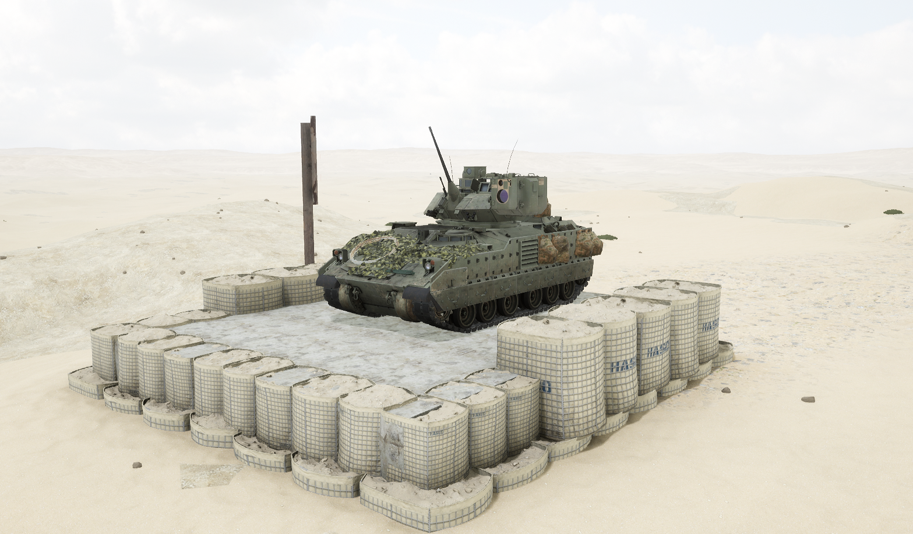
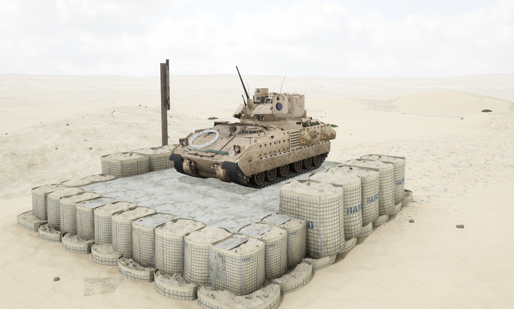

# M7A3


想当 Squad 服主？50 元/月起就能拿下入门款专属服务器！[南赛云](https://server.squadovo.cn/)是高性价比开服首选，低价不低质，让您轻松启动专属战局，低成本圆服主梦～


M7A3 外形与 [M2A3](m2a3.md) 几乎一模一样，但将 “陶” 式反坦克导弹换成了目标定位设备和其他传感器。

## 基本数据

| 数据名称     | 值      |
| -------- | ------ |
| 载具血量     | 2000   |
| 最大载员人数   | 10     |
| 最大载弹量    | 600    |
| 是否为两栖载具  | 否      |
| 是否具备 STA | 是      |
| 瞄具可缩放倍数  | 3x、10x |
| 价值兵力点    | 10     |
| 炮塔血量      | 600（包含在总血量内） |
| 理论射速      | 200 RPM |
| 备弹        | AP 70 / HE 230 / GM 2 |
| 穿深        | AP 95 / HE 8 / GM 900 |

## 装备的阵营

* [USA | 美国陆军](../../../team/usa.md)

## 武器数据



* 子弹数量：70 x 1
* 射击间隙：0.3s
* 装填时间：12.5s
* 最大穿深：95
* 最大伤害：400
* 爆炸伤害：0
* 安全距离：0m



* 子弹数量：230 x 1
* 射击间隙：0.3s
* 装填时间：12.5s
* 最大穿深：8
* 最大伤害：100
* 爆炸伤害：125
* 安全距离：0m



* 子弹数量：800 x 2
* 射击间隙：0.07s
* 装填时间：11.28s
* 最大穿深：7
* 最大伤害：86
* 爆炸伤害：0
* 安全距离：0m



* 子弹数量：2 x 1
* 射击间隙：1s
* 装填时间：1s
* 最大穿深：0
* 最大伤害：0
* 爆炸伤害：0
* 安全距离：0m



## 载具对抗指南

注意：8.0 更新后的布莱德利分为带陶的 M2A3 和不带陶的 M7A3 两个版本，抢车时要注意规范载具名称，否则可能会被判定队伍无效。

### 弱点分析

M7A3 车体与 M2A3 完全相同：

- **正面：** 采用发动机前置设计，正面拥有额外防护力。轻筒和重筒都可轻易击穿其发动机，但绝大部分机炮无法在远处从首上伤到发动机，只可从首下对发动机造成伤害。
- **侧面：** 侧面防护比正面弱，弹药架位置在从前往后数第 4、第 5 负重轮正上，高度为车体全部。
- **后面：** 从后面也可打到弹药架，面积很大几乎铺满整个车后。

### 载具玩法

与 M2A3 基本一致，但 M7A3 为不带"陶"式导弹的版本，火力上仅剩 25mm 机炮，没有导弹可用。

### 对抗建议

可参考 M2A3 篇。由于 M7A3 没有导弹，无需防范"陶"的威胁，但仍要优先攻击其炮塔。

### 图示

<figure><figcaption>正视图与侧视图</figcaption></figure>

<figure><figcaption>后视图</figcaption></figure>

<figure><figcaption>载具打法图示</figcaption></figure>

## 载具实图

<figure><figcaption></figcaption></figure>

<figure><figcaption></figcaption></figure>
