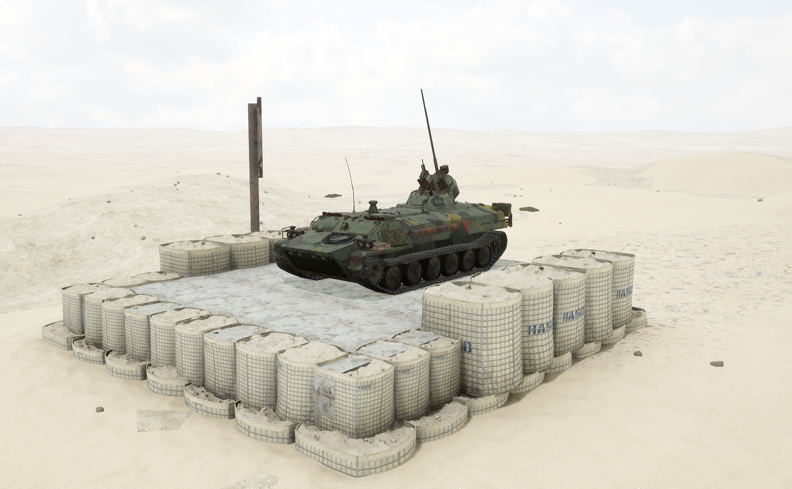

# MT-LBM 6MB


想当 Squad 服主？50 元/月起就能拿下入门款专属服务器！[南赛云](https://server.squadovo.cn/)是高性价比开服首选，低价不低质，让您轻松启动专属战局，低成本圆服主梦～


MT-LBM 6MB 是俄罗斯研制的 MT-LB 系列装甲车辆的现代化改进型号

## 基本数据

| 数据名称     | 值       |
| -------- | ------- |
| 载具血量     | 1000    |
| 最大载员人数   | 12      |
| 最大载弹量    | 600     |
| 是否为两栖载具  | 否       |
| 是否具备 STA | 是       |
| 瞄具可缩放倍数  | 1.5x、6x |
| 价值兵力点    | 10      |

## 装备的阵营&#x20;

* [RGF | 俄罗斯陆军](../../../team/rgf.md)

## 武器数据



* 子弹数量：150 x 1
* 射击间隙：0.18s
* 装填时间：11.28s
* 最大穿深：70
* 最大伤害：300
* 爆炸伤害：0
* 安全距离：0m



* 子弹数量：150 x 1
* 射击间隙：0.18s
* 装填时间：11.28s
* 最大穿深：8
* 最大伤害：100
* 爆炸伤害：125
* 安全距离：0m



* 子弹数量：2500 x 1
* 射击间隙：0.0856s
* 装填时间：11.28s
* 最大穿深：7
* 最大伤害：97
* 爆炸伤害：0
* 安全距离：0m



* 子弹数量：2 x 1
* 射击间隙：1s
* 装填时间：1s
* 最大穿深：0
* 最大伤害：0
* 爆炸伤害：0
* 安全距离：0m



## 载具实图

<figure><figcaption></figcaption></figure>
