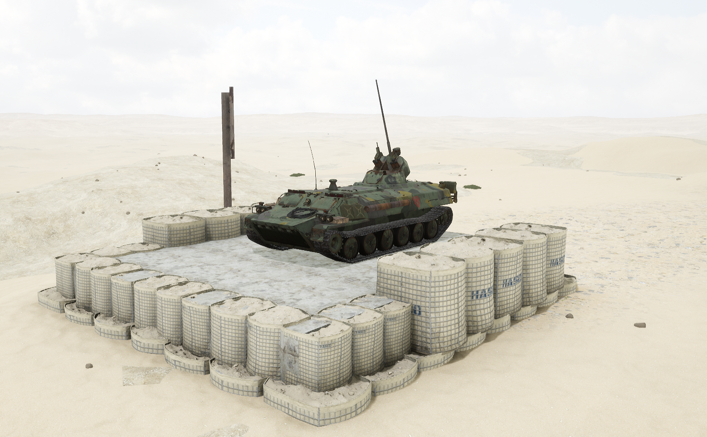

# MT-LBM 6MB


想当 Squad 服主？50 元/月起就能拿下入门款专属服务器！[南赛云](https://server.squadovo.cn/)是高性价比开服首选，低价不低质，让您轻松启动专属战局，低成本圆服主梦～


MT-LBM 6MB 是俄罗斯研制的 MT-LB 系列装甲车辆的现代化改进型号

## 基本数据

| 数据名称     | 值       |
| -------- | ------- |
| 载具血量     | 1000    |
| 最大载员人数   | 12      |
| 最大载弹量    | 600     |
| 是否为两栖载具  | 否       |
| 是否具备 STA | 是       |
| 瞄具可缩放倍数  | 1.5x、6x |
| 价值兵力点    | 10      |
| 炮塔血量      | 300（包含在总血量内） |
| 理论射速      | 330 RPM  |
| 备弹        | AP 150 / HE 150 |
| 穿深        | AP 70 / HE 8 |

## 装备的阵营&#x20;

* [RGF | 俄罗斯陆军](../../../team/rgf.md)

## 武器数据



* 子弹数量：150 x 1
* 射击间隙：0.18s
* 装填时间：11.28s
* 最大穿深：70
* 最大伤害：300
* 爆炸伤害：0
* 安全距离：0m



* 子弹数量：150 x 1
* 射击间隙：0.18s
* 装填时间：11.28s
* 最大穿深：8
* 最大伤害：100
* 爆炸伤害：125
* 安全距离：0m



* 子弹数量：2500 x 1
* 射击间隙：0.0856s
* 装填时间：11.28s
* 最大穿深：7
* 最大伤害：97
* 爆炸伤害：0
* 安全距离：0m



* 子弹数量：2 x 1
* 射击间隙：1s
* 装填时间：1s
* 最大穿深：0
* 最大伤害：0
* 爆炸伤害：0
* 安全距离：0m



## 载具对抗指南

MT-LB 系列：1.MT-LB 装甲运输车（电摇 7.62mm 轻机枪，可装 2000 点弹药或建材）；2.MT-LB PKT（电摇 7.62mm 轻机枪，备弹更多）；3.MT-LB VMK（电摇 12.7mm 重机枪）；4.MT-LB 6MA（电摇 14.5mm 重机枪，BTR-80 同款）；5.MT-LB 6MA 伊朗版（14.5mm 重机枪+S5 火箭巢）；6.MT-LB 6MB 步兵战车（30mm 机炮）。图示为 MT-LB 6MB。

### 弱点分析

MT-LB 系列底盘规格完全相同：

- **正面：** 同高度下蓝色区域可防 12.7。
- **侧面：** 此系列侧面皆可被 12.7 所伤。
- **后面：** 后面与侧面同理。

> **Ps：** 虽然 30 与 6MB 的炮塔外观完全一致，但 6MB 使用的 3UBR6 穿甲弹穿深比 30 使用的 3UBR8 略逊，为 70。

### 载具玩法

参考 30。但 MT-LB 系列动力一般，运动战也不太打得起来，唯一的好处可能就是发动机不至于会被 12.7 抽爆。

### 对抗建议

6MB 实际上就是 04 和 30 的结合版，兼具 04 的垃圾穿深、30 的低血量和炮塔外观，总之从上到下拉完了，随便打。

### 图示

<figure><figcaption>正视图与侧视图</figcaption></figure>

<figure><figcaption>后视图</figcaption></figure>

## 载具实图

<figure><figcaption></figcaption></figure>
