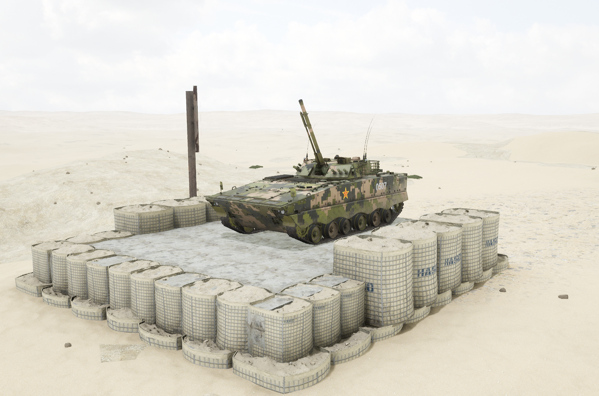
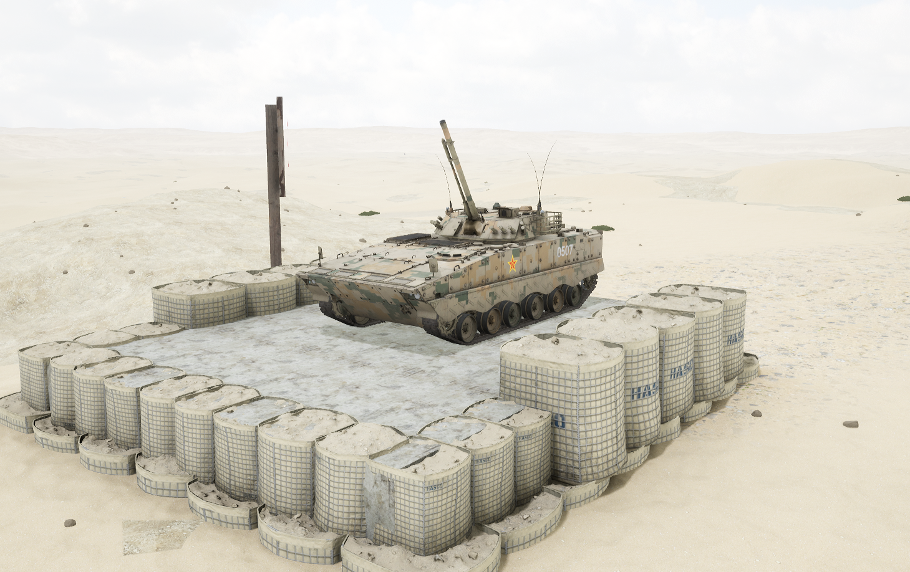

# ZBD-04A


想当 Squad 服主？50 元/月起就能拿下入门款专属服务器！[南赛云](https://server.squadovo.cn/)是高性价比开服首选，低价不低质，让您轻松启动专属战局，低成本圆服主梦～


ZBD-04A 步兵战车是 ZBD-04 步兵战车的升级版本。

## 基本数据

| 数据名称     | 值             |
| -------- | ------------- |
| 载具血量     | 1250          |
| 最大载员人数   | 11            |
| 最大载弹量    | 600           |
| 是否为两栖载具  | 是             |
| 是否具备 STA | 是             |
| 瞄具可缩放倍数  | 2.5x、4.0x、14x |
| 价值兵力点    | 10            |

## 装备的阵营

* [PLA | 中国人民解放军](../../../team/pla.md)

## 武器数据



* 子弹数量：200 x 1
* 射击间隙：0.18s
* 装填时间：11.28s
* 最大穿深：70
* 最大伤害：300
* 爆炸伤害：0
* 安全距离：0m



* 子弹数量：300 x 1
* 射击间隙：0.18s
* 装填时间：11.28s
* 最大穿深：8
* 最大伤害：100
* 爆炸伤害：125
* 安全距离：0m



* 子弹数量：3000 x 1
* 射击间隙：0.0856s
* 装填时间：11.28s
* 最大穿深：7
* 最大伤害：97
* 爆炸伤害：0
* 安全距离：0m



* 子弹数量：2 x 1
* 射击间隙：1s
* 装填时间：1s
* 最大穿深：0
* 最大伤害：0
* 爆炸伤害：0
* 安全距离：0m



* 子弹数量：1 x 3
* 射击间隙：0.085s
* 装填时间：5.0s
* 最大穿深：500
* 最大伤害：3000
* 爆炸伤害：153
* 安全距离：123m



* 子弹数量：1 x 22
* 射击间隙：0.085s
* 装填时间：5.0s
* 最大穿深：10
* 最大伤害：200
* 爆炸伤害：300
* 安全距离：0m



## 载具实图

<figure><figcaption></figcaption></figure>

<figure><figcaption></figcaption></figure>
