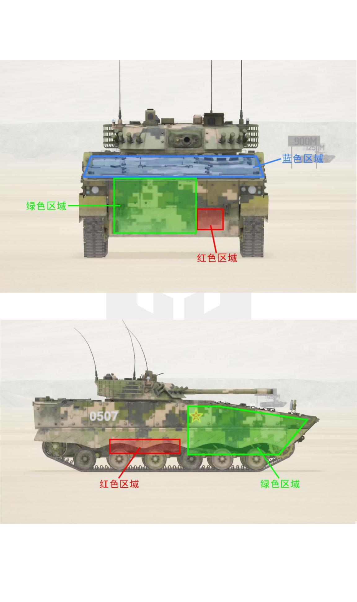
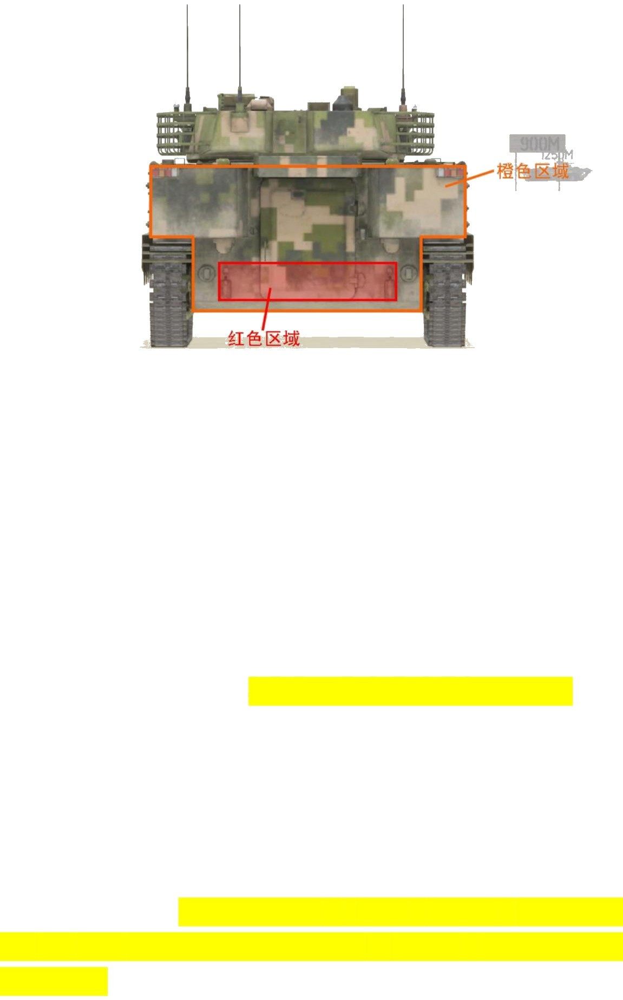
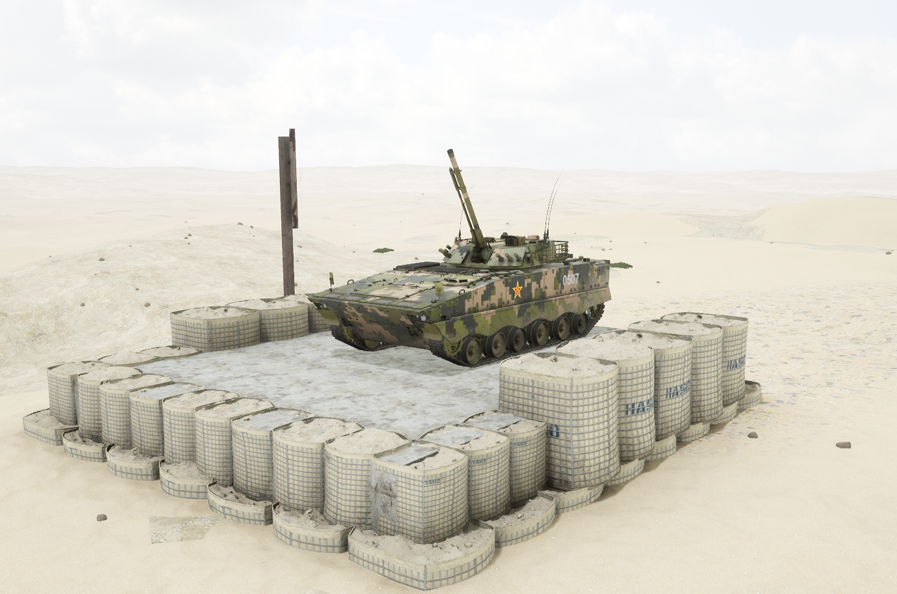
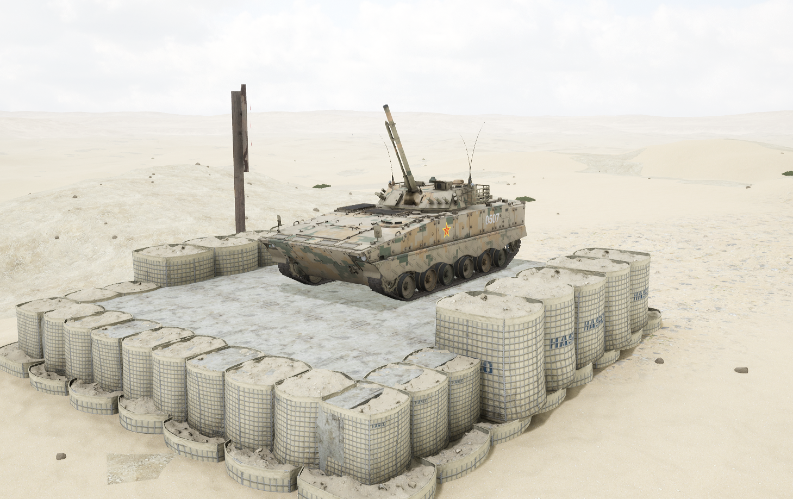

# ZBD-04A


想当 Squad 服主？50 元/月起就能拿下入门款专属服务器！[南赛云](https://server.squadovo.cn/)是高性价比开服首选，低价不低质，让您轻松启动专属战局，低成本圆服主梦～


ZBD-04A 步兵战车是 ZBD-04 步兵战车的升级版本。

## 基本数据

| 数据名称     | 值             |
| -------- | ------------- |
| 载具血量     | 1250          |
| 最大载员人数   | 11            |
| 最大载弹量    | 600           |
| 是否为两栖载具  | 是             |
| 是否具备 STA | 是             |
| 瞄具可缩放倍数  | 2.5x、4.0x、14x |
| 价值兵力点    | 10            |
| 炮塔血量      | 300（包含在总血量内）   |
| 理论射速      | 330 RPM        |
| 备弹        | AP 200 / HE 300 / HF 22 / GM 3 |
| 穿深        | AP 70 / HE 8 / HF 10 / GM 500 |

## 装备的阵营

* [PLA | 中国人民解放军](../../../team/pla.md)

## 武器数据



* 子弹数量：200 x 1
* 射击间隙：0.18s
* 装填时间：11.28s
* 最大穿深：70
* 最大伤害：300
* 爆炸伤害：0
* 安全距离：0m



* 子弹数量：300 x 1
* 射击间隙：0.18s
* 装填时间：11.28s
* 最大穿深：8
* 最大伤害：100
* 爆炸伤害：125
* 安全距离：0m



* 子弹数量：3000 x 1
* 射击间隙：0.0856s
* 装填时间：11.28s
* 最大穿深：7
* 最大伤害：97
* 爆炸伤害：0
* 安全距离：0m



* 子弹数量：2 x 1
* 射击间隙：1s
* 装填时间：1s
* 最大穿深：0
* 最大伤害：0
* 爆炸伤害：0
* 安全距离：0m



* 子弹数量：1 x 3
* 射击间隙：0.085s
* 装填时间：5.0s
* 最大穿深：500
* 最大伤害：3000
* 爆炸伤害：153
* 安全距离：123m



* 子弹数量：1 x 22
* 射击间隙：0.085s
* 装填时间：5.0s
* 最大穿深：10
* 最大伤害：200
* 爆炸伤害：300
* 安全距离：0m



## 载具对抗指南

### 弱点分析

- **正面：** 发动机前置，正面拥有一定减伤，所有火箭筒和机炮皆可从正面打穿发动机。蓝色区域坚硬的车体首上在同高度下全防所有机炮，战斗中避免攻击这个位置。绿色区域发动机大部分暴露在首下的可击穿区域，仅有 25mm 和 FV510 可从正面打炸发动机，其他 30mm 只能对车体造成伤害。红色区域露出的部分弹药架所有机炮都可击穿，但面积太小太靠下，实战意义不大，锁炮塔性价比远高于硬打弹药架。
- **侧面：** 绿色区域为发动机侧面体表投影，可被所有火箭筒和机炮打穿。红色区域为弹药架，位置在从前往后数第 4、第 5 负重轮上方，高度为裙板下部，除了 FV510 没有任何机炮能从侧面击穿其弹药架。
- **后面：** 从后面也可打到弹药架，在其车体下部，实战意义不大。

### 载具玩法

1. 载弹量"量大管饱"，200 发穿甲、300 发高爆、22 发杀爆弹，配合步兵进攻、排查房区或压敌方兵站都有不错表现，多配合步兵进攻或防守是第一要务。
2. 配备三发激光制导弹射导弹，注意等导弹出膛后再切换其他弹种，不要让导弹脱离控制区域。
3. 炮导穿深太低，应对坦克乏力，不能与坦克硬刚，配合自家坦克支援或绕侧绕后偷袭。
4. 炮手在上一发炮导射出后立刻按 R 换弹，无需等待命中。
5. 30mm 机炮伤害、穿深和火力持续性均衡，中近程表现不错，远程尽量用炮导解决战斗。
6. 驾驶员尽量保持车体正面面向敌人，正面大部分弹药架都有发动机保护。

### 对抗建议

1. 坦克打 04 比打 BMP-2 更轻松，1250 血量两炮即可打炸，直接打炸发动机或断履限制其行动能力。
2. 带导弹步战车参考布莱德利篇。
3. 不带导弹步战车参考布莱德利篇。
4. 只有 12.7mm（.50）重机枪的载具正面遇到 04 能跑就跑，04 炮塔 360°全防 12.7，正面和侧面车体同样全防，只有后面橙色区域可被 12.7 打穿但无法伤到弹药架。

### 图示

<figure><figcaption>正视图与侧视图</figcaption></figure>

<figure><figcaption>后视图</figcaption></figure>

## 载具实图

<figure><figcaption></figcaption></figure>

<figure><figcaption></figcaption></figure>
