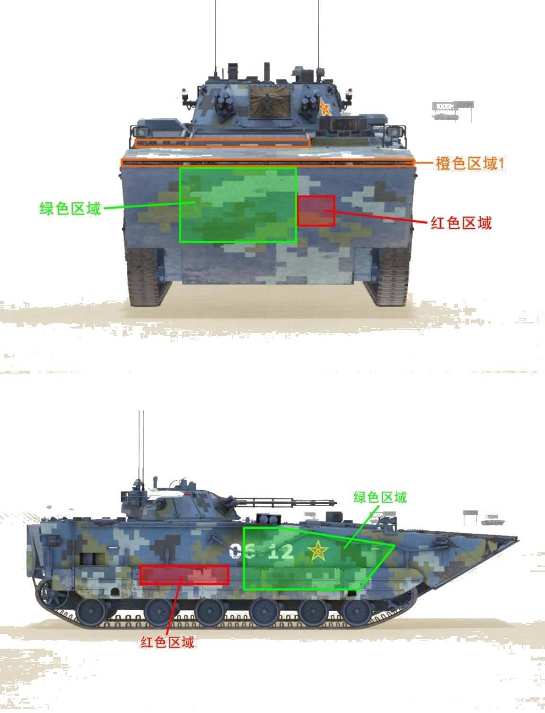
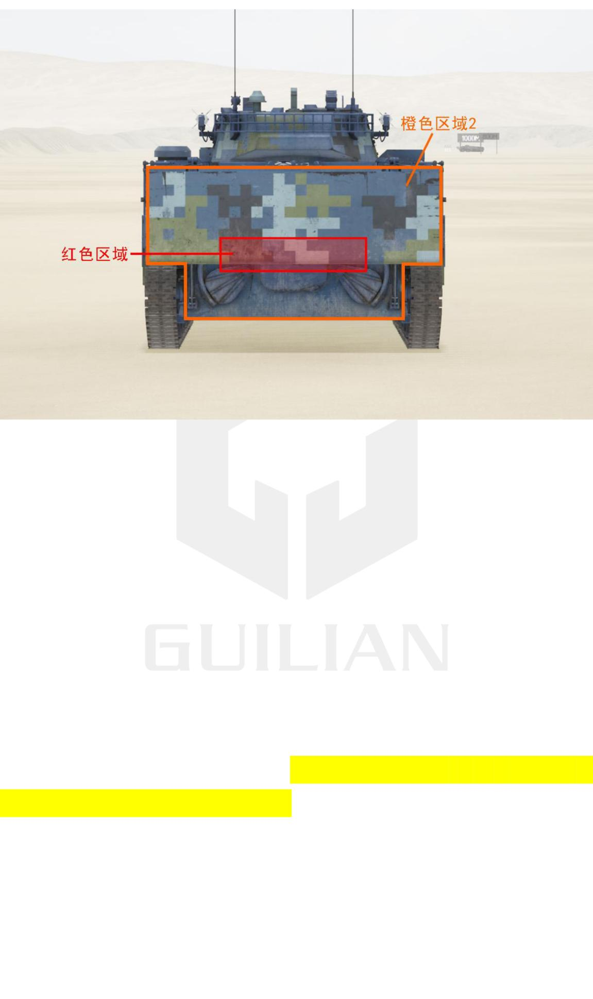
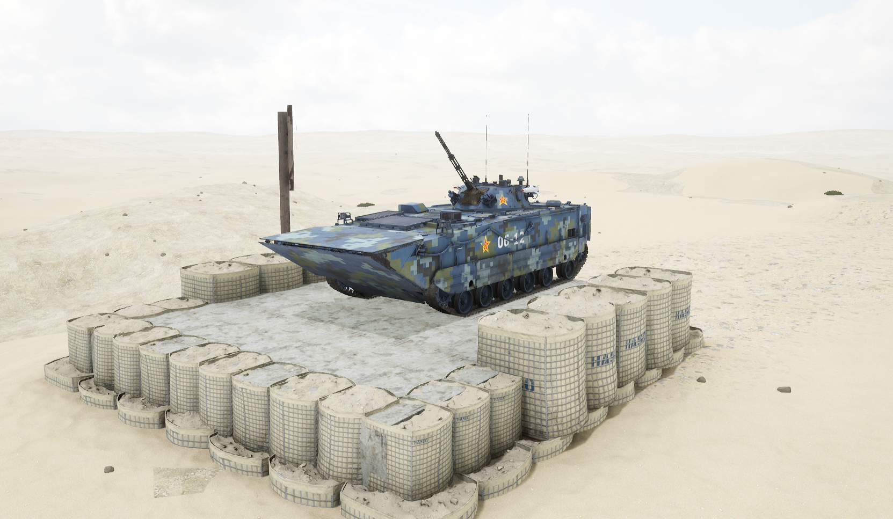
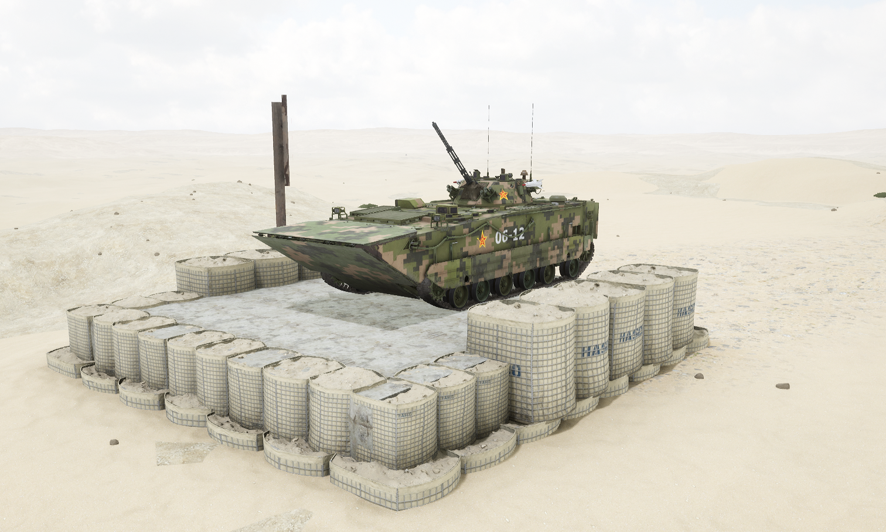

# ZBD05


想当 Squad 服主？50 元/月起就能拿下入门款专属服务器！[南赛云](https://server.squadovo.cn/)是高性价比开服首选，低价不低质，让您轻松启动专属战局，低成本圆服主梦～


一款专为两栖作战打造的现代化载具，是中华人民共和国在两栖作战领域的关键装备。

## 基本数据

| 数据名称     | 值         |
| -------- | --------- |
| 载具血量     | 1250      |
| 最大载员人数   | 11        |
| 最大载弹量    | 600       |
| 是否为两栖载具  | 是         |
| 是否具备 STA | 是         |
| 瞄具可缩放倍数  | 2.0x、8.0x |
| 价值兵力点    | 10        |
| 炮塔血量      | 300（包含在总血量内） |
| 理论射速      | 330 RPM    |
| 备弹        | AP 160 / HE 300 / GM 2 |
| 穿深        | AP 105 / HE 8 / GM 500 |

## 装备的阵营

* [PLA | 中国人民解放军](../../../team/pla.md)
* [PLANMC | 中国人民解放军海军陆战队](../../../team/planmc.md)
* [PLAAGF | 中国人民解放军两栖部队](../../../team/plaagf.md)

## 武器数据



* 子弹数量：160 x 1
* 射击间隙：0.18s
* 装填时间：11.28s
* 最大穿深：105
* 最大伤害：300&#x20;
* 爆炸伤害：0
* 安全距离：0m



* 子弹数量：300 x 1
* 射击间隙：0.18s
* 装填时间：11.28s
* 最大穿深：8
* 最大伤害：100
* 爆炸伤害：125
* 安全距离：0m



* 子弹数量：3000 x 1
* 射击间隙：0.0856s
* 装填时间：11.28s
* 最大穿深：7
* 最大伤害：97
* 爆炸伤害：0
* 安全距离：0m



* 子弹数量：2 x 1
* 射击间隙：1s
* 装填时间：1s
* 最大穿深：0
* 最大伤害：0
* 爆炸伤害：0
* 安全距离：0m



* 子弹数量：2 x 1
* 射击间隙：0s
* 装填时间：12.0s&#x20;
* 最大穿深：500
* 最大伤害：1800
* 爆炸伤害：153
* 安全距离：123m



## 载具对抗指南

### 弱点分析

- **正面：** 底盘配置与 04 相似，有一小部分红色区域弹药架暴露。但 05 没有 04 那样坚硬的首上，首上首下皆可被机炮打穿，甚至橙色区域 1 的两处缝隙还可被 12.7 打穿。
- **侧面：** 绿色区域面积巨大的发动机使 05 十分容易被击中发动机失去动力。红色区域的弹药架几乎没有任何防护，位置在从后往前数第 2、第 3 负重轮正上方、炮塔正下方，高度为车体中下部，坦克可一炮打穿。
- **后面：** 从后面也可打到弹药架，在其车体中下部。橙色区域 2 可被 12.7 打穿。

> **Ps：** 05 与 08 的炮塔外观与火力配置完全一致，但 05 炮塔血量从 08 的 600 削弱到了 300。

### 载具玩法

1. 炮塔火力配置与 08 完全相同，同样标配两发 AFT07C 导弹。但驾驶体验两极反转，庞大车身、差劲动力、不灵敏转向和极度靠左的驾驶位使其成为全游戏最难开的载具之一。
2. 车体过长且炮塔后置，角度很小的坡就可能把向前瞄准的炮管挡死，不能在半坡停留，过坡时要快速通过。
3. 炮塔与 08 完全相同，火力方面可完全参考 08。
4. 别看车身庞大，血量与 04、08、BMP-2 相同为 1250，坦克两炮打炸。
5. 没练过别硬开，真的难开。

### 对抗建议

1. v9.0 后 05 与 08 一样对坦克威胁大大降低，找机会偷袭才是王道。
2. 带导弹步战车参考布莱德利篇。
3. 不带导弹步战车参考布莱德利篇。
4. 只有 12.7mm（.50）重机枪的载具正面遇到 05 能跑就跑。05 炮塔规格与 08 相同，360°全防 12.7，车体正面橙色区域 1 两处缝隙可被打穿但无实战意义，侧面大部分和后面橙色区域 2 也可造成伤害，但只适合偷袭耗血。

### 图示

<figure><figcaption>正视图与侧视图</figcaption></figure>

<figure><figcaption>后视图</figcaption></figure>

## 载具实图

<figure><figcaption></figcaption></figure>

<figure><figcaption></figcaption></figure>
