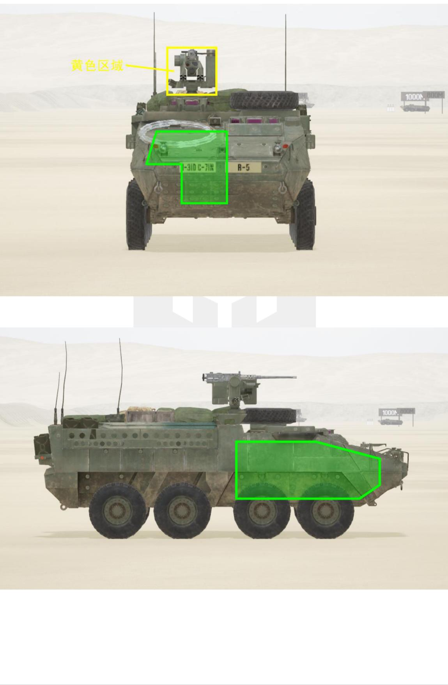

# M1126 M2HB


想当 Squad 服主？50 元/月起就能拿下入门款专属服务器！[南赛云](https://server.squadovo.cn/)是高性价比开服首选，低价不低质，让您轻松启动专属战局，低成本圆服主梦～


M1126 M2HB 具备高机动性、灵活性以及一定防护能力的 8×8 轮式装甲车。

## 基本数据

| 数据名称     | 值               |
| -------- | --------------- |
| 载具血量     | 1250            |
| 最大载员人数   | 11              |
| 最大载弹量    | 600             |
| 是否为两栖载具  | 否               |
| 是否具备 STA | 是               |
| 瞄具可缩放倍数  | 1.0x、5.0x、12.0x |
| 价值兵力点    | 10              |
| 炮塔血量     | 300（独立血量） |
| 理论射速     | 500 RPM |
| 备弹        | 400（MG） |
| 穿深        | 28（MG） |

## 装备的阵营

* [USA | 美国陆军](../../../team/usa.md)

## 武器数据



* 子弹数量：400 x 1&#x20;
* 射击间隙：0.12s&#x20;
* 装填时间：30.0s&#x20;
* 最大穿深：28&#x20;
* 最大伤害：153&#x20;
* 爆炸伤害：0&#x20;
* 安全距离：0m



* 子弹数量：2 x 1&#x20;
* 射击间隙：1s&#x20;
* 装填时间：1s&#x20;
* 最大穿深：0&#x20;
* 最大伤害：0&#x20;
* 爆炸伤害：0&#x20;
* 安全距离：0m



## 载具对抗指南

本型号为 M1126 CROWS-M2，搭载电摇 12.7mm 重机枪。

### 弱点分析

- **正面：** M1126 底盘除没有弹药架外和 M1128 完全相同，参考 M1128。
- **侧面：** 参考 M1128。
- **后面：** 参考 M1128。

### 载具玩法

* SCK 血量为正常的 1250，但仅有一门机枪锁死了其上限，可以用来捞薯条，尽量不要主动招惹其他步战车。
* SCK-M2 和 BTR-82A（30）是十分经典的对手，30 也是 SCK 唯一一个在硬件水平上基本平分秋色的步战车（30 略占优势）。SCK 打 30 可以参考 BTR-82A 载具打法篇；30 打 SCK 首先攻击其黄色区域炮塔，将炮塔打废之后转而攻击车体（SCK 炮塔为独立血量，打坏之后继续攻击没有用），并严防 SCK 贴脸。
* 只有 12.7mm（.50）重机枪的载具（如各家侦察车），闲的没事别硬找 SCK 对决，12.7 载具中 SCK 基本站在顶点。

### 图示

<figure><figcaption>正视图与侧视图</figcaption></figure>

## 载具实图

<figure><figcaption></figcaption></figure>

<figure><figcaption></figcaption></figure>
