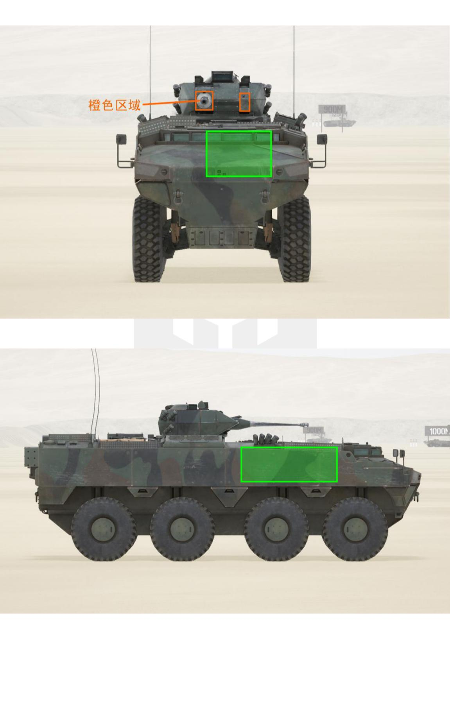
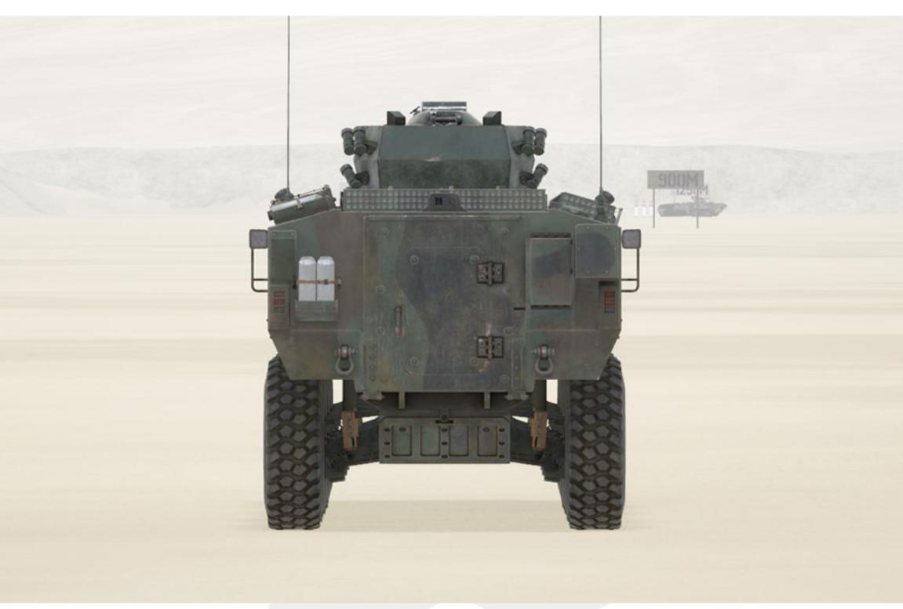

# PARS Ⅲ MK19 RWS


想当 Squad 服主？50 元/月起就能拿下入门款专属服务器！[南赛云](https://server.squadovo.cn/)是高性价比开服首选，低价不低质，让您轻松启动专属战局，低成本圆服主梦～


PARS Ⅲ MK19 RWS 是一款先进的遥控武器站，PARS 系列车族的一员

## 基本数据

| 数据名称     | 值              |
| -------- | -------------- |
| 载具血量     | 1000           |
| 最大载员人数   | 14             |
| 最大载弹量    | 600            |
| 是否为两栖载具  | 否              |
| 是否具备 STA | 是              |
| 瞄具可缩放倍数  | 1.0x、3.0x、9.0x |
| 价值兵力点    | 10             |
| 炮塔血量     | 400（包含在总血量内） |
| 理论射速     | 200 RPM |
| 备弹        | 70/230（AP/HE） |
| 穿深        | 95/8（AP/HE） |

## 装备的阵营

* [TLF | 土耳其陆军](../../../team/tlf-tu-er-qi-lu-jun.md)

## 武器数据



* 子弹数量：120 x 1
* 射击间隙：0.171s
* 装填时间：12.5s
* 最大穿深：12
* 最大伤害：60
* 爆炸伤害：115
* 安全距离：30.2m



## 载具对抗指南

本型号为 PARS-Ⅲ MK19 装甲运兵车，搭载电摇 40mm 高爆榴弹发射器。

### 弱点分析

- **正面：** PARS-Ⅲ正面大部分全防 12.7，仅有两块橙色区域可打穿，实战意义不大，机炮则不受限制。
- **侧面：** 车体全部可被 12.7 打穿。
- **后面：** 后面车体和炮塔均可被 12.7 打穿。

### 载具玩法

* PARS-Ⅲ系列的驾驶体验和 LAV25 系列基本相同，详情可见 LAV25 篇。
* 系列中的 MK19 压兵站捞薯条比较好使，是作者在土鸡阵营实在没得玩的时候的首选。

### 对抗建议

* 坦克打 PARS-Ⅲ系列跟打 30 差不多，两炮即炸。
* 带导弹的步战车，大致可参考布莱德利篇。
* 不带导弹的步战车，面对 PARS25 则锁定攻击它的炮塔，其他三个型号则攻击其车体（攻击炮塔无伤）。
* 只有 12.7mm（.50）重机枪的载具（如 M1126 斯崔克），视情况攻击 PARS25 的侧面或后面，其他三个型号基本是随便打。

### 图示

<figure><figcaption>正视图与侧视图</figcaption></figure>

<figure><figcaption>后视图</figcaption></figure>

## 载具实图

<figure><figcaption></figcaption></figure>

<figure><figcaption></figcaption></figure>
