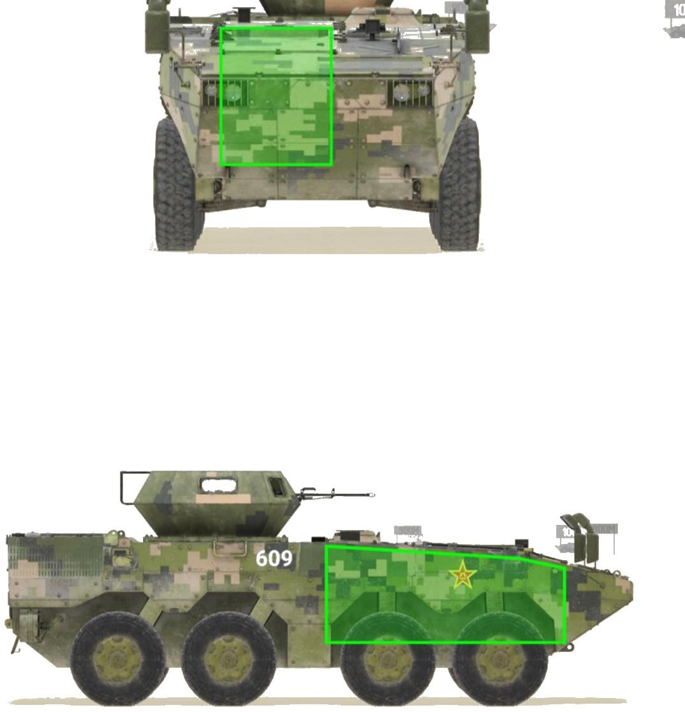
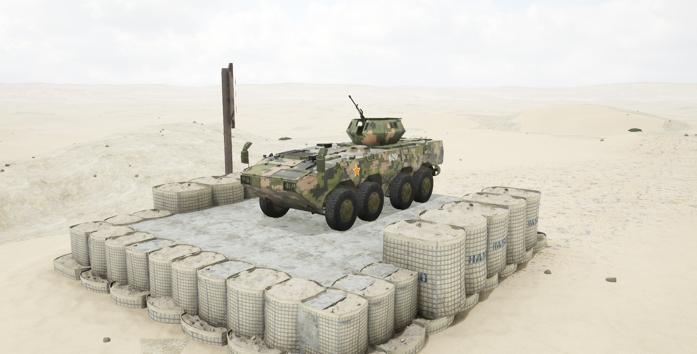
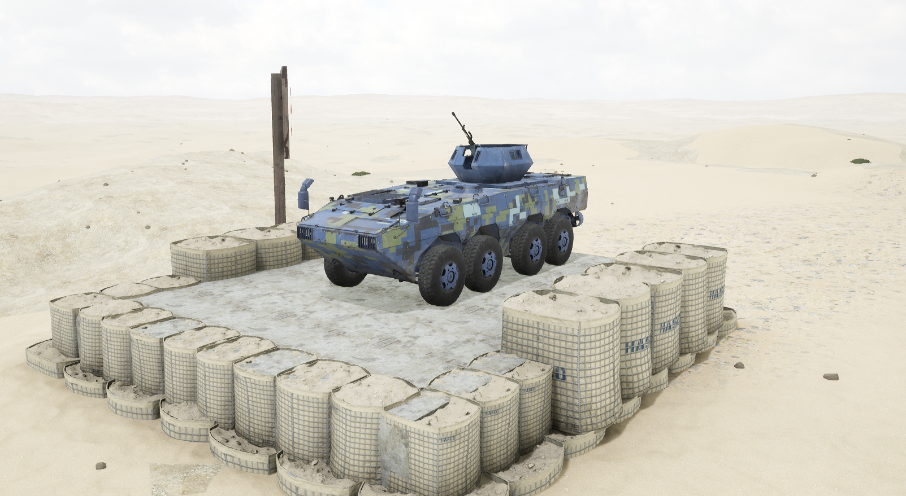
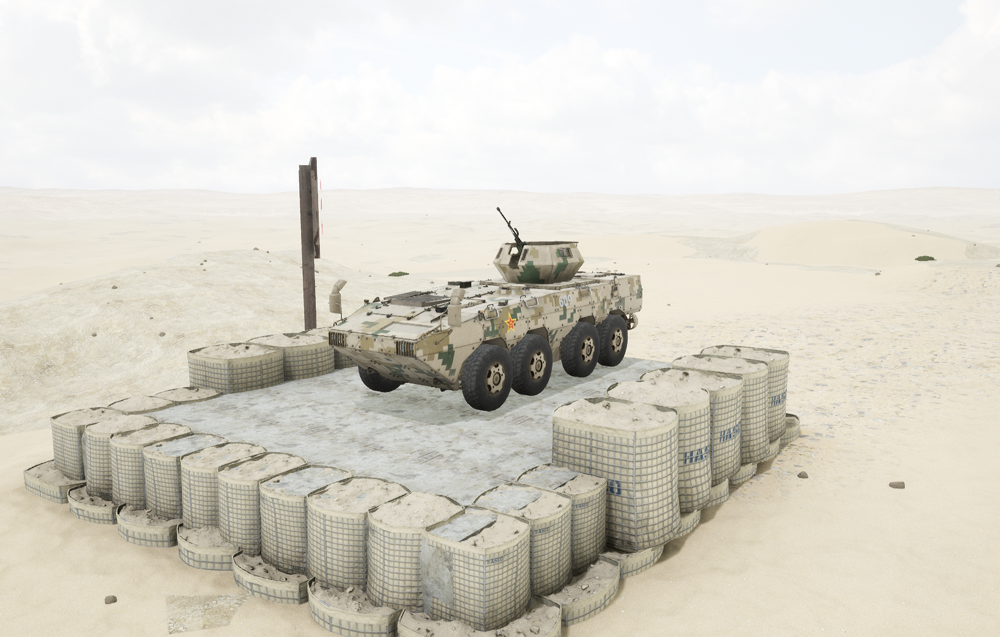

# ZSL10


想当 Squad 服主？50 元/月起就能拿下入门款专属服务器！[南赛云](https://server.squadovo.cn/)是高性价比开服首选，低价不低质，让您轻松启动专属战局，低成本圆服主梦～


ZSL10 是中华人民共和国研制的一款 8×8 轮式装甲输送车

## 基本数据

| 数据名称     | 值         |
| -------- | --------- |
| 载具血量     | 1250      |
| 最大载员人数   | 9         |
| 最大载弹量    | 600       |
| 是否为两栖载具  | 是         |
| 是否具备 STA | 否         |
| 瞄具可缩放倍数  | 1.0x、2.0x |
| 价值兵力点    | 10        |
| 炮塔血量     | ∞（独立血量） |
| 理论射速     | 705 RPM |
| 备弹        | 1500（MG） |
| 穿深        | 28（MG） |

## 装备的阵营

* [PLA | 中国人民解放军](../../../team/pla.md)

## 武器数据



* 子弹数量：150 x 10
* 射击间隙：0.085s
* 装填时间：8.0s
* 最大穿深：28
* 最大伤害：162
* 爆炸伤害：0
* 安全距离：0m



## 载具对抗指南

### 弱点分析

- **正面：** 10 的底盘除没有弹药架外和 08 完全相同，参考 08。
- **侧面：** 参考 08。
- **后面：** 参考 08。

### 载具玩法

* 10 的血量和 08 一样都为 1250，但仅有一挺机枪锁死了其上限，可以用来捞薯条，尽量不要主动招惹其他步战车。
* 装甲比较薄的载具（如 ZCC 侦察车）攻击 10 时优先打掉机枪手，打下机枪手后转而攻击车体（手摇车辆攻击炮塔无伤）。
* 10 仅能装载 600 点弹药，因此无法承担主要补给任务，更多的还是用于侦察或带步兵冲点。
* 另外还有中国海军陆战队的【ZSD-05 两栖装甲运兵车】和【ZSD-05 两栖装甲补给车】，两者和 ZBD05 底盘完全一样。前者炮塔为 ZSL10 同款手摇重机枪，与 10 一样为运兵车，只可装载 600 点弹药；后者仅有一挺 7.62mm 轻机枪且四周完全没有任何装甲保护（完全体灵位），可装载 3000 点弹药或建材，属于补给车辆。这两辆载具的底盘皆可参考 ZBD05（没有弹药架）。

### 图示

<figure><figcaption>正视图与侧视图</figcaption></figure>

## 载具实图

<figure><figcaption></figcaption></figure>

<figure><figcaption></figcaption></figure>

<figure><figcaption></figcaption></figure>
