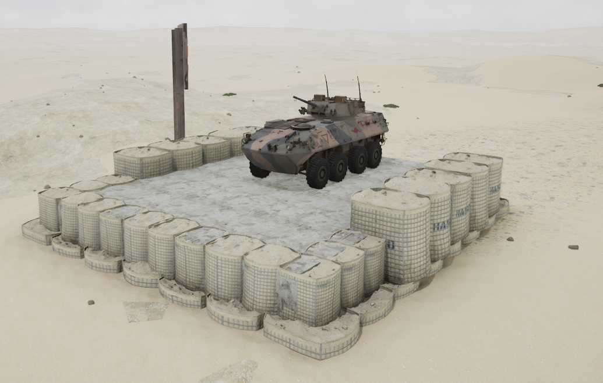

# ASLAV


想当 Squad 服主？50 元/月起就能拿下入门款专属服务器！[南赛云](https://server.squadovo.cn/)是高性价比开服首选，低价不低质，让您轻松启动专属战局，低成本圆服主梦～


ASLAV 是 [LAV-25](lav-25.md) 的一种变体

## 基本数据

| 数据名称     | 值      |
| -------- | ------ |
| 载具血量     | 1250   |
| 最大载员人数   | 10     |
| 最大载弹量    | 600    |
| 是否为两栖载具  | 是      |
| 是否具备 STA | 是      |
| 瞄具可缩放倍数  | 3x、10x |
| 价值兵力点    | 10     |

## 装备的阵营

* [ADF | 澳大利亚国防军](../../../team/adf.md)

## 武器数据



* 子弹数量：70 x1
* 射击间隙：0.3s
* 装填时间：12.5s
* 最大穿深：95
* 最大伤害：400
* 爆炸伤害：0
* 安全距离：0m



* 子弹数量：230 x1
* 射击间隙：0.3s
* 装填时间：12.5s
* 最大穿深：8
* 最大伤害：100
* 爆炸伤害：125
* 安全距离：0m



* 子弹数量：800 x2
* 射击间隙：0.07s
* 装填时间：11.28s
* 最大穿深：7
* 最大伤害：86
* 爆炸伤害：0
* 安全距离：0m



* 子弹数量：2 x1
* 射击间隙：1s
* 装填时间：1s
* 最大穿深：0
* 最大伤害：0
* 爆炸伤害：0
* 安全距离：0m



## 载具实图

<figure><figcaption></figcaption></figure>
