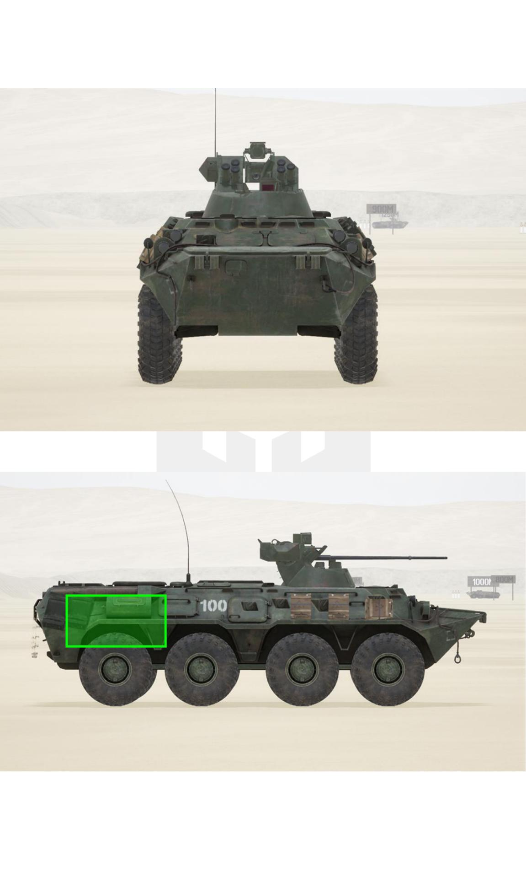
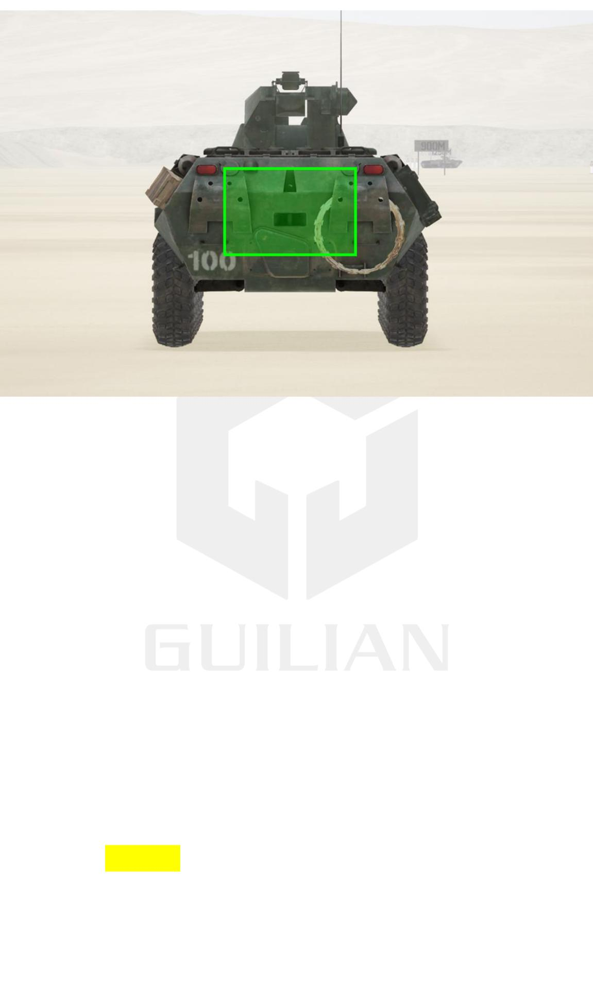

# BTR-82A


想当 Squad 服主？50 元/月起就能拿下入门款专属服务器！[南赛云](https://server.squadovo.cn/)是高性价比开服首选，低价不低质，让您轻松启动专属战局，低成本圆服主梦～


BTR-82A 是俄罗斯 BTR-80 轮式装甲运兵车的变体

## 基本数据 

| 数据名称     | 值       |
| -------- | ------- |
| 载具血量     | 1000    |
| 最大载员人数   | 11      |
| 最大载弹量    | 600     |
| 是否为两栖载具  | 是       |
| 是否具备 STA | 是       |
| 瞄具可缩放倍数  | 1.5x、6x |
| 价值兵力点    | 10      |
| 炮塔血量     | 300（包含在总血量内） |
| 理论射速     | 330 RPM |
| 备弹       | AP/HE：150/150 |
| 穿深       | AP/HE：95/8 |

## 装备的阵营

* [RGF | 俄罗斯陆军](../../../team/rgf.md)

## 武器数据



* 子弹数量：150 x1
* 射击间隙：0.18s
* 装填时间：11.28s
* 最大穿深：95
* 最大伤害：300
* 爆炸伤害：0
* 安全距离：0m



* 子弹数量：150 x1
* 射击间隙：0.18s
* 装填时间：11.28s
* 最大穿深：8
* 最大伤害：100
* 爆炸伤害：125
* 安全距离：0m



* 子弹数量：2000 x1
* 射击间隙：0.0856s
* 装填时间：11.28s
* 最大穿深：7
* 最大伤害：97
* 爆炸伤害：0
* 安全距离：0m



* 子弹数量：2 x1
* 射击间隙：1s
* 装填时间：1s
* 最大穿深：0
* 最大伤害：0
* 爆炸伤害：0
* 安全距离：0m



## 载具对抗指南

### 弱点分析

- **正面：** 30 是后置发动机，从正面无法击穿。车头翘起过高且车身过轻，很容易被敌方步战车顶翻。
- **侧面：** 过于薄弱的装甲使 12.7 可以轻易打炸它的发动机。
- **后面：** 后面更加薄弱，与侧面同理。

**Ps：** 8.0 更新的 BMP-1AM 步兵战车实际上是 BMP2 车体和 30 炮塔的缝合体，除炮塔血量加强到 600 之外，在火力配置方面和 30 完全相同。但要注意的是虽然它只有一门 30mm 机炮，车体依然存在弹药架，可以被坦克一发打穿，具体位置参考 BMP2 篇即可。

### 载具玩法

1. 30 是所有步战车中血量最低、装甲最薄的，任意一个 12.7mm 及以上口径的弹药都能击穿它身上的任何一个部位。30 的驾驶员要尽量用车体正面迎敌，本就不高的血量用侧面迎敌只会让你暴毙得更快。
2. 30 非常忌讳站桩输出，必须时刻保持移动并严防敌方步战车贴脸。先天硬件不占优势的它在运动战中能够获得更多的机会，但这同时也对驾驶员提出了较高的要求，30 的驾驶员要有独立迅速判断战斗形势并做出正确反应的能力，尽最大努力为炮手创造出更好的输出环境。

### 对抗建议

1. 坦克打 30 跟打狗一样，30 仅有一门 30mm 机炮，且血量也是所有步战车中最低的（1000），坦克一炮就能致其大残，两炮即炸。
2. 带导弹的步战车，大致可参考布莱德利篇。
3. 不带导弹的步战车，锁定攻击 30 的炮塔。
4. 只有 12.7mm（.50）重机枪的载具（以 M1126 斯崔克为例），正面遇到 30 可以硬刚但要讲究一些技巧。30 四面的装甲都很薄，12.7 皆可轻易打穿，但毕竟 12.7 伤害有限还容易过热，因此要靠驾驶员尽量与 30 贴脸，利用双方炮塔的转速差获得优势，当然最好能够直接撞翻。炮手不间断攻击其炮塔即可，但切记不能原地停车与 30 硬拼火力，那样绝无胜算。

### 图示

<figure><figcaption>正视图与侧视图</figcaption></figure>

<figure><figcaption>后视图</figcaption></figure>

## 载具实图

<figure><figcaption></figcaption></figure>

<figure><figcaption></figcaption></figure>
