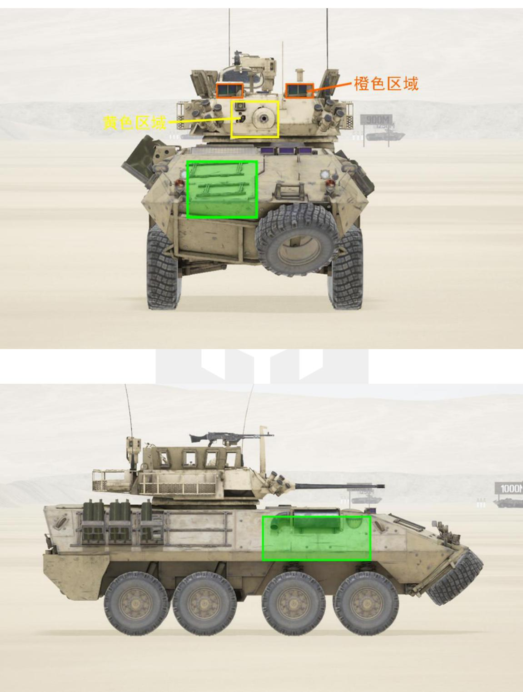
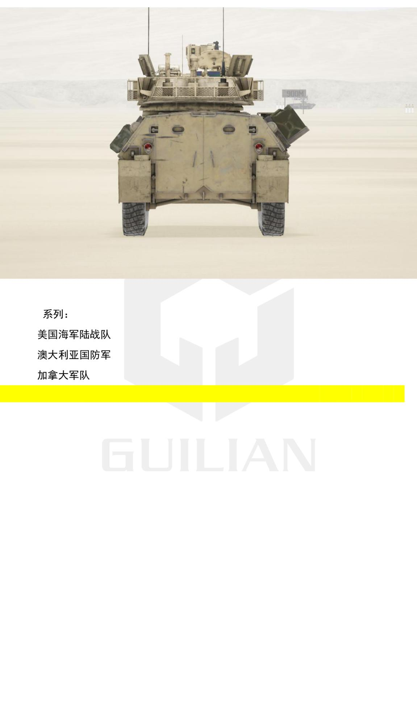
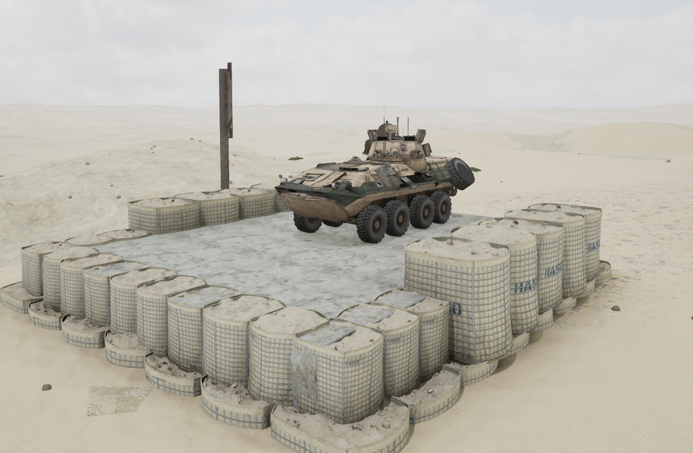
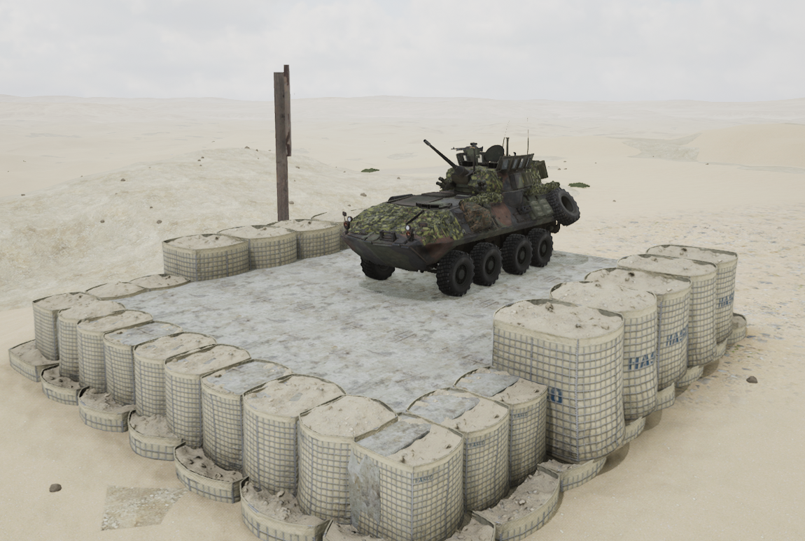

# LAV-25


想当 Squad 服主？50 元/月起就能拿下入门款专属服务器！[南赛云](https://server.squadovo.cn/)是高性价比开服首选，低价不低质，让您轻松启动专属战局，低成本圆服主梦～


LAV-25 步兵战车，是 20 世纪 80 年代初期美国研制装备的轮式步兵战车

## 基本数据

| 数据名称     | 值      |
| -------- | ------ |
| 载具血量     | 1250   |
| 最大载员人数   | 10     |
| 最大载弹量    | 600    |
| 是否为两栖载具  | 是      |
| 是否具备 STA | 是      |
| 瞄具可缩放倍数  | 1x、10x |
| 价值兵力点    | 10     |
| 炮塔血量     | 300（包含在总血量内） |
| 理论射速     | 200 RPM |
| 备弹       | AP/HE：60/150（LAV-25A2） |
| 穿深       | AP/HE：95/8 |

## 装备的阵营

* [USMC | 美国海军陆战队](../../../team/usmc.md)

## 武器数据



* 子弹数量：60 x1
* 射击间隙：0.3s
* 装填时间：12.5s
* 最大穿深：95
* 最大伤害：400
* 爆炸伤害：0
* 安全距离：0m



* 子弹数量：150 x1
* 射击间隙：0.3s
* 装填时间：12.5s
* 最大穿深：8
* 最大伤害：100
* 爆炸伤害：125
* 安全距离：0m



* 子弹数量：225 x2
* 射击间隙：0.07s
* 装填时间：11.28s
* 最大穿深：7
* 最大伤害：86
* 爆炸伤害：0
* 安全距离：0m



* 子弹数量：2 x1
* 射击间隙：1s
* 装填时间：1s
* 最大穿深：0
* 最大伤害：0
* 爆炸伤害：0
* 安全距离：0m



## 载具对抗指南

### 弱点分析

- **正面：** LAV-25 系列（LAV-25A2/ASLAV-25/Coyote）都为前右置发动机，机炮可以轻易从正面将其打炸。三者炮塔上均有橙色区域的两个观瞄镜，这里可被 12.7 打穿。黄色区域的炮闩区域只有郊狼可防 12.7，其他两者则不行。
- **侧面：** 三者侧面皆可被 12.7 打穿发动机。
- **后面：** 三者后面皆可被 12.7 打穿。

### 载具玩法

1. LAV25 系列的驾驶体验在轮战中可以说是最差（之一），速度慢稳定性也不好，随便一个甩尾漂移都有可能侧翻。因此驾驶员要避免做大幅度的动作，在高速时尽量平滑地完成转弯掉头等操作，否则遇敌时一个漂移侧翻在敌人面前那可真是滑天下之大稽。
2. LAV25 并不是多么强的载具，哪怕是面对 30 也不可掉以轻心。LAV25 系列唯一的优势也就是血量比 30 多一点（1250），但秒伤比 30 低且炮塔受击面积也比 30 大，在与 30 的正面对抗中自己的炮塔往往会先被打坏掉。

### 对抗建议

1. 坦克打 LAV25 系列跟打 30 差不多，他们的血量也只是比 30 多了一点（1250），两炮即炸。
2. 带导弹的步战车，大致可参考布莱德利篇。
3. 不带导弹的步战车，锁定攻击它们的炮塔。
4. 只有 12.7mm（.50）重机枪的载具（如 M1126 斯崔克），可以尝试配合己方步兵偷袭，但一旦失手要迅速撤离，毕竟它们正面大部分区域还是可以防 12.7 的。

### 图示

<figure><figcaption>正视图与侧视图</figcaption></figure>

<figure><figcaption>后视图</figcaption></figure>

## 载具实图

<figure><figcaption></figcaption></figure>

<figure><figcaption></figcaption></figure>
